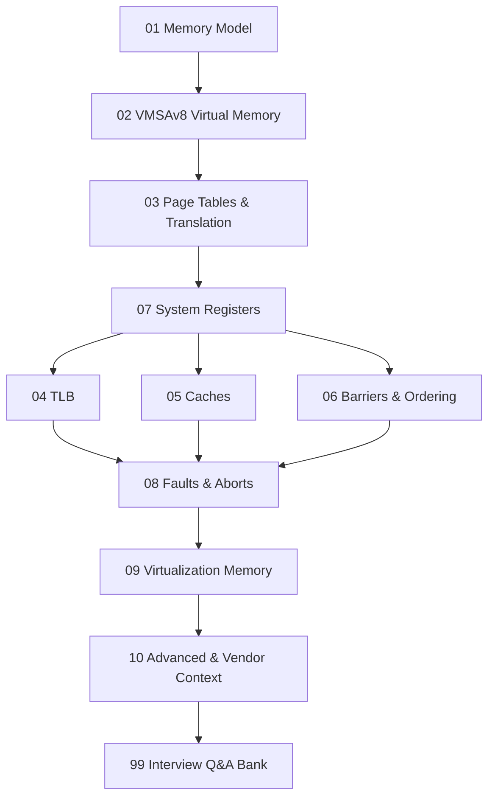

# ARMv8-A Memory & MMU — Interview Design Documents

Deep-dive theory notes derived from the **ARM Architecture Reference Manual, ARMv8 (for ARMv8-A architecture profile)** with industry/interview context for senior engineering roles at **NVIDIA / AMD / Qualcomm** (10+ years experience).

Source PDF: `../ARM Architecture Reference Manual - ARMv8, for ARMv8-A architecture profile-1.pdf`

---

## How to Use

1. Read top-down in the order below — later topics build on earlier ones.
2. Each document follows the same template: **Overview → Theory → Diagrams → Worked Example → Registers → Software Implications → Pitfalls → Interview Q&A → Cross-refs**.
3. Diagrams use **Mermaid** — open in VS Code with a Mermaid preview extension or GitHub.
4. Bracketed ARM ARM section references (e.g. `[ARM ARM §D5]`) point back to the PDF.

---

## Study Roadmap

---

## Topic Index

### 01 — [Memory Model](01_Memory_Model/)
| Doc | Topic |
|---|---|
| [01](01_Memory_Model/01_Memory_Types_Normal_Device.md) | Normal vs Device memory types |
| [02](01_Memory_Model/02_Cacheability_Shareability.md) | Cacheability & Shareability domains |
| [03](01_Memory_Model/03_MAIR_and_Attribute_Encoding.md) | MAIR_ELx and attribute indirection |
| [04](01_Memory_Model/04_Weakly_Ordered_Memory_Model.md) | The ARM weakly-ordered model |
| [05](01_Memory_Model/05_Atomicity_and_Single_Copy_Atomic.md) | Single-copy / multi-copy atomicity |

### 02 — [Virtual Memory (VMSAv8)](02_Virtual_Memory_VMSAv8/)
| Doc | Topic |
|---|---|
| [01](02_Virtual_Memory_VMSAv8/01_VMSA_Overview_and_Address_Spaces.md) | VMSA overview & address spaces |
| [02](02_Virtual_Memory_VMSAv8/02_Translation_Regimes_and_ELs.md) | Translation regimes & Exception Levels |
| [03](02_Virtual_Memory_VMSAv8/03_Translation_Granules_4K_16K_64K.md) | Translation granules (4K/16K/64K) |
| [04](02_Virtual_Memory_VMSAv8/04_VA_IPA_PA_Layout.md) | VA / IPA / PA layout & sizes |
| [05](02_Virtual_Memory_VMSAv8/05_ASID_and_VMID.md) | ASID and VMID tagging |

### 03 — [Page Tables & Translation](03_Page_Tables_and_Translation/)
| Doc | Topic |
|---|---|
| [01](03_Page_Tables_and_Translation/01_Translation_Table_Format_Descriptors.md) | Descriptor formats (block/table/page/invalid) |
| [02](03_Page_Tables_and_Translation/02_Multi_Level_Page_Walk.md) | Multi-level page-table walk |
| [03](03_Page_Tables_and_Translation/03_Block_vs_Page_Mappings.md) | Block vs page mappings (hugepages) |
| [04](03_Page_Tables_and_Translation/04_Stage1_vs_Stage2_Translation.md) | Stage-1 vs Stage-2 translation |
| [05](03_Page_Tables_and_Translation/05_Access_Flag_and_Dirty_State.md) | Access Flag & dirty-bit management |
| [06](03_Page_Tables_and_Translation/06_Permission_Checks_AP_UXN_PXN.md) | AP, UXN, PXN permission checks |

### 04 — [TLB](04_TLB/)
| Doc | Topic |
|---|---|
| [01](04_TLB/01_TLB_Architecture_and_Tagging.md) | TLB architecture & tagging (ASID/VMID) |
| [02](04_TLB/02_TLB_Maintenance_Instructions.md) | TLBI instructions |
| [03](04_TLB/03_TLB_Shootdown_and_Broadcast.md) | Cross-CPU TLB shootdown / broadcast TLBI |
| [04](04_TLB/04_TLB_Performance_and_Hugepages.md) | TLB performance, contiguous bit, hugepages |

### 05 — [Caches](05_Caches/)
| Doc | Topic |
|---|---|
| [01](05_Caches/01_Cache_Hierarchy_L1_L2_L3.md) | Cache hierarchy L1/L2/L3/SLC |
| [02](05_Caches/02_PoU_PoC_Inner_Outer.md) | Point of Unification / Coherency, Inner/Outer |
| [03](05_Caches/03_Cache_Maintenance_Ops_DC_IC.md) | DC and IC maintenance ops |
| [04](05_Caches/04_Cache_Coherency_MESI_MOESI.md) | Cache coherency (MESI / MOESI / ARM ACE) |
| [05](05_Caches/05_VIPT_PIPT_Aliasing.md) | VIPT vs PIPT, synonym/homonym aliasing |
| [06](05_Caches/06_Cache_Performance_Prefetch.md) | Cache performance & prefetching |

### 06 — [Memory Barriers & Ordering](06_Memory_Barriers_Ordering/)
| Doc | Topic |
|---|---|
| [01](06_Memory_Barriers_Ordering/01_DMB_DSB_ISB.md) | DMB / DSB / ISB |
| [02](06_Memory_Barriers_Ordering/02_Acquire_Release_LDAR_STLR.md) | Acquire / Release semantics, LDAR/STLR |
| [03](06_Memory_Barriers_Ordering/03_Load_Store_Reordering_Examples.md) | Load/store reordering — worked examples |
| [04](06_Memory_Barriers_Ordering/04_Coherency_vs_Consistency.md) | Coherency vs consistency |

### 07 — [System Registers](07_System_Registers/)
| Doc | Topic |
|---|---|
| [01](07_System_Registers/01_SCTLR_EL1_EL2_EL3.md) | SCTLR_ELx |
| [02](07_System_Registers/02_TTBR0_TTBR1_TCR.md) | TTBR0/1_ELx and TCR_ELx |
| [03](07_System_Registers/03_MAIR_and_Attribute_Indirection.md) | MAIR_ELx — attribute indirection |
| [04](07_System_Registers/04_VTTBR_VTCR_Stage2.md) | VTTBR_EL2, VTCR_EL2 |

### 08 — [Faults & Aborts](08_Faults_and_Aborts/)
| Doc | Topic |
|---|---|
| [01](08_Faults_and_Aborts/01_Translation_Permission_Alignment_Faults.md) | Translation / permission / alignment faults |
| [02](08_Faults_and_Aborts/02_ESR_FAR_HPFAR_Decoding.md) | ESR_ELx, FAR_ELx, HPFAR_EL2 decoding |
| [03](08_Faults_and_Aborts/03_Synchronous_vs_Asynchronous_Aborts.md) | Sync vs async aborts (SError) |
| [04](08_Faults_and_Aborts/04_Fault_Handling_Flow.md) | Kernel fault-handling flow |

### 09 — [Virtualization Memory](09_Virtualization_Memory/)
| Doc | Topic |
|---|---|
| [01](09_Virtualization_Memory/01_Two_Stage_Translation_for_Hypervisor.md) | Two-stage translation for hypervisors |
| [02](09_Virtualization_Memory/02_IPA_Space_and_VMID.md) | IPA space and VMID |
| [03](09_Virtualization_Memory/03_SMMU_IOMMU_Overview.md) | SMMU (IOMMU) overview |

### 10 — [Advanced & Vendor Context](10_Advanced_and_Vendor_Context/)
| Doc | Topic |
|---|---|
| [01](10_Advanced_and_Vendor_Context/01_Pointer_Authentication_MTE.md) | Pointer Authentication & MTE |
| [02](10_Advanced_and_Vendor_Context/02_NVIDIA_GPU_Unified_Memory_Context.md) | NVIDIA GPU unified memory context |
| [03](10_Advanced_and_Vendor_Context/03_AMD_x86_vs_ARM_MMU_Compare.md) | AMD/x86 vs ARM MMU contrast |
| [04](10_Advanced_and_Vendor_Context/04_Qualcomm_SoC_Memory_Subsystem.md) | Qualcomm SoC memory subsystem |
| [05](10_Advanced_and_Vendor_Context/05_Performance_Counters_PMU.md) | PMU counters for memory perf |

### 99 — [Interview Q&A Bank](99_Interview_QA_Bank/)
| Doc | Topic |
|---|---|
| [01](99_Interview_QA_Bank/01_MMU_Questions.md) | MMU questions |
| [02](99_Interview_QA_Bank/02_Cache_Questions.md) | Cache questions |
| [03](99_Interview_QA_Bank/03_Barriers_Ordering_Questions.md) | Barriers & ordering questions |
| [04](99_Interview_QA_Bank/04_System_Design_Memory_Scenarios.md) | System-design memory scenarios |

---

## Interview-Focus Matrix

| Company | Highest-Yield Sections |
|---|---|
| **NVIDIA** | 05 Caches, 06 Barriers, 09 Virtualization (SMMU), 10.02 GPU UM, 04 TLB |
| **AMD**    | 05 Caches (MOESI), 06 Barriers, 10.03 x86 vs ARM, 03 Page Tables (5-level analogue) |
| **Qualcomm** | 01 Memory Model, 02 VMSA, 03 Page Tables, 08 Faults, 10.04 SoC subsystem, 09 SMMU |

---

## Status

| Phase | Scope | Status |
|---|---|---|
| A | Scaffold + README | ✅ Complete |
| B | Foundations (01, 02, 03, 07) | ✅ Complete |
| C | TLB, Caches, Ordering (04, 05, 06) | ✅ Complete |
| D | Faults, Virtualization, Vendor (08, 09, 10) | ✅ Complete |
| E | Interview Q&A Bank (99) | ✅ Complete |

**Total documents**: 1 README + 45 content files across 10 topic sections + Q&A bank.
