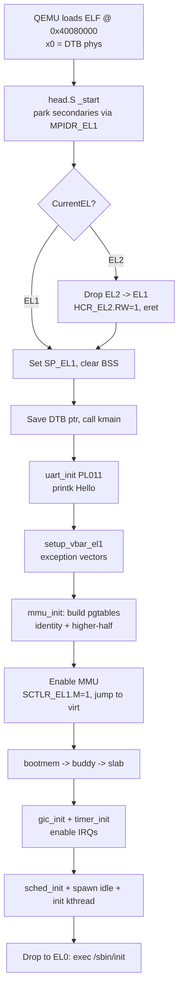
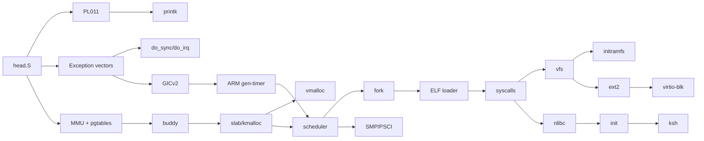

# nkernel — Architecture Overview

> A Linux-like, monolithic, preemptive, SMP-ready educational kernel for **ARMv8-A / AArch64** on **QEMU `virt`** (Cortex-A72).
> Target: bootable image + initramfs + tiny shell in 30 days.

---

## 1. Goals & Non-Goals

### Goals
- Boot on `qemu-system-aarch64 -M virt -cpu cortex-a72` and (stretch) Raspberry Pi 3B+.
- Higher-half monolithic kernel at `0xFFFF_0000_4008_0000`.
- MMU, virtual memory (buddy + slab + vmalloc), page faults.
- Preemptive Round-Robin scheduler, SMP up to 4 CPUs.
- POSIX-flavored syscalls (write/read/exit/fork/execve/wait4/mmap/brk).
- VFS with initramfs (CPIO) + ext2 read/write on VirtIO-blk.
- Tiny libc (`nlibc`) + `init` + `ksh` shell + 5 coreutils.

### Non-Goals (out of 30-day scope)
- Networking, USB, PCI enumeration, GPU/framebuffer.
- COW fork, signals with user handlers, loadable modules.
- Namespaces, cgroups, SELinux, audit.
- x86_64 / RISC-V ports.

---

## 2. Phase Map

| Phase | Days | Theme | Gate |
|---|---|---|---|
| 1 | 1–5  | Boot, UART, exceptions, GIC, timer | Periodic tick in QEMU |
| 2 | 6–11 | MMU + physical/virtual memory | `kmalloc`/`vmalloc` + page-fault recovery |
| 3 | 12–16| Tasking, scheduler, locks, EL0 drop | Two kthreads + first userspace `hello` |
| 4 | 17–19| Syscalls, ELF loader, signals stub | User ELF runs via `exec`, returns via `exit` |
| 5 | 20–24| VFS, initramfs, VirtIO-blk, ext2 | `cat /mnt/file` after reboot persists |
| 6 | 25–27| libc, init, shell, devfs | Interactive shell on serial |
| 7 | 28–30| SMP, hardening, release | 2-CPU boot, CI green, tag v1.0 |

---

## 3. System Memory Map (AArch64, QEMU virt)

```
Physical (QEMU virt with -m 512M):
  0x0000_0000_0000_0000 ─┐
                         │  (low MMIO holes)
  0x0800_0000            │  GICv2 dist
  0x0801_0000            │  GICv2 CPU iface
  0x0900_0000            │  PL011 UART0
  0x0901_0000            │  PL031 RTC
  0x0a00_0000..0x0a00_x  │  VirtIO-MMIO transports (x32)
  0x4000_0000            │  RAM base (DTB lives near here)
  0x4008_0000            │  Kernel load address (image start)
  0x4FFF_FFFF            ─┘  End of 512 MiB RAM

Virtual (after MMU on):
  0x0000_0000_0000_0000 ─┐
                         │  User space (TTBR0_EL1) — per-process
  0x0000_FFFF_FFFF_FFFF ─┘
  0xFFFF_0000_0000_0000 ─┐
                         │  Direct linear map (phys+PAGE_OFFSET)
  0xFFFF_0000_4008_0000  │  Kernel image (text/rodata/data/bss)
  0xFFFF_8000_0000_0000  │  vmalloc area (16 MiB initially)
  0xFFFF_C000_0000_0000  │  Fixmap / per-CPU
  0xFFFF_FFFF_FFFF_FFFF ─┘
```

> 48-bit VA, 4 KiB granule, TG0/TG1 = 4K, T0SZ = T1SZ = 16.

---

## 4. Boot Flow (high level)



---

## 5. Subsystem Dependency Graph



---

## 6. Repository Layout (final)

```
nkernel/
├── Makefile, linker.ld, .config, README.md
├── arch/arm64/
│   ├── boot/head.S
│   ├── kernel/{entry.S, exceptions.c, gic.c, timer.c, smp.c, psci.c}
│   └── mm/{mmu.c, pgtable.S, tlb.c}
├── kernel/
│   ├── printk.c, panic.c, syscall.c, time.c, softirq.c
│   ├── sched/{core.c, rr.c}
│   ├── fork.c, exit.c, signal.c
├── mm/{buddy.c, slab.c, vmalloc.c, page_fault.c, uaccess.c}
├── fs/
│   ├── vfs/{super.c, inode.c, dentry.c, file.c, namei.c}
│   ├── initramfs/cpio.c
│   ├── ext2/{super.c, inode.c, dir.c, file.c, balloc.c, ialloc.c}
│   └── devfs/
├── drivers/
│   ├── uart/pl011.c
│   ├── irqchip/gicv2.c
│   ├── virtio/{mmio.c, blk.c, console.c}
│   └── rtc/pl031.c
├── lib/{string.c, printf.c, list.h, rbtree.c, bitmap.c, ctype.c}
├── include/{kernel/, asm-arm64/, uapi/}
├── user/{libc/, init/, ksh/, coreutils/{ls,cat,echo,ps,uname}}
├── tools/{mkinitramfs/, qemu-run.sh, gdb-init}
├── scripts/{build.sh, debug.sh, ci-smoke.sh}
├── docs/{architecture.md, day01..day30.md, diagrams/}
└── .github/workflows/ci.yml
```

---

## 7. Coding Conventions

- **Style**: Linux kernel style — 8-space tabs, K&R braces, `checkpatch`-lite via clang-format.
- **Flags (kernel)**: `-ffreestanding -nostdlib -nostartfiles -mgeneral-regs-only -fno-stack-protector -fno-pic -mcmodel=large -O2 -g -Wall -Wextra -Werror`.
- **No FP/SIMD in kernel paths** (lazy save at EL0 boundary only).
- **Error model**: negative `errno` returns (`-ENOMEM`, `-EFAULT`); `ERR_PTR`/`PTR_ERR`/`IS_ERR` for pointer-or-error.
- **Headers**: `include/kernel/` private; `include/uapi/` shared with userland.
- **Commits**: `[dayNN] <subsystem>: <change>`, signed-off-by.

---

## 8. Toolchain (Day 0)

```bash
# Debian/Ubuntu host
sudo apt install gcc-aarch64-linux-gnu binutils-aarch64-linux-gnu \
    qemu-system-arm gdb-multiarch device-tree-compiler cpio mtools \
    make clang-format bear universal-ctags

# Verify
aarch64-linux-gnu-gcc --version          # >= 12
qemu-system-aarch64 --version            # >= 8.0
```

**Boot template**:
```bash
qemu-system-aarch64 -M virt,gic-version=2 -cpu cortex-a72 -smp 2 -m 512M \
    -nographic -kernel build/nkernel.elf \
    -initrd build/initramfs.cpio \
    -append "console=ttyAMA0" \
    -drive if=none,file=build/disk.ext2,format=raw,id=hd0 \
    -device virtio-blk-device,drive=hd0 \
    -s -S    # -s -S for GDB attach
```

---

## 9. Verification Strategy

**Automated CI (per day):**
1. `make` builds clean with `-Werror`.
2. `scripts/ci-smoke.sh` boots QEMU `-no-reboot`, greps serial log for the day's marker.
3. Static checks: clang-format diff, kernel-doc lint.

**Phase gates:** see table in §2.

**Debugging:**
```bash
qemu-system-aarch64 … -s -S &
gdb-multiarch build/nkernel.elf -x tools/gdb-init
(gdb) target remote :1234
(gdb) hb kmain
(gdb) c
```

---

## 10. References (per-day docs link these)

- **ARM ARM**: *ARM® Architecture Reference Manual, ARMv8 for ARMv8-A profile* (DDI 0487).
- **Linux source** (read-only, no copy): `arch/arm64/`, `kernel/sched/`, `mm/`, `fs/ext2/`.
- **xv6-public** (RISC-V/x86) for design patterns.
- **OSDev wiki** — ARMv8 boot, GIC, VirtIO pages.
- **VirtIO 1.2 spec** (OASIS).
- **Devicetree spec 0.4**.

---

## 11. Final Deliverable Checklist (Day 30)

- [ ] `make` produces `build/nkernel.elf` and `build/initramfs.cpio`.
- [ ] Boots on QEMU virt, single CPU and `-smp 2`.
- [ ] Lands at `ksh#` prompt; `ls /`, `cat /etc/motd`, `ps`, `uname` work.
- [ ] `echo hi > /mnt/x; sync; reboot; cat /mnt/x` → `hi` (ext2 persistence).
- [ ] CI green on GitHub Actions.
- [ ] README + asciinema demo.
- [ ] Tag `v1.0`, GPLv2 LICENSE.
