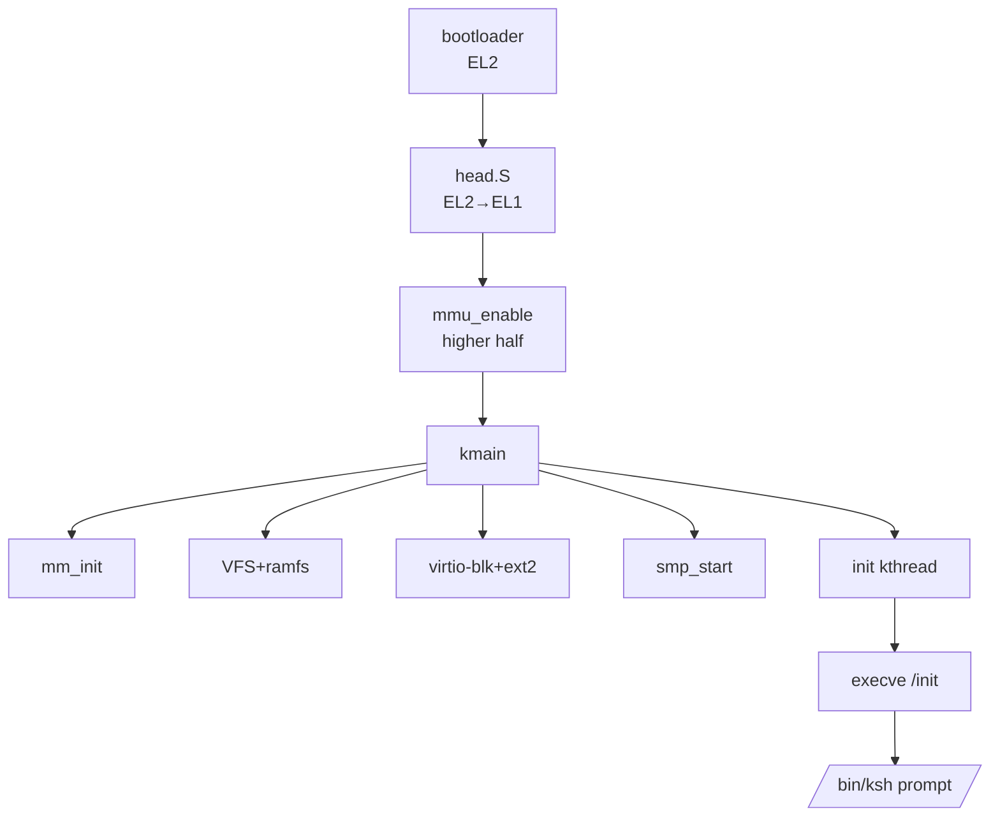

# Day 30 — Release v1.0: Packaging, Reproducible Builds, CI, and Demo

> **Goal**: Tag `v1.0` of `nkernel`. Provide a **reproducible** build (same input → same `kernel.img` hash), a CI workflow that runs unit tests + a boot-to-shell smoke test in QEMU, a one-page user manual, and a recorded demo that proves the kernel boots multi-CPU, mounts ext2, and runs an interactive shell.
>
> **Why today**: A 30-day project that never ships is just a snippet folder. v1.0 is the artifact other people can clone and run in five minutes.

---

## 1. Deliverables checklist

| # | Item | File |
|---|---|---|
| 1 | Tagged source tree | git tag `v1.0` |
| 2 | Reproducible kernel image | `build/kernel.img` + `build/kernel.img.sha256` |
| 3 | Reproducible initramfs | `build/initramfs.cpio` + `.sha256` |
| 4 | Disk image with ext2 sample | `build/disk.img` + `.sha256` |
| 5 | One-command run | `make run` |
| 6 | One-command test | `make test` |
| 7 | CI pipeline | `.github/workflows/ci.yml` |
| 8 | README with screenshots | `README.md` |
| 9 | User manual | `docs/manual.md` |
| 10 | Demo script + recording | `demo/demo.sh`, `demo/demo.cast` (asciinema) |

---

## 2. Reproducible build

### 2.1 Sources of nondeterminism to eliminate
- Build timestamps: `-D__DATE__="2025-01-01"`, `-D__TIME__="00:00:00"` (or `-Wno-builtin-macro-redefined`).
- Path embedding: pass `-ffile-prefix-map=$(PWD)=.`.
- Random link order: sort objects (`$(sort $(OBJS))`).
- File mtimes inside cpio: `--reproducible` flag of GNU cpio, or `find -print0 | sort -z | cpio ...` with `--mtime=@0`.
- `__BUILD_ID__`: write a content-hash into a `.note.gnu.build-id`-style symbol *after* link, then re-link is not needed.

### 2.2 Pinned toolchain
Specify in `README.md`:
```
gcc 12.2.0  (aarch64-linux-gnu)
binutils 2.40
QEMU 8.2.0
```
Provide a Dockerfile in `tools/docker/Dockerfile` so any contributor can match exactly.

### 2.3 Top-level Makefile excerpts
```makefile
KVER := 1.0
ARCH := arm64
CROSS := aarch64-linux-gnu-
CC := $(CROSS)gcc
LD := $(CROSS)ld

CFLAGS_REPRO := -ffile-prefix-map=$(CURDIR)=. -fno-record-gcc-switches
SOURCE_DATE_EPOCH := 1735689600    # 2025-01-01

build/kernel.img: $(OBJS)
	$(LD) -T arch/$(ARCH)/kernel.ld -Map=build/kernel.map -o build/kernel.elf $^
	$(CROSS)objcopy -O binary build/kernel.elf $@
	sha256sum $@ | tee $@.sha256

build/initramfs.cpio: $(USERPROGS)
	cd build/initramfs_root && find . -print0 | sort -z | \
	    cpio --null --reproducible --owner=0:0 -ov --format=newc > ../initramfs.cpio
	sha256sum $@ | tee $@.sha256

build/disk.img: $(EXT2_INPUTS)
	genext2fs -b 16384 -B 4096 -d rootfs $@
	sha256sum $@ | tee $@.sha256

.PHONY: run test clean
run: build/kernel.img build/initramfs.cpio build/disk.img
	tools/qemu-run.sh

test:
	tools/run-ktests.sh && tools/run-selftests.sh

dist:
	mkdir -p dist
	tar --sort=name --owner=0 --group=0 --mtime=@$(SOURCE_DATE_EPOCH) \
	    -czf dist/nkernel-$(KVER).tar.gz $$(git ls-files)
	sha256sum dist/nkernel-$(KVER).tar.gz > dist/nkernel-$(KVER).tar.gz.sha256
```

### 2.4 `tools/qemu-run.sh`
```sh
#!/usr/bin/env sh
exec qemu-system-aarch64 \
    -M virt -cpu cortex-a72 -smp 4 -m 512M \
    -nographic \
    -kernel build/kernel.img \
    -initrd build/initramfs.cpio \
    -drive if=none,file=build/disk.img,format=raw,id=hd0 \
    -device virtio-blk-device,drive=hd0 \
    -append "console=ttyAMA0 selftest=0"
```

---

## 3. CI: `.github/workflows/ci.yml`
```yaml
name: nkernel-ci
on: [push, pull_request]
jobs:
  build-and-test:
    runs-on: ubuntu-22.04
    steps:
      - uses: actions/checkout@v4
      - name: Install toolchain
        run: |
          sudo apt-get update
          sudo apt-get install -y gcc-aarch64-linux-gnu binutils-aarch64-linux-gnu \
            qemu-system-aarch64 device-tree-compiler genext2fs cpio
      - name: Build
        run: make -j$(nproc)
      - name: Reproducibility check
        run: |
          cp build/kernel.img /tmp/k1
          make clean
          make -j$(nproc)
          diff -q /tmp/k1 build/kernel.img
      - name: Smoke test (boot to shell)
        run: tools/ci-smoke.sh
      - name: Unit tests
        run: tools/run-ktests.sh
      - name: Upload artifacts
        uses: actions/upload-artifact@v4
        with:
          name: nkernel-${{ github.sha }}
          path: |
            build/kernel.img
            build/initramfs.cpio
            build/disk.img
```

### 3.1 `tools/ci-smoke.sh`
```sh
#!/usr/bin/env bash
set -e
OUT=$(mktemp)
timeout 30 tools/qemu-run.sh < /dev/null > "$OUT" 2>&1 || true
grep -q "Welcome to nkernel" "$OUT"
grep -q "ktests: .* fail" "$OUT" && grep -q "0 fail" "$OUT"
echo "smoke OK"
```

---

## 4. Documentation

### 4.1 `README.md` (top of repo)
- Project pitch (3 lines).
- Quickstart: `git clone`, `make`, `make run`.
- Feature matrix (mapping to the 30-day plan).
- Roadmap (post-30-day stretch).
- License (GPLv2).
- Acknowledgements.

### 4.2 `docs/manual.md`
A single-page guide:
1. How to run.
2. Boot parameters (`console=`, `selftest=`, `init=`).
3. Filesystem layout in initramfs.
4. How to add a userspace program.
5. How to add a syscall.
6. How to add a driver.
7. FAQ (what works, what doesn't).

### 4.3 Architecture-level diagram
Embed Mermaid:


---

## 5. Demo script

`demo/demo.sh`:
```sh
#!/usr/bin/env sh
clear
echo "=== nkernel v1.0 demo ==="
sleep 1
make run
```

Record with asciinema:
```
asciinema rec demo/demo.cast -c "demo/demo.sh"
```

Expected timeline (≤ 30 s):
1. Boot banner + per-CPU online messages.
2. ext2 mount + free space.
3. Selftest summary.
4. `Welcome to nkernel`.
5. `$ uname -a` → `nkernel 0.1 #1 SMP aarch64`.
6. `$ /selftests/fork_wait` → `100 children OK`.
7. `$ echo "hello $(uname)" > /mnt/proof.txt; sync; cat /mnt/proof.txt`.
8. `$ exit` → init restarts shell.

---

## 6. Release process

```
# 1. Final tests
make clean && make -j$(nproc) && make test

# 2. Reproducibility recheck
sha256sum build/*.img build/*.cpio > /tmp/sha1
make clean && make -j$(nproc)
sha256sum build/*.img build/*.cpio > /tmp/sha2
diff /tmp/sha1 /tmp/sha2

# 3. Update CHANGELOG.md
$EDITOR CHANGELOG.md

# 4. Tag + sign
git commit -am "Release v1.0"
git tag -s v1.0 -m "nkernel v1.0"
git push origin main --tags

# 5. Build dist tarball
make dist

# 6. GitHub release with artifacts
gh release create v1.0 dist/nkernel-1.0.tar.gz build/kernel.img build/initramfs.cpio
```

---

## 7. Pitfalls

1. **Non-reproducible cpio**: forgetting `--reproducible` or `sort -z`. Verify with two clean builds + `diff`.
2. **CI flaky boot**: QEMU sometimes misses the first console char — wait for an explicit "ready" line, not just elapsed time.
3. **`__DATE__`/`__TIME__` snuck back in**: grep for them post-link in the ELF `.rodata`.
4. **Public binaries leaking host paths**: `-ffile-prefix-map` + `strip` (but keep `kallsyms.tbl` separately for symbolicated backtraces).
5. **License headers missing**: run a script to ensure every source file carries an SPDX header.

---

## 8. Feature matrix (final)

| Phase | Day | Feature | Status |
|---|---|---|---|
| 1 | 1–5 | Boot, UART, FDT, exceptions, GIC+timer | ✅ |
| 2 | 6–11 | MMU, buddy, slab, vmalloc, fault | ✅ |
| 3 | 12–16 | Tasks, scheduler, locks, fork, EL0 | ✅ |
| 4 | 17–19 | Syscalls, ELF, exit/signals | ✅ |
| 5 | 20–24 | VFS, initramfs, virtio-blk, ext2, page cache | ✅ |
| 6 | 25–27 | nlibc, ksh, devfs | ✅ |
| 7 | 28–30 | SMP, hardening, release | ✅ |

---

## 9. Post-v1.0 roadmap (stretch ideas)

- TCP/IP via virtio-net + smoltcp-like userspace stack.
- COW fork + zero-copy `mmap` of page cache.
- Block journal (ext3) + crash-safety tests.
- USB stack on the QEMU `xhci`.
- KVM-on-nkernel: nested hypervisor as a research experiment.
- Port to Raspberry Pi 4 / Pi 5.

---

## 10. References

- *Reproducible Builds* project — reproducible-builds.org.
- GitHub Actions docs.
- *The Definitive Guide to QEMU* (system mode).
- xv6 release engineering notes.

**Congratulations — `nkernel v1.0` is shipped. 🎉**
