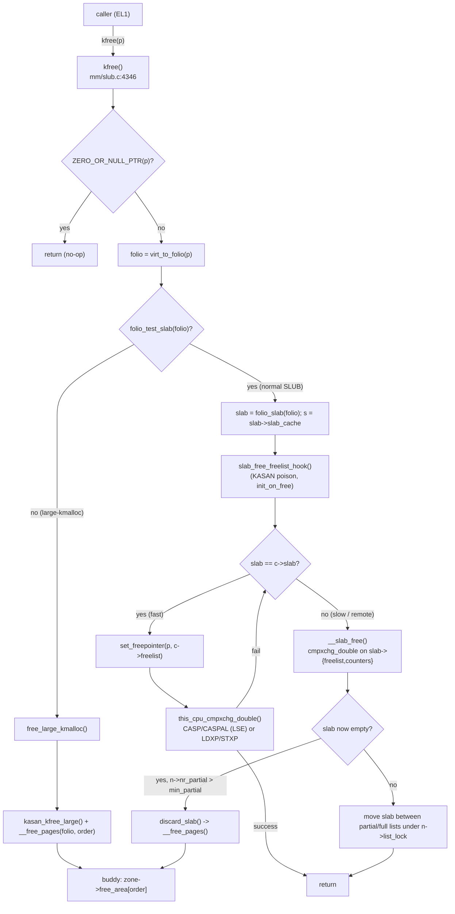

# kfree — ARM64 Call Flow

> Linux 6.6 · AArch64 · 4 KB pages · 48-bit VA.
> Same architectural primitives as `kmalloc` ([`../kmalloc/03_arm64_callflow.md`](../kmalloc/03_arm64_callflow.md)):
> per-CPU base via `tpidr_el1`, 16-byte CAS via `CASP`/`LDXP-STXP`, no TLB work.

---

## 1. End-to-end Mermaid graph



---

## 2. ARM64 specifics

### 2.1 No page-table churn

Like `kmalloc`, `kfree` runs at EL1, touches only the linear map. The pages stay mapped even after they're returned to buddy — only the bookkeeping flips. **No TLB invalidation, no DSB, no ISB on either path.** This is what makes SLUB free as cheap as a store + CAS on ARM64.

### 2.2 Atomic primitive

`this_cpu_cmpxchg_double(freelist, tid, old_head, old_tid, new_head, new_tid)` lowers to:

| LSE? | Instruction sequence                                |
|------|-----------------------------------------------------|
| yes  | single `CASPAL Xs, Xs+1, Xt, Xt+1, [Xn]`            |
| no   | `LDXP / STXP` retry loop                            |

See [`arch/arm64/include/asm/cmpxchg.h`](https://elixir.bootlin.com/linux/v6.6/source/arch/arm64/include/asm/cmpxchg.h). `CASPAL` is acquire-release — orders prior stores (the `set_freepointer` store) before the freelist publication.

### 2.3 `set_freepointer()` and pointer hardening

```c
/* mm/slub.c:333 (hardened) */
static inline void set_freepointer(struct kmem_cache *s, void *object, void *fp)
{
    unsigned long freeptr_addr = (unsigned long)object + s->offset;
    *(void **)freeptr_addr = freelist_ptr(s, fp, freeptr_addr);
}
```

On ARM64 this is a single `STR` to `[object + s->offset]`. With `CONFIG_SLAB_FREELIST_HARDENED`, the stored pointer is `fp ^ s->random ^ freeptr_addr` — an attacker who corrupts a freed object cannot easily redirect the next allocation.

### 2.4 `init_on_free` zeroing

If `CONFIG_INIT_ON_FREE_DEFAULT_ON=y` or `init_on_free=1` boot arg, `slab_free_freelist_hook` emits `memset(p, 0, s->object_size)` before the cmpxchg push. On ARM64 this hits the same `__memset` path that uses `DC ZVA` — see [03_arm64_callflow.md in kzalloc](../kzalloc/03_arm64_callflow.md) §2.

### 2.5 Remote free contention

If CPU A frees an object that belongs to CPU B's `c->slab`:

```
CPU A:  __slab_free() -> cmpxchg_double(&slab->freelist, &slab->counters, ...)
CPU B:  slab_alloc_node() fast path on the same slab
```

Both contend on the **per-slab** `(freelist, counters)` pair (not the per-CPU one). On ARM64 with `CASPAL` this is one atomic; under heavy cross-CPU traffic it can become a hotspot — diagnosed via `perf c2c`. Mitigation: pin allocations to local CPUs (NUMA awareness) or use per-CPU dedicated caches.

---

## 3. Slow-path sequence diagram (remote free triggering page discard)

```mermaid
sequenceDiagram
    participant A as CPU A (free)
    participant Slab as slab metadata
    participant Node as kmem_cache_node
    participant Buddy as Buddy allocator
    participant ARM as arch/arm64/mm

    A->>Slab: cmpxchg_double(slab->freelist, slab->counters)
    Slab-->>A: success; inuse == 0
    A->>Node: spin_lock(&n->list_lock)
    Node->>Node: remove slab from n->partial
    A->>Node: spin_unlock(&n->list_lock)
    A->>Buddy: discard_slab() -> __free_pages(slab_page, oo_order(s->oo))
    Buddy->>ARM: page returned to free_area; linear-map PTE untouched
```

---

## 4. `kfree_rcu` on ARM64

`kfree_rcu(p, member)` does **not** call `kfree` immediately. It:

1. Initializes `p->member.func = (rcu_callback_t)offset_in_struct`.
2. Pushes onto a per-CPU `krc->bkvhead[]` array via `call_rcu()`.
3. Eventually `kfree_rcu_work()` (workqueue) dequeues and calls `kvfree_call_rcu_arg2()` → `kfree()`.

From an ARM64 standpoint the deferred path adds:

- A `smp_store_release` on the callback link (orders `p`'s last stores before publication).
- A pass through the RCU grace period (uses `dsb ish` in `synchronize_rcu_expedited`).
- The eventual `kfree` runs in a workqueue kthread, generally on a different CPU than the original free — guaranteed remote-free path.

---

## 5. Quick disassembly hint

```c
kfree(p);
```

becomes (release build, GCC 13, ARM64, fast path):

```asm
    cbz     x0, .Lret           ; NULL check
    cmp     x0, #0x10           ; ZERO_SIZE_PTR
    b.eq    .Lret
    bl      kfree               ; tail-call
    ; inside kfree fast path:
    mrs     x9, tpidr_el1
    add     x10, x9, #cpu_slab_off
    ldp     x11, x12, [x10]     ; freelist, tid
    str     x11, [x0, #s->offset]   ; set_freepointer
    caspal  x11, x12, x0, x13, [x10]
```

`tpidr_el1` is the per-CPU base register on ARM64; `caspal` is the LSE 16-byte CAS with acquire-release semantics.
