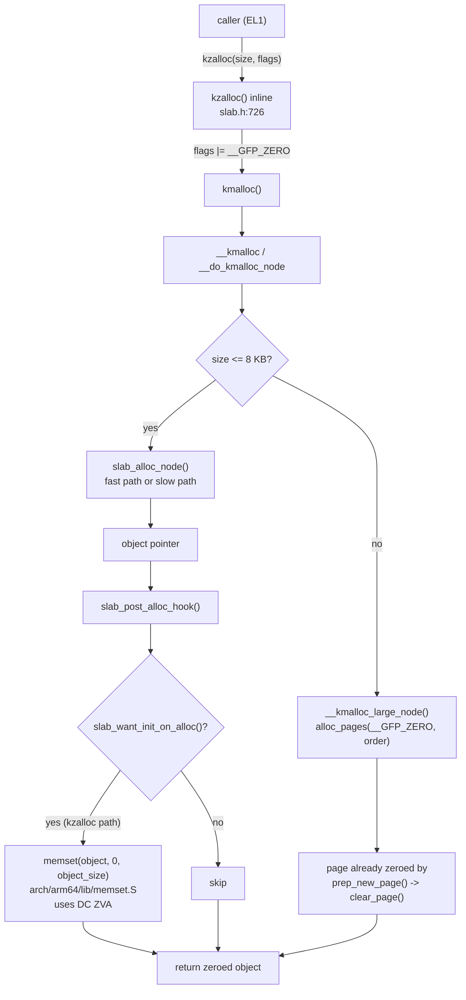

# kzalloc — ARM64 Call Flow

> Same SLUB pipeline as `kmalloc` (see [`../kmalloc/03_arm64_callflow.md`](../kmalloc/03_arm64_callflow.md)),
> with one extra terminal step: the zeroing pass.

---

## 1. Call graph (delta from kmalloc highlighted)



The pink box (`memset → DC ZVA`) is the only thing that distinguishes `kzalloc` from `kmalloc` at runtime.

---

## 2. ARM64 architectural detail of `DC ZVA`

The Data-Cache Zero-by-VA instruction is the workhorse of ARM64 zeroing:

```asm
    mrs     x9, dczid_el0          // query zero-block size (typ. log2(64) = 4)
    tbz     w9, #4, .Lno_dc_zva    // DZP bit: 1 => DC ZVA prohibited
    mov     x10, #1
    lsl     x10, x10, x9           // block size in bytes (64)
.Lloop:
    dc      zva, x0                // zero one cache line at [x0]
    add     x0, x0, x10
    subs    x2, x2, x10
    b.ge    .Lloop
```

Properties:

- Writes the whole block without a prior cache-line read (no Read-For-Ownership) → halves memory traffic vs. naive `STP xzr,xzr` loops.
- Requires Normal-cacheable memory — true for the kernel linear map where SLUB objects live, true for vmalloc/page pages.
- Respects MMU permissions; faults on RO mappings.
- Honors `DCZID_EL0.DZP` (Disable Zero-by-VA Prohibited) — some hypervisors / emulators set this bit and force the assembly fallback.

---

## 3. Where `DC ZVA` is invoked from `kzalloc`

| Path                             | Function                | Asm hot loop                          |
|----------------------------------|-------------------------|---------------------------------------|
| Fast/slow SLUB path (≤ 8 KB)     | `memset` from `slab_post_alloc_hook` | `arch/arm64/lib/memset.S:__memset` |
| Large-kmalloc (> 8 KB)           | `clear_page` per page in `prep_new_page` | `arch/arm64/lib/clear_page.S:clear_page` |

Both are alternatives-patched: on cores with feature `CPU_FEATURE_ZVA` they use `DC ZVA`; otherwise they fall back to `stnp` / `stp` non-temporal stores.

---

## 4. Cache & TLB consequences

| Effect                              | Notes                                                                 |
|-------------------------------------|-----------------------------------------------------------------------|
| Cache footprint                     | The zeroed lines land in L1 (allocate-on-write). Hot for the caller. |
| TLB                                 | None — linear-map pages already mapped. No invalidation needed.       |
| Speculation                         | Zero writes are visible to the same CPU immediately; cross-CPU visibility per Normal-memory ordering rules (use `smp_wmb()` if publishing the pointer). |
| `dsb`/`isb`                         | Not needed inside the hot path; the SLUB `cmpxchg_double` provides ordering for the freelist publication. |

---

## 5. Publishing a kzalloc'd pointer to another CPU

```c
struct foo *f = kzalloc(sizeof(*f), GFP_KERNEL);
if (!f) return -ENOMEM;
f->initialized = true;
smp_store_release(&global_foo, f);   // pair with smp_load_acquire on reader
```

The zeroing inside `kzalloc` happens *before* the function returns, so callers can rely on the all-zero state without extra barriers. Only the publication needs release/acquire.

---

## 6. Failure paths (same as kmalloc)

`kzalloc` has no failure modes of its own. Any error (NULL return, WARN, OOM kill, lockdep splat) comes from the underlying `kmalloc` path — see [`../kmalloc/03_arm64_callflow.md`](../kmalloc/03_arm64_callflow.md) §5.

---

## 7. Quick disassembly hint

```c
struct foo *f = kzalloc(64, GFP_KERNEL);
```

becomes (release build, GCC 13, ARM64):

```asm
    adrp    x0, kmalloc_caches+...
    ldr     x0, [x0, #:lo12:kmalloc_caches+...]
    mov     w1, #0xdc0          ; GFP_KERNEL | __GFP_ZERO (0xcc0 | 0x100)
    bl      kmem_cache_alloc_trace
    cbz     x0, .Lfail
    // memset(x0, 0, 64) — emitted inline by GCC for small const sizes:
    stp     xzr, xzr, [x0]
    stp     xzr, xzr, [x0, #16]
    stp     xzr, xzr, [x0, #32]
    stp     xzr, xzr, [x0, #48]
```

For sizes ≥ 128 B the compiler emits a call into `__memset` which then uses `DC ZVA`.

---

Next: [04_memory_map.md](04_memory_map.md) — identical to kmalloc's linear-map placement, with notes on info-leak hardening.
