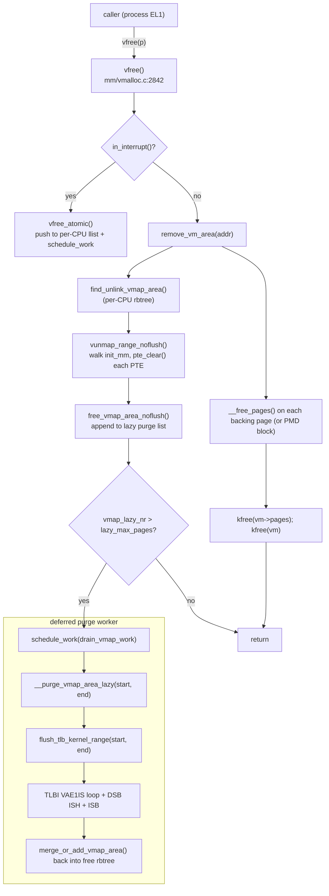
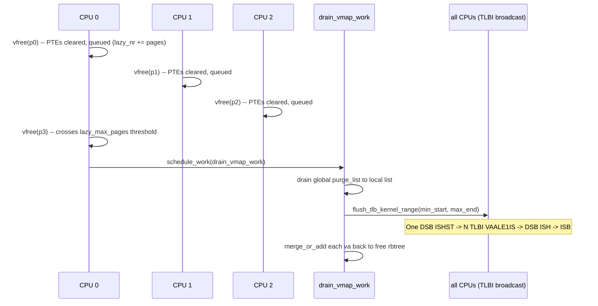

# vfree — ARM64 Call Flow

> Linux 6.6 · AArch64 · 48-bit VA · 4 KB pages.
> The key arm64 instructions: `TLBI VAE1IS`, `DSB ISH`, `ISB`.

---

## 1. End-to-end Mermaid graph



---

## 2. The arm64 TLB invalidate sequence

[`arch/arm64/include/asm/tlbflush.h:flush_tlb_kernel_range`](https://elixir.bootlin.com/linux/v6.6/source/arch/arm64/include/asm/tlbflush.h#L383)

For a small range:

```c
static inline void flush_tlb_kernel_range(unsigned long start, unsigned long end)
{
    unsigned long addr;

    if ((end - start) > (MAX_TLBI_OPS << PAGE_SHIFT)) {
        flush_tlb_all();
        return;
    }

    start = __TLBI_VADDR(start, 0);
    end   = __TLBI_VADDR(end,   0);

    dsb(ishst);
    for (addr = start; addr < end; addr += 1 << (PAGE_SHIFT - 12))
        __tlbi(vaale1is, addr);     /* TLBI VAALE1IS — last-level, all ASIDs */
    dsb(ish);
    isb();
}
```

Decomposed:

| Instruction         | Effect                                                                  |
|---------------------|-------------------------------------------------------------------------|
| `DSB ISHST`         | Ensure prior PTE writes are visible to inner-shareable domain.          |
| `TLBI VAALE1IS, va` | Invalidate last-level TLB entry at `va`, EL1, all ASIDs, inner-shareable (broadcasts to all CPUs). |
| `DSB ISH`           | Wait for TLBIs to complete on every CPU.                                |
| `ISB`               | Synchronize the issuing CPU's instruction stream.                       |

`VAALE1IS` (vs `VAE1IS`) means **last-level only** — sufficient because we cleared leaf PTEs only; PUD/PMD intermediate tables remain. The `IS` suffix is the key for broadcast.

For large ranges (`> MAX_TLBI_OPS << PAGE_SHIFT`, typically 1024 pages = 4 MB on default config), it falls back to `flush_tlb_all` — a single `TLBI VMALLE1IS` invalidates the entire EL1 TLB on all CPUs.

---

## 3. Why lazy purge matters on arm64

Every `TLBI ...IS` is **architecturally broadcast** to all CPUs in the inner-shareable domain. On a 64-core Ampere Altra, an immediate per-`vfree` flush would:

1. Stall the issuing CPU until all 63 others ACK.
2. Cause **all** CPUs to invalidate matching TLB entries — disturbing their working set.
3. Serialize at the system-coherent interconnect.

The lazy purge converts N small flushes into one batched flush over a union range, often using `flush_tlb_all` when the union is large — paying one IPI for many frees.

---

## 4. Per-PTE clear sequence (no flush in inner loop)

Inside `vunmap_pte_range`:

```asm
    str     xzr, [pte_ptr]      ; pte_clear() — write 0
    add     pte_ptr, pte_ptr, #8
```

No `DSB`, no `TLBI` per entry. Both come once at purge time, covering the union of all queued ranges.

---

## 5. `vfree_atomic()` arm64 path

Atomic free pushes onto a per-CPU `llist` (lockless single-linked list):

```asm
    mrs     x9, tpidr_el1            ; per-CPU base
    add     x10, x9, #vfree_deferred_off
    ; llist_add via STXR / LDXR pair or CASAL with LSE
```

Then `schedule_work(&p->wq)` wakes the per-CPU `vfree_deferred` workqueue, which eventually runs `__vfree` in process context. From the caller's perspective the cost is two stores and a wakeup — IRQ-safe.

---

## 6. Sequence diagram — four vfree's on a 64-core system



Four `vfree` calls, one TLB invalidation cycle.

---

## 7. PMD-block (huge) unmap

For a huge-page vmalloc area, `vunmap_pmd_range` clears the PMD entry directly:

```c
if (pmd_leaf(*pmd)) {
    pmd_clear(pmd);     /* one 8-byte write covers 2 MB */
    continue;
}
```

One `STR XZR` collapses a 2 MB mapping. The subsequent `TLBI` invalidates 2 MB worth of TLB entries (or one block entry, depending on TLB implementation). Big win.

---

## 8. KASAN-VMALLOC interaction

When the area is finally purged, `kasan_release_vmalloc(start, end, free_region_start, free_region_end)` ([`mm/kasan/shadow.c`](https://elixir.bootlin.com/linux/v6.6/source/mm/kasan/shadow.c)) marks the shadow as freed and may free the shadow pages themselves if the entire free region is empty. Otherwise the shadow bytes stay as `KASAN_VMALLOC_FREE` so later UAF accesses (rare, since the VA is also gone) still trap.

---

## 9. Failure splat — the classic "use after vfree"

```
Unable to handle kernel paging request at virtual address ffff_8000_4012_3000
Call trace:
  my_driver_thread+0x40/0x80
  kthread+0x10c/0x110
  ret_from_fork+0x10/0x20
```

Meaning: `vfree(buf)` was called, then `buf[i]` was dereferenced. The TLB may still have the entry (lazy purge pending) — giving inconsistent crash timing. Reproducible with `CONFIG_DEBUG_PAGEALLOC=y` (which disables lazy purge, making every `vfree` flush immediately) and `CONFIG_KASAN_VMALLOC=y`.

---

## 10. Quick disassembly hint

```c
vfree(buf);
```

becomes:

```asm
    cbz     x0, .Lret
    bl      vfree
    ; inside vfree -> remove_vm_area -> vunmap_range_noflush:
    str     xzr, [pte_ptr]   ; many of these
    ; ... eventually inside __purge_vmap_area_lazy -> flush_tlb_kernel_range:
    dsb     ishst
    tlbi    vaale1is, x9
    dsb     ish
    isb
```
