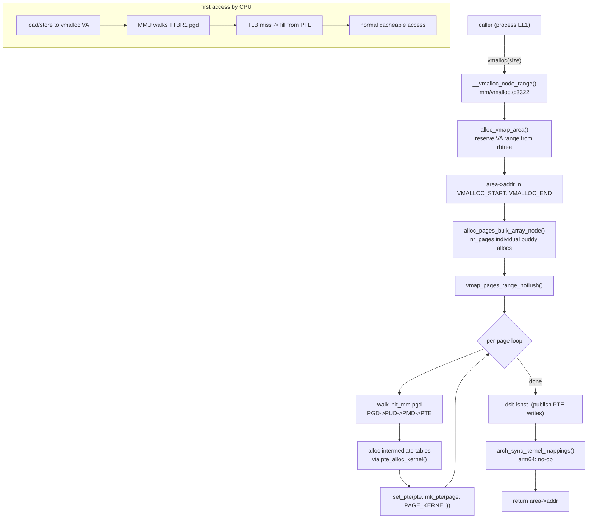
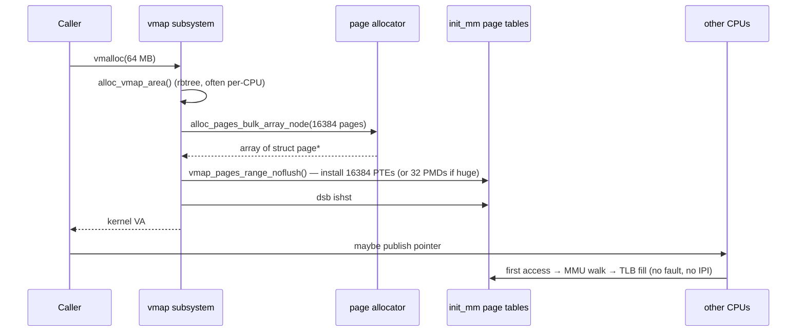

# vmalloc — ARM64 Call Flow

> Linux 6.6 · AArch64 · 48-bit VA, 4 KB pages.
> Page tables: 4 levels (PGD→PUD→PMD→PTE), kernel pgd = `init_pg_dir` in
> `arch/arm64/kernel/head.S`, loaded into `TTBR1_EL1` at boot.

---

## 1. End-to-end Mermaid graph



---

## 2. ARM64 page-table walk for a vmalloc address

Given a 48-bit VA `0xffff_8001_2345_6000`:

```
VA bits [47:39]  -> PGD index   (init_pg_dir)
VA bits [38:30]  -> PUD index
VA bits [29:21]  -> PMD index
VA bits [20:12]  -> PTE index
VA bits [11:0]   -> offset within page
```

During `vmap_pages_range_noflush()`:

```c
/* mm/vmalloc.c — simplified */
pgd = pgd_offset_k(addr);
p4d = p4d_alloc_track(&init_mm, pgd, addr, mask);
pud = pud_alloc_track(&init_mm, p4d, addr, mask);
pmd = pmd_alloc_track(&init_mm, pud, addr, mask);
pte = pte_alloc_kernel_track(pmd, addr, mask);
set_pte_at(&init_mm, addr, pte, mk_pte(page, prot));
```

Each `*_alloc_*` call may invoke `__get_free_page()` to allocate a new intermediate table; that page's PFN is then written into the parent entry with `set_pud()` / `set_pmd()`. After the chain is in place, `set_pte_at` issues a plain store (no DSB per-PTE) and the final `dsb ishst` at the end of the range publishes all of them.

---

## 3. ARM64-specific PTE encoding

`PAGE_KERNEL` on arm64 ([`arch/arm64/include/asm/pgtable-prot.h`](https://elixir.bootlin.com/linux/v6.6/source/arch/arm64/include/asm/pgtable-prot.h)):

```
#define PAGE_KERNEL  __pgprot(PROT_NORMAL)

PROT_NORMAL = PTE_TYPE_PAGE | PTE_AF | PTE_SHARED   /* AF set; inner-shareable */
            | PTE_PXN  | PTE_UXN                    /* no exec */
            | PTE_WRITE                             /* AP[2]=0 -> writable */
            | PTE_ATTRINDX(MT_NORMAL)               /* MAIR slot 0 -> cacheable WB-WA */
```

Key bits:

| Bit       | Meaning                              |
|-----------|--------------------------------------|
| `AF`      | Access Flag — set so HW doesn't trap |
| `SH[1:0]` | `11` = Inner shareable               |
| `AP[2:1]` | `00` = EL1 RW, EL0 no access         |
| `UXN`/`PXN` | both 1 — NX                        |
| `nG`      | 0 — global (no ASID tag, kernel)     |
| `Contig`  | optionally set when 16 entries are contiguous in PA — hint to TLB compression |
| `ATTRINDX`| index into MAIR_EL1 = `MT_NORMAL`    |

---

## 4. Why no TLB invalidate when adding mappings

ARMv8 architectural guarantee (B2.2.6): a TLB entry that *would* have been a translation fault before the PTE was written may still be cached as "non-fault present" only **after** the PTE write becomes visible. Since the prior state was "invalid", no stale entry can exist for that VA in any CPU's TLB. So `vmap` only needs `dsb ishst` (make the PTE writes visible) — no TLBI.

Exceptions:

- If the area was **previously mapped** (e.g., reused after a synchronous purge), then the lazy-purge code does the TLBI at purge time, not at alloc time.
- If `set_pte_at` overwrites a present PTE with a different one, `flush_tlb_kernel_range` must be called — vmalloc avoids this by always starting from invalid.

---

## 5. Huge-page (PMD-block) installation on arm64

When `vmalloc_huge` succeeds:

```c
set_pmd(pmd, __pmd(__phys_to_pmd_val(phys) | PMD_TYPE_SECT | PROT_SECT_NORMAL));
```

A single 2 MB-block PMD entry replaces 512 PTEs. The arm64 architecture supports both PMD block (`PMD_TYPE_SECT`) and PUD block (1 GB, only with 4K + `CONFIG_PGTABLE_LEVELS=4`). vmalloc currently uses PMD blocks; PUD blocks are reserved for the linear map.

---

## 6. Sequence: vmalloc page fault NOT triggered

Unlike some architectures' historical "vmalloc fault sync" path, **ARM64 has no vmalloc page fault handler**. The kernel pgd (`init_pg_dir`) is the single source of truth; all CPUs and all processes share it via TTBR1. So as soon as `vmap_pages_range` completes and `dsb ishst` is observed, every CPU can fault-free access the new VA.

Historically x86 had per-process pgd copies of kernel mappings and needed `vmalloc_sync_all()` — ARM64 does not.

---

## 7. Sequence diagram: a 64 MB vmalloc on a 64-core system



No IPIs, no TLBI broadcasts. The expensive part is the page table writes and the bulk page allocation, both of which are O(N pages).

---

## 8. ARM64 KASAN-VMALLOC interaction

With `CONFIG_KASAN_VMALLOC=y`, every `vmap_pages_range` also populates KASAN shadow PTEs at `KASAN_SHADOW_OFFSET + (vmalloc_va >> 3)`. The shadow uses on-demand allocation via `kasan_populate_vmalloc()` ([`mm/kasan/shadow.c`](https://elixir.bootlin.com/linux/v6.6/source/mm/kasan/shadow.c)). This adds ~12.5% memory overhead for the vmalloc area but enables full UAF/OOB detection inside vmalloc'd buffers.

---

## 9. Failure splat examples

| dmesg                                                          | Cause |
|----------------------------------------------------------------|-------|
| `vmap allocation for size 524288 failed: use vmalloc=<size>`    | VA exhausted (rare on 48-bit) |
| `vmalloc: allocation failure, allocated 50331648 of 67108864`   | Buddy ran out partway; partially-built area rolled back |
| `BUG: sleeping function called from invalid context`            | `vmalloc` from IRQ/spinlock; ARM64 backtrace via `dump_backtrace()` |
| `Unable to handle kernel paging request at virtual address ffff_8001_…` | vfree-then-access; lazy purge already flushed it |

---

## 10. Quick disassembly hint

```c
void *p = vmalloc(SZ_1M);
```

becomes:

```asm
    mov     x0, #0x100000
    mov     w1, #0xcc0          ; GFP_KERNEL
    bl      __vmalloc_node
    ; ... eventually inside vmap_pages_range:
    ldr     x9, [pgd_ptr]
    str     x10, [pte_ptr]      ; install PTE
    dsb     ishst                ; ARM64 publish barrier
```
