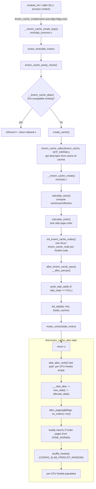
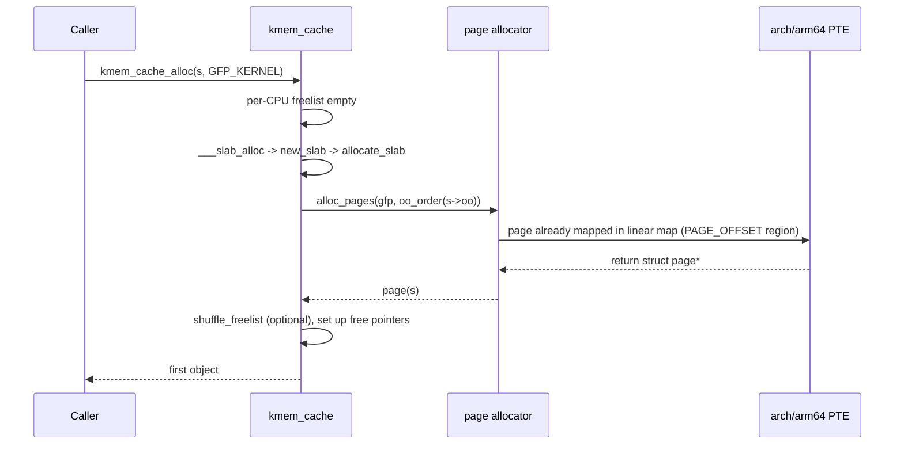

# kmem_cache_create — ARM64 Call Flow

> Linux 6.6 · AArch64. Mostly a slow-path, init-time API; ARM64 specifics
> appear in the per-CPU allocation (`__alloc_percpu`), sysfs creation, and
> the eventual first slab page allocation.

---

## 1. End-to-end Mermaid graph



---

## 2. ARM64-specific bits during creation

### 2.1 `__alloc_percpu` and per-CPU offsets

`alloc_kmem_cache_cpus()` calls `__alloc_percpu(sizeof(struct kmem_cache_cpu), align)` ([`mm/percpu.c`](https://elixir.bootlin.com/linux/v6.6/source/mm/percpu.c)). On arm64, per-CPU data is reached via `tpidr_el1`:

```asm
    mrs     x9, tpidr_el1         ; per-CPU base for this CPU
    add     x10, x9, #cpu_slab_off
    ldr     x11, [x10]            ; -> kmem_cache_cpu fields
```

The per-CPU area itself lives in the percpu allocator's reserved chunks, mapped into kernel VA at boot.

### 2.2 Cache-line alignment with `SLAB_HWCACHE_ALIGN`

On arm64 `cache_line_size()` is read from `CTR_EL0.IDC/DminLine`. Typical values:

| SoC family        | L1 D-cache line |
|-------------------|-----------------|
| Cortex-A53/A72    | 64 B            |
| Cortex-A76+ (most modern Arm) | 64 B |
| Apple M-series    | 128 B           |
| Some Neoverse     | 64 B            |

With `SLAB_HWCACHE_ALIGN`, `s->align` is rounded up to that value — prevents two cache objects from sharing a line (false sharing).

### 2.3 Slab page is always linear-map

The pages backing a slab cache come from the buddy allocator (`alloc_pages`) and thus live in the **linear map** at `PAGE_OFFSET..`. No vmalloc, no per-cache page tables. The PTE attributes are inherited from the linear map (`MT_NORMAL`, EL1 RW, no exec, global).

### 2.4 No TLB work in cache creation itself

The `kmem_cache *` descriptor allocation is just slab + percpu. No new VA mappings are created; no TLB invalidation. The first slab page is allocated **lazily** on the first `kmem_cache_alloc` from this cache.

---

## 3. Locking sequence

```
   kmem_cache_create
     mutex_lock(&slab_mutex)            <- big lock for the slab subsystem
       __kmem_cache_alias()              (read-only scan of slab_caches list)
       create_cache()
         kmem_cache_zalloc(kmem_cache)   (recursive slab alloc; reentrant-safe because
                                          slab_mutex is per-subsystem, not per-cache)
         __kmem_cache_create()
           init_kmem_cache_nodes()       may alloc_pages
           alloc_kmem_cache_cpus()       may take pcpu_lock
         list_add(&s->list, &slab_caches)
     mutex_unlock(&slab_mutex)
```

`slab_mutex` is a sleepable mutex held across the whole creation — reinforces why this API is process-context-only.

---

## 4. Sysfs side effects

`sysfs_slab_add()` creates `/sys/kernel/slab/<name>/` with attribute files. On arm64 this involves kobject infrastructure, kernfs allocations, and ultimately appears under `sysfs_root` in the kernel VA. Tunables exposed:

```
/sys/kernel/slab/<name>/
    object_size           # user-requested size
    slab_size             # actual stride incl. metadata
    align                 # final alignment
    order                 # log2(pages per slab)
    objs_per_slab
    cpu_partial           # writable: per-CPU partial chain length
    min_partial           # writable: node partial threshold
    shrink                # write '1' to shrink empty slabs
    aliases               # other cache names merged into this one
    cpu_slabs / partial / objects   # stats
```

---

## 5. First-alloc-after-create sequence



Note: **no PTE installation, no TLB invalidation** — the linear map is permanent.

---

## 6. KASAN / KFENCE creation hooks

- `kasan_cache_create(s, &size, &flags)` is called inside `__kmem_cache_create` to widen `size` (add redzones) and reserve shadow space.
- `kfence_shutdown_cache()` is registered for teardown.
- The per-object redzone is reflected in `s->size` vs `s->object_size`.

On arm64, KASAN shadow lives at `KASAN_SHADOW_OFFSET` mapped via dedicated PUD entries; cache creation does not need to install shadow PTEs (linear-map shadow is preallocated at boot for the entire physmem).

---

## 7. Quick disassembly hint

```c
static struct kmem_cache *c = kmem_cache_create("foo", 128, 0,
                                                SLAB_HWCACHE_ALIGN, NULL);
```

Releases to:

```asm
    adrp    x0, .Lname
    add     x0, x0, :lo12:.Lname
    mov     w1, #128
    mov     w2, #0
    mov     w3, #0x2000          ; SLAB_HWCACHE_ALIGN
    mov     x4, #0
    bl      kmem_cache_create
    str     x0, [c]
```

Followed (much later) by per-CPU access patterns described in [`../kmem_cache_alloc/03_arm64_callflow.md`](../kmem_cache_alloc/03_arm64_callflow.md).
