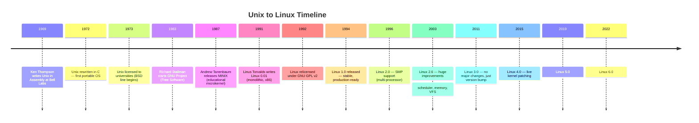
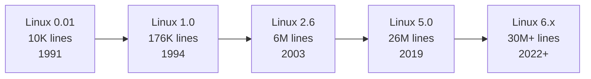
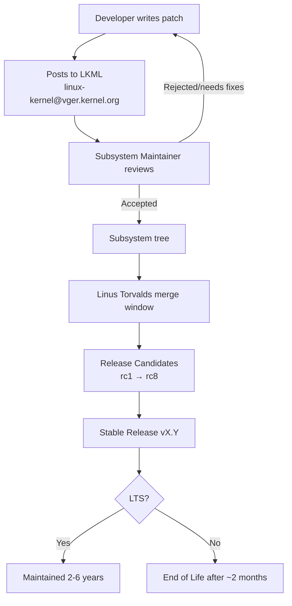

# 01 — History of Unix and Linux

## 1. Definition

The Linux kernel is the result of decades of operating system evolution starting with Unix in the 1960s. Understanding this history explains **why** Linux is designed the way it is — its philosophy, its portability goals, and its open development model.

---

## 2. Timeline: From Unix to Linux



---

## 3. Unix Origins

### 3.1 Bell Labs (1969)
- **Ken Thompson** and **Dennis Ritchie** at AT&T Bell Labs created Unix
- Originally written in **Assembly** for PDP-7
- Goal: small, elegant, multi-user, multi-tasking OS

### 3.2 The C Rewrite (1972)
- Dennis Ritchie created the **C language** specifically to rewrite Unix
- This made Unix the first **portable** operating system
- The same source code could compile on different hardware architectures

### 3.3 Unix Philosophy (Doug McIlroy)
```
1. Write programs that do one thing and do it well.
2. Write programs that work together.
3. Write programs that handle text streams — the universal interface.
```
This philosophy deeply influenced Linux kernel design.

---

## 4. The BSD Line
- AT&T licensed Unix to universities (especially UC Berkeley)
- Berkeley produced **BSD (Berkeley Software Distribution)**
- BSD added: virtual memory, TCP/IP networking, fast filesystem
- Modern derivatives: FreeBSD, OpenBSD, NetBSD, macOS (Darwin core)

---

## 5. The GNU Project

### 5.1 Richard Stallman (1983)
- Physicist/programmer at MIT AI Lab
- Wrote **GNU Manifesto** — argued software should be free
- Started GNU Project to create a completely free Unix-like OS
- Created: `gcc`, `gdb`, `glibc`, `bash`, `emacs`, `coreutils`

### 5.2 The Missing Piece
- By 1991, GNU had **almost all pieces of a complete OS**
- The one missing piece: **the kernel** (GNU Hurd was incomplete)

---

## 6. MINIX and Its Influence

- **Andrew Tanenbaum** created MINIX in 1987 for educational purposes
- **Microkernel** design (very different from Unix monolithic)
- Tanenbaum released source code — but restrictively licensed
- Linus studied MINIX to learn OS development
- Famous **Tanenbaum-Torvalds debate (1992)**: monolithic vs microkernel

---

## 7. Linux is Born

### 7.1 Linus Torvalds (1991)
- Finnish computer science student at University of Helsinki
- Posted to **comp.os.minix** newsgroup on August 25, 1991:

```
Hello everybody out there using minix -
I'm doing a (free) operating system (just a hobby, won't be big and
professional like gnu) for 386(486) AT clones.
                                        — Linus Torvalds
```

### 7.2 Linux 0.01
- ~10,000 lines of code
- Only ran on **Intel 386 hardware**
- Had basic process management, filesystem, terminal
- Released under a **custom restrictive license** initially

### 7.3 GPL Relicensing (1992)
- Linus relicensed Linux under **GNU GPL v2**
- This was a critical decision: it allowed GPL GNU tools to be combined
- Created the **GNU/Linux system** as we know it today

---

## 8. GNU GPL v2 — Key Points

| Aspect | Detail |
|--------|--------|
| Freedom 0 | Run the program for any purpose |
| Freedom 1 | Study and modify the source code |
| Freedom 2 | Redistribute copies |
| Freedom 3 | Distribute modified versions |
| Copyleft | If you distribute binaries, you must provide source code |
| Kernel modules | Controversial — modules must be GPL-compatible (generally) |

---

## 9. Linux Growth



### Major Milestones
| Version | Year | Key Feature |
|---------|------|-------------|
| 0.01 | 1991 | First release, x86 only |
| 1.0 | 1994 | Stable, production use |
| 2.0 | 1996 | SMP (symmetric multiprocessing) |
| 2.2 | 1999 | Better networking, VFS improvements |
| 2.4 | 2001 | USB, Bluetooth, memory improvements |
| 2.6 | 2003 | O(1) scheduler, better threading, many subsystems |
| 3.0 | 2011 | Cleaned up versioning |
| 4.0 | 2015 | Live kernel patching |
| 5.0 | 2019 | New features per release cycle |
| 6.0 | 2022 | Ongoing development |

---

## 10. Open Development Model



### Development Cycle (~10 weeks)
1. **Merge window (2 weeks):** Linus accepts new features from subsystem trees
2. **RC phase (6-8 weeks):** Only bug fixes accepted, release candidates published
3. **Final release:** `vX.Y` tagged and released

---

## 11. Key People in Linux History

| Person | Contribution |
|--------|-------------|
| Linus Torvalds | Creator, BDFL (Benevolent Dictator For Life) |
| Alan Cox | Early networking, x86 stability |
| Ingo Molnár | Scheduler (CFS), real-time patches, security |
| Andrew Morton | Memory management, -mm tree |
| Greg Kroah-Hartman | Stable releases, driver model, USB |
| David Miller | Networking subsystem |
| Al Viro | VFS subsystem |
| Arnd Bergmann | ARM architecture |

---

## 12. Related Concepts
- [02_Linux_Vs_Unix.md](./02_Linux_Vs_Unix.md) — How Linux compares to Unix today
- [04_Monolithic_vs_Microkernel.md](./04_Monolithic_vs_Microkernel.md) — The Tanenbaum-Torvalds debate in depth
- [05_Linux_Kernel_Versions.md](./05_Linux_Kernel_Versions.md) — Current versioning model
