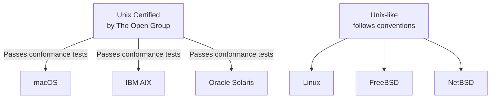
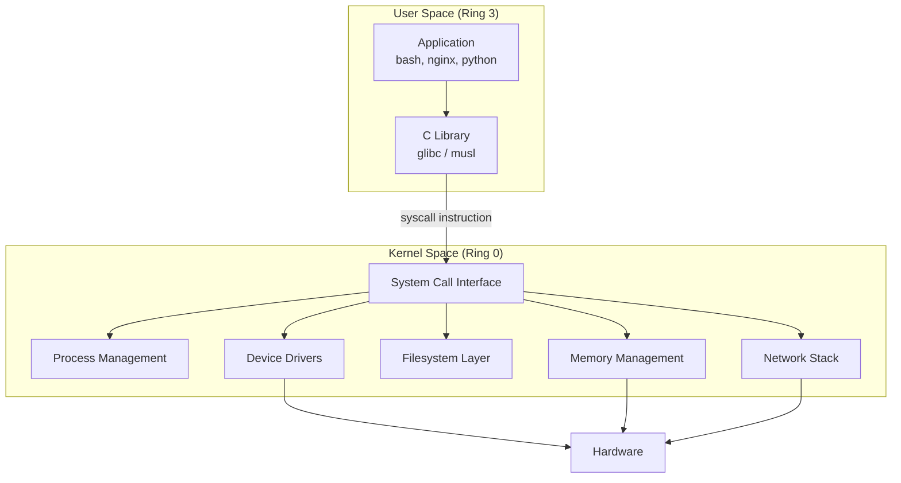

# 02 — Linux vs Unix

## 1. Definition

Linux is a **Unix-like** operating system — it follows Unix conventions and is POSIX-compliant, but it is **not Unix**. Understanding the similarities and differences helps you understand why Linux kernel code looks and behaves the way it does.

---

## 2. What Makes Something "Unix"?



> Linux intentionally follows Unix APIs and conventions but **has never been certified Unix** — this would cost money and is unnecessary for its goals.

---

## 3. POSIX Compliance

**POSIX** (Portable Operating System Interface) is an IEEE standard that defines the API for Unix-like systems.

| Standard | Description |
|----------|-------------|
| POSIX.1 | Core API: files, processes, signals |
| POSIX.1b | Real-time extensions |
| POSIX.1c | Threads (pthreads) |
| POSIX.2 | Shell and utilities |

Linux is **substantially POSIX-compliant** — almost all POSIX programs run on Linux without modification.

---

## 4. Key Similarities: Linux and Unix

| Feature | Unix | Linux |
|---------|------|-------|
| Everything is a file | ✅ | ✅ |
| Hierarchical filesystem | ✅ | ✅ |
| Multi-user, multi-tasking | ✅ | ✅ |
| Pipes and redirection | ✅ | ✅ |
| Fork/exec process model | ✅ | ✅ |
| C standard library | ✅ | ✅ (glibc) |
| System calls | ✅ | ✅ |
| Signals | ✅ | ✅ |
| Permissions (owner/group/other) | ✅ | ✅ |

---

## 5. Key Differences: Linux vs Traditional Unix

| Aspect | Traditional Unix | Linux |
|--------|-----------------|-------|
| **License** | Proprietary (AT&T/commercial) | GPLv2 (free/open source) |
| **Source code** | Closed | Fully open |
| **Development model** | Company teams | Open community + Linus |
| **Hardware support** | Limited platforms | Virtually all hardware |
| **Kernel type** | Monolithic (mostly) | Monolithic with modules |
| **Preemption** | Limited | Full kernel preemption (since 2.6) |
| **Threading** | Various (heavyweight) | NPTL (lightweight, 1:1 model) |
| **Scheduler** | Various | CFS (Completely Fair Scheduler) |
| **Real-time** | Some variants | PREEMPT_RT patches / built-in |
| **Loadable modules** | Rare | Core feature (LKM) |
| **Device model** | Static device files | udev + dynamic /dev |

---

## 6. Linux Unique Features (Not in Traditional Unix)

### 6.1 Loadable Kernel Modules (LKM)
- Load/unload drivers and kernel code at runtime without reboot
- `insmod`, `rmmod`, `modprobe` commands
- Traditional Unix required recompiling or rebooting for new drivers

### 6.2 `/proc` and `/sys` Virtual Filesystems
- Linux exposes kernel internals as files in `/proc` and `/sys`
- `/proc/cpuinfo`, `/proc/meminfo`, `/proc/net/` etc.
- No equivalent in traditional Unix (or it came later)

### 6.3 Preemptive Kernel (since 2.6)
- Linux kernel code itself can be preempted by higher-priority tasks
- Traditional Unix kernels were mostly non-preemptive

### 6.4 Symmetric Multiprocessing (SMP)
- Linux has excellent SMP support since 2.0
- Fine-grained locking throughout the kernel

### 6.5 Control Groups (cgroups)
- Resource control: limit CPU, memory, I/O per group of processes
- Foundation of containers (Docker, Podman, Kubernetes)

### 6.6 Namespaces
- Process, network, filesystem, user namespaces for isolation
- Foundation of Linux containers

---

## 7. The Unix Philosophy Applied in Linux

```mermaid
flowchart LR
    subgraph Unix_Philosophy
        A[Small tools\nthat do one thing]
        B[Compose via pipes]
        C[Everything is a file]
        D[Text streams\nas interfaces]
    end
    subgraph Linux_Kernel
        E[Kernel subsystems\nare modular]
        F[VFS unifies all\nfilesystems]
        G[/proc and /sys\nexpose state as files]
        H[Socket interface\nfor networking]
    end
    A --> E
    C --> F
    C --> G
    D --> H
```

---

## 8. User Space vs Kernel Space



### Protection Rings (x86)
| Ring | Name | Used by |
|------|------|---------|
| Ring 0 | Kernel mode | Linux kernel |
| Ring 1 | (unused) | — |
| Ring 2 | (unused) | — |
| Ring 3 | User mode | All applications |

---

## 9. How Linux Differs from Other Unix-Like Systems

| Feature | Linux | FreeBSD | macOS |
|---------|-------|---------|-------|
| Kernel | Linux kernel | FreeBSD kernel | XNU (Mach + BSD) |
| License | GPLv2 | BSD | Proprietary |
| Package mgmt | apt/yum/pacman | pkg/ports | Homebrew/App Store |
| Init system | systemd (mostly) | rc scripts / openrc | launchd |
| libc | glibc / musl | FreeBSD libc | libSystem |
| Scheduler | CFS | ULE | |
| ZFS support | optional | native | limited |
| Containers | native (cgroups+ns) | jails | limited |
| Kernel modules | LKM | KLD | kext |

---

## 10. Related Concepts
- [01_History_Of_Unix_And_Linux.md](./01_History_Of_Unix_And_Linux.md) — How Linux came to be
- [03_Kernel_Architecture_Overview.md](./03_Kernel_Architecture_Overview.md) — Inside the Linux kernel
- [04_Monolithic_vs_Microkernel.md](./04_Monolithic_vs_Microkernel.md) — Design comparison
