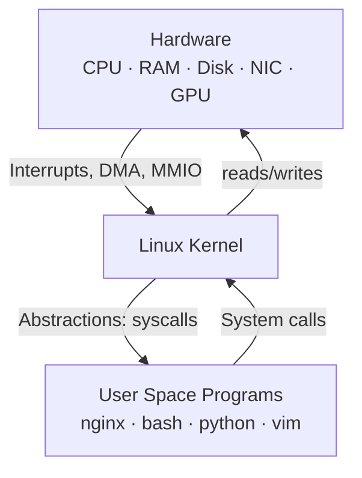
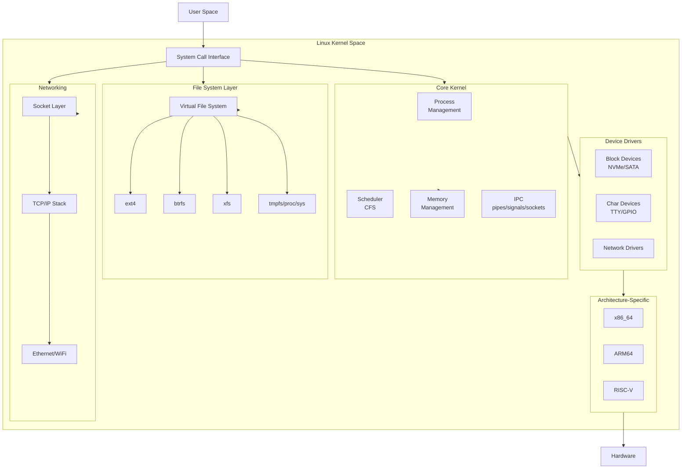
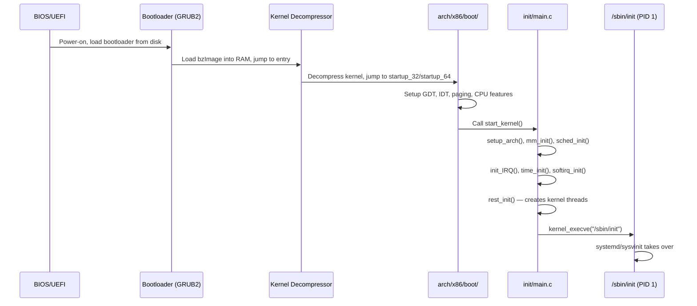
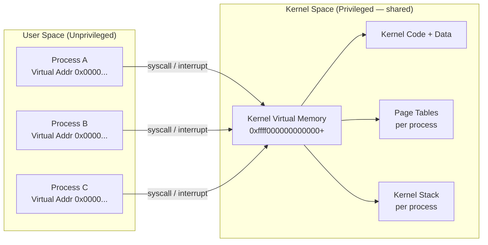
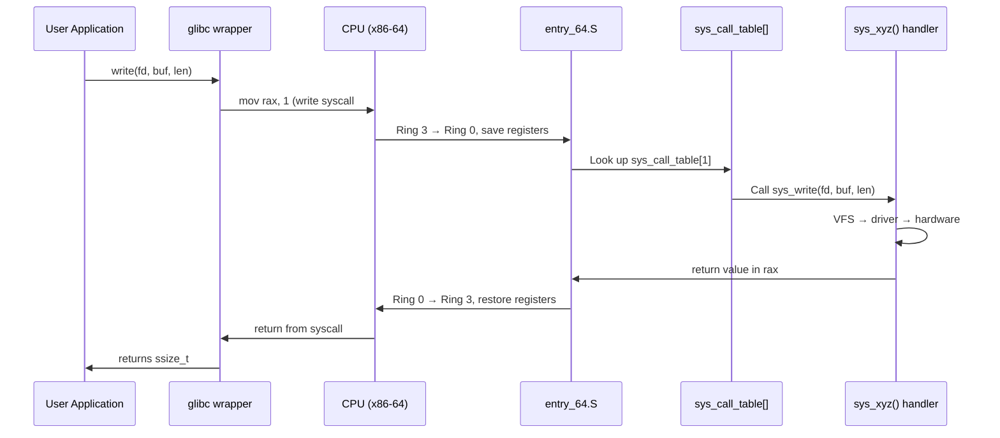
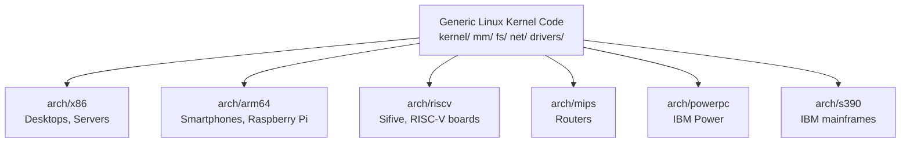

# 03 — Kernel Architecture Overview

## 1. Definition

The **kernel** is the core of the operating system. It is the software that manages hardware resources and provides abstractions (processes, files, network) for user programs to use safely and efficiently.

Linux is a **monolithic kernel** — all kernel services run in a single large program in a single address space with full hardware access.

---

## 2. What the Kernel Does



### Six Core Responsibilities

| Responsibility | Description | Kernel Subsystem |
|----------------|-------------|-----------------|
| **Process Management** | Create, schedule, terminate processes/threads | `kernel/` |
| **Memory Management** | Virtual memory, page allocation, swap | `mm/` |
| **File System** | File I/O, filesystem abstraction (VFS) | `fs/` |
| **Device Drivers** | Communicate with hardware | `drivers/` |
| **Networking** | TCP/IP stack, sockets | `net/` |
| **Security** | Permissions, capabilities, LSM (SELinux) | `security/` |

---

## 3. Kernel Subsystem Architecture



---

## 4. Kernel Source Tree Layout

```
linux/
├── arch/           # Architecture-specific code (x86, arm64, riscv...)
├── block/          # Block layer (bio, request queue, I/O schedulers)
├── crypto/         # Cryptographic API
├── drivers/        # All device drivers (huge — ~60% of kernel)
├── fs/             # Filesystems (ext4, btrfs, xfs, vfs core...)
├── include/        # Kernel headers
│   ├── linux/      # Core kernel headers
│   └── uapi/       # User-space API headers
├── init/           # Kernel init (main.c — start_kernel())
├── ipc/            # IPC: pipes, semaphores, shared memory
├── kernel/         # Core kernel: scheduler, fork, signal, time...
├── lib/            # General-purpose library functions
├── mm/             # Memory management
├── net/            # Networking stack
├── security/       # LSM framework: SELinux, AppArmor, seccomp
├── sound/          # Audio subsystem (ALSA)
├── tools/          # User-space tools for kernel development
├── Documentation/  # Kernel documentation
├── Makefile        # Top-level build file
└── Kconfig         # Configuration system root
```

---

## 5. Kernel Boot Flow



### Key Functions in Boot
| Function | File | What it does |
|----------|------|-------------|
| `start_kernel()` | `init/main.c` | Main kernel entry point |
| `setup_arch()` | `arch/x86/kernel/setup.c` | Architecture initialization |
| `mm_init()` | `init/main.c` | Initialize memory management |
| `sched_init()` | `kernel/sched/core.c` | Initialize the scheduler |
| `rest_init()` | `init/main.c` | Create kernel threads, hand off to init |

---

## 6. User Space vs Kernel Space (Deep Dive)



### Virtual Address Space (x86-64 Linux)
```
0x0000000000000000 - 0x00007fffffffffff  → User space (128 TB)
0xffff800000000000 - 0xffffffffffffffff  → Kernel space (128 TB)
```

---

## 7. System Call Interface — The Bridge



---

## 8. Kernel Mode Switch Triggers

| Trigger | Description |
|---------|-------------|
| **System Call** | User program uses `syscall` instruction |
| **Hardware Interrupt** | CPU receives IRQ (disk, NIC, timer...) |
| **Software Exception** | Page fault, divide-by-zero, invalid opcode |
| **Software Interrupt** | `int 0x80` (legacy x86 syscall mechanism) |

---

## 9. Kernel Portability

The kernel abstracts hardware via `arch/` directories:



---

## 10. Key Data Types & Conventions in Kernel Code

| Convention | Meaning |
|-----------|---------|
| `__u8`, `__u16`, `__u32`, `__u64` | Unsigned fixed-width integers |
| `__s8`, `__s16`, `__s32`, `__s64` | Signed fixed-width integers |
| `pid_t` | Process ID |
| `uid_t`, `gid_t` | User/group ID |
| `dev_t` | Device number |
| `sector_t` | Disk sector number |
| `pgoff_t` | Page offset in file |
| `gfp_t` | Memory allocation flags |
| `atomic_t` | Atomic integer (thread-safe) |

---

## 11. Related Concepts
- [04_Monolithic_vs_Microkernel.md](./04_Monolithic_vs_Microkernel.md) — Why Linux is monolithic
- [../01_Getting_Started_With_The_Kernel/01_Kernel_Source_Tree_Layout.md](../01_Getting_Started_With_The_Kernel/01_Kernel_Source_Tree_Layout.md) — Navigating the source tree
- [../04_System_Calls/01_What_Are_System_Calls.md](../04_System_Calls/01_What_Are_System_Calls.md) — System calls in depth
