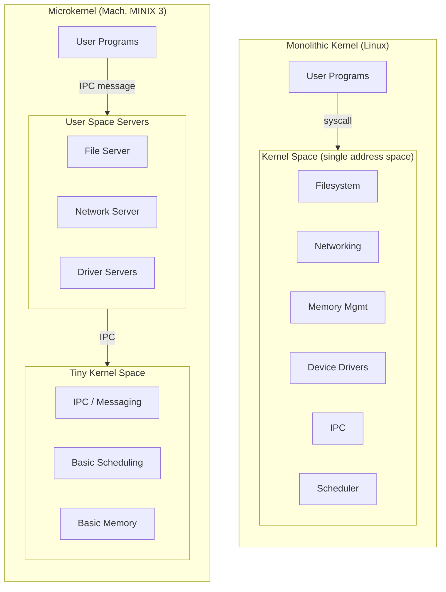
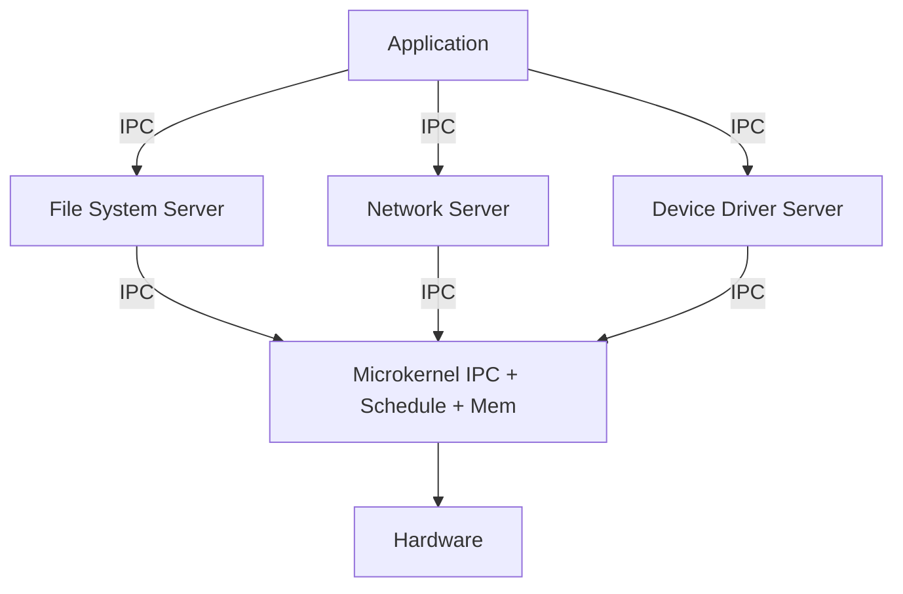
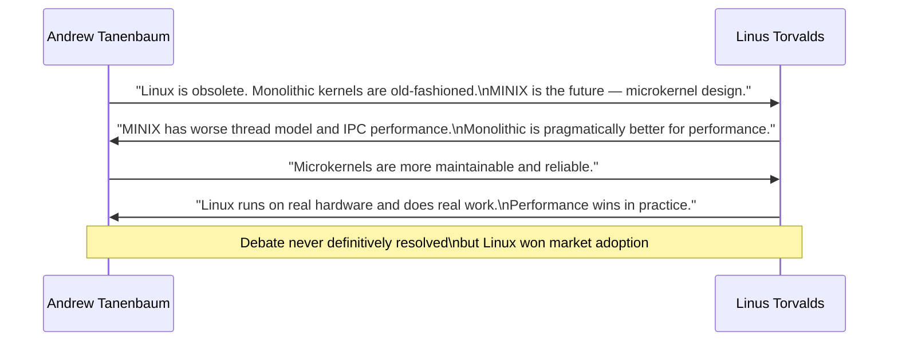
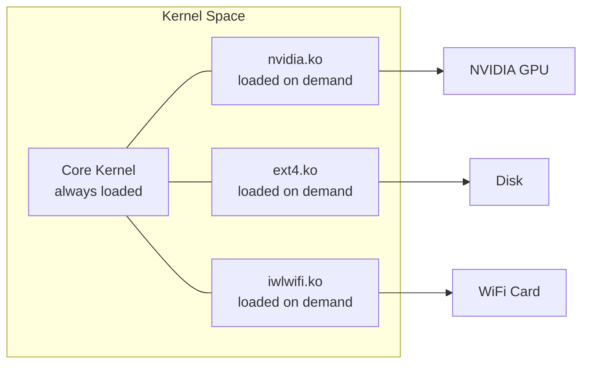
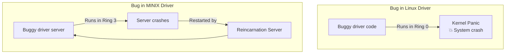

# 04 — Monolithic vs Microkernel Design

## 1. Definition

A kernel's **architecture** determines how its components are organized, how they communicate, and what runs in privileged mode. The two main philosophies are:

- **Monolithic kernel** — all OS services in one large privileged program
- **Microkernel** — minimal kernel; most services run as user-space servers

Linux chose **monolithic** (with loadable modules).

---

## 2. Architectural Comparison

---

## 3. Monolithic Kernel Deep Dive

### 3.1 Characteristics
- **All kernel services** (filesystem, networking, drivers, memory) run in **kernel space** (Ring 0)
- Direct function calls between subsystems — no message passing overhead
- A bug in any subsystem can crash the entire kernel
- Traditionally not preemptible (Linux added preemption in 2.6)

### 3.2 Advantages
| Advantage | Explanation |
|-----------|-------------|
| **Performance** | Direct function calls, no context switching between servers |
| **Simplicity of sharing** | All subsystems share same address space — easy to share data |
| **Mature ecosystem** | Decades of optimization in Linux |
| **Loadable modules** | Can add/remove functionality without reboot |

### 3.3 Disadvantages
| Disadvantage | Explanation |
|-------------|-------------|
| **Stability** | A buggy driver can panic the whole kernel |
| **Security** | A compromised driver has full kernel access |
| **Large footprint** | Kernel binary is large |
| **Difficult to test** | Components are tightly coupled |

---

## 4. Microkernel Deep Dive

### 4.1 Characteristics
- Only **IPC, basic scheduling, and basic memory management** run in kernel space
- Everything else (filesystems, device drivers, network stack) runs as **user-space servers**
- Servers communicate via **message passing (IPC)**
- A crashed driver server can be restarted without rebooting

### 4.2 Core Services in Microkernel

### 4.3 Advantages
| Advantage | Explanation |
|-----------|-------------|
| **Reliability** | Server crash doesn't take down the kernel |
| **Security** | Driver has only user-space privileges |
| **Modularity** | Clean interfaces via IPC |
| **Easier to verify** | Small kernel can be formally verified (seL4) |

### 4.4 Disadvantages
| Disadvantage | Explanation |
|-------------|-------------|
| **Performance overhead** | IPC between servers is expensive |
| **Complexity** | Shared state is hard across process boundaries |
| **Debugging** | Distributed system debugging is harder |

---

## 5. The Tanenbaum-Torvalds Debate (1992)

This famous debate on **comp.os.minix** defined the split in OS design thinking.

### Tanenbaum's Points
- Monolithic kernels are 1970s technology
- Microkernels are the future (research direction)
- Linux tied to x86 — will not port well

### Torvalds' Points  
- Performance matters — IPC overhead is real
- Pragmatic design beats theoretical purity
- Linux already works on real hardware

### Who Was Right?
- Tanenbaum's research influenced formal verification (seL4, L4)
- Torvalds' approach dominated commercial/desktop/server/embedded use
- In practice: **both** are valid for different contexts

---

## 6. Hybrid Kernels

Modern OSes blur the line:

| OS | Type | Description |
|----|------|-------------|
| **Linux** | Monolithic + Modules | Core monolithic, drivers as modules |
| **macOS / XNU** | Hybrid | Mach microkernel + BSD monolithic layer |
| **Windows NT** | Hybrid | Executive services in kernel, but structured |
| **MINIX 3** | Microkernel | Pure microkernel |
| **seL4** | Microkernel | Formally verified microkernel |
| **QNX** | Microkernel | Used in embedded/automotive (BlackBerry) |

---

## 7. Linux Modules — Best of Both Worlds

Linux gets some microkernel benefits via **Loadable Kernel Modules (LKM)**:

### Module Advantages
- Load only what you need (small embedded systems)
- Reload a buggy driver without rebooting (in development)
- Distribute proprietary drivers without kernel source (controversial)
- Hot-plug hardware support

### Module Limitations vs Microkernel
- A loaded module **still runs in Ring 0** — a bug can still panic the kernel
- No fault isolation — unlike a microkernel server

---

## 8. Linux vs MINIX Security Model

---

## 9. Related Concepts
- [03_Kernel_Architecture_Overview.md](./03_Kernel_Architecture_Overview.md) — Full kernel subsystem map
- [../16_Devices_And_Modules/02_Kernel_Modules.md](../16_Devices_And_Modules/02_Kernel_Modules.md) — How LKMs work in detail
