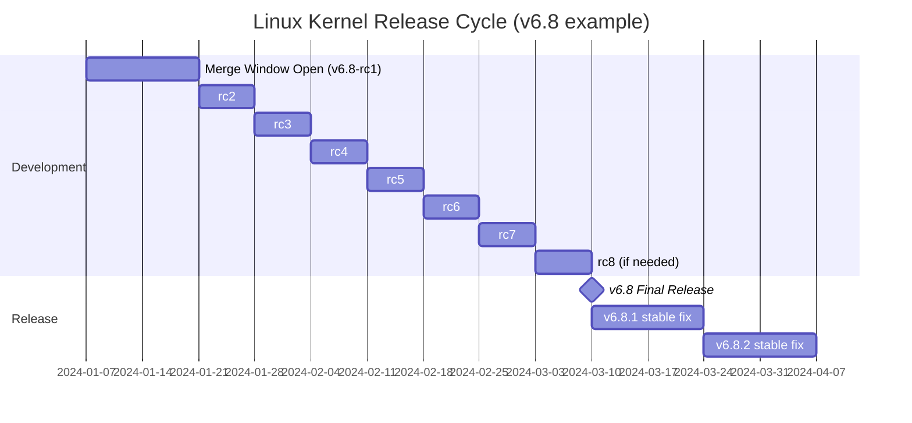
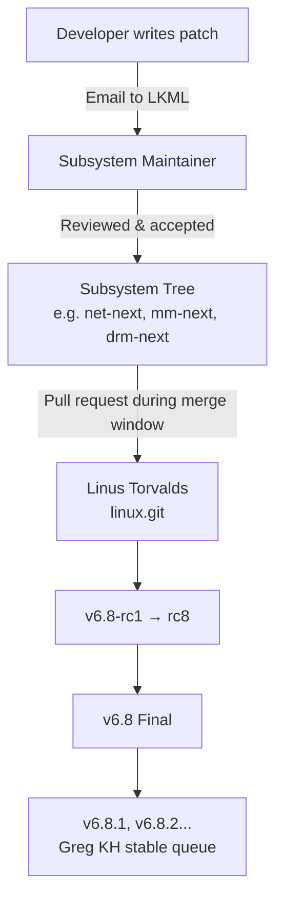
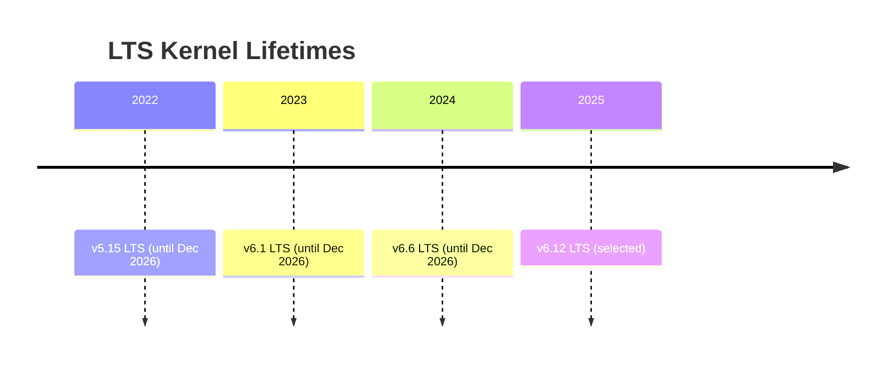

# 05 — Linux Kernel Versions and Release Model

## 1. Definition

The Linux kernel uses a **structured versioning scheme** and a **time-based release cycle** managed by Linus Torvalds and subsystem maintainers. Understanding this is required for kernel development participation and for knowing which features exist in which version.

---

## 2. Version Number Format

```
v6.8.2
│ │ │
│ │ └── Patch level (stable fixes only — no new features)
│ └──── Minor version (new features, released every ~10 weeks)
└────── Major version (incremented periodically, no strict rule)
```

### Examples
| Version | Type | Notes |
|---------|------|-------|
| `v6.8` | Mainline release | New features, from Linus |
| `v6.8.1` | Stable update | Bug + security fixes only |
| `v6.6 LTS` | Long-Term Support | Maintained for ~6 years |
| `v6.8-rc3` | Release Candidate | Not for production |

---

## 3. The Release Cycle (~10 Weeks)



### Phase Details

| Phase | Duration | What Happens |
|-------|----------|-------------|
| **Merge Window** | ~2 weeks | Linus pulls from subsystem trees (new features accepted) |
| **RC1 (rc1)** | Day ~14 | Merge window closes, first release candidate tagged |
| **RC phase** | 6–8 weeks | Only bug fixes, regressions fixed. rc2→rc8 |
| **Final Release** | Week ~10 | `vX.Y` tagged, announced on LKML |
| **Stable updates** | Ongoing | `vX.Y.Z` patches (bug/security fixes) |

---

## 4. Subsystem Tree Flow



### Major Subsystem Trees
| Subsystem | Maintainer | Tree |
|-----------|-----------|------|
| Net | David S. Miller / Jakub Kicinski | `net-next` |
| Memory management | Andrew Morton | `-mm` |
| Filesystems | Various | `vfs.git`, `ext4.git` |
| ARM64 | Catalin Marinas / Will Deacon | `arm64` |
| x86 | Thomas Gleixner / Ingo Molnár | `tip` (tip.git) |
| Scheduler | Peter Zijlstra / Ingo Molnár | `tip/sched` |
| Drivers/GPU | Dave Airlie | `drm-next` |
| USB | Greg KH | `usb-next` |

---

## 5. Long-Term Support (LTS)

Some kernels are designated **LTS** by kernel developers and maintained for years. These are used by Android, embedded systems, enterprise distros.



### LTS vs Mainline vs Stable

| Type | Example | Lifecycle | Who uses it |
|------|---------|-----------|------------|
| Mainline | `v6.8` | ~10 weeks | Enthusiasts, developers |
| Stable | `v6.8.z` | ~2 months | Desktop users |
| LTS | `v6.6` | 2–6 years | Android, embedded, enterprise |
| EOL | `v5.4` | Dead | Migrate away |

---

## 6. Distribution Kernels

Linux distributions modify the upstream kernel:

| Distribution | Base Kernel | Modifications |
|--------------|-------------|---------------|
| Ubuntu 24.04 | v6.8 | Governance, security patches, backports |
| RHEL 9 | v5.14 LTS | Heavy patching, enterprise stability focus |
| Debian 12 | v6.1 LTS | Minimal patches, focus on stability |
| Android 14 | v5.15 LTS | Android-specific patches (Binder, ION, etc.) |
| Fedora 40 | v6.8 | Close to upstream |
| Arch Linux | Latest mainline | Almost vanilla |

> **Rule:** When doing kernel development, always work against **mainline** kernel source (`git.kernel.org`), not a distro kernel.

---

## 7. Where to Get the Kernel Source

```
Official repos:
  https://git.kernel.org/pub/scm/linux/kernel/git/torvalds/linux.git/
  https://kernel.org   ← tarball downloads

Clone mainline:
  git clone https://git.kernel.org/pub/scm/linux/kernel/git/torvalds/linux.git

Clone stable:
  git clone https://git.kernel.org/pub/scm/linux/kernel/git/stable/linux.git
```

---

## 8. Checking Kernel Version

```bash
# Runtime version
uname -r                    # e.g., 6.8.0-41-generic

# Detailed info
uname -a

# From source tree
head Makefile               # Shows VERSION, PATCHLEVEL, SUBLEVEL
cat /proc/version           # Kernel version + build info
```

---

## 9. Key Kernel Configuration Files

| File | Purpose |
|------|---------|
| `Makefile` | Top-level build; contains VERSION |
| `Kconfig` | Configuration system (menuconfig) |
| `.config` | Current build configuration |
| `include/linux/version.h` | Generated version header |
| `include/generated/utsrelease.h` | UTS release string |

---

## 10. Related Concepts
- [../01_Getting_Started_With_The_Kernel/02_Building_The_Kernel.md](../01_Getting_Started_With_The_Kernel/02_Building_The_Kernel.md) — Building from source
- [../01_Getting_Started_With_The_Kernel/05_Kernel_Development_Community.md](../01_Getting_Started_With_The_Kernel/05_Kernel_Development_Community.md) — Submitting patches
