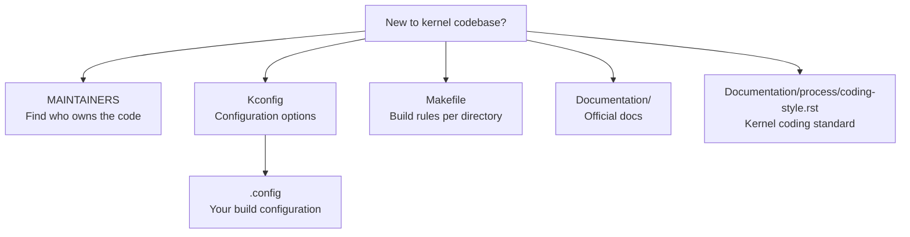

# 01 — Kernel Source Tree Layout

## 1. Definition

The **Linux kernel source tree** is a git repository (~1GB) containing all kernel code, documentation, build scripts, and architecture support. Understanding the layout is the first skill for any kernel developer.

---

## 2. Getting the Source

```bash
# Clone mainline (Linus's tree)
git clone https://git.kernel.org/pub/scm/linux/kernel/git/torvalds/linux.git
cd linux

# Or download tarball from kernel.org
wget https://cdn.kernel.org/pub/linux/kernel/v6.x/linux-6.8.tar.xz
tar xf linux-6.8.tar.xz
cd linux-6.8
```

---

## 3. Top-Level Directory Structure

```
linux/
├── arch/           # CPU architecture-specific code
├── block/          # Block layer: bio, I/O scheduler, request queue
├── certs/          # Kernel signing certificates
├── crypto/         # Cryptographic algorithms (AES, SHA, etc.)
├── Documentation/  # Kernel documentation (also at docs.kernel.org)
├── drivers/        # Device drivers (~60% of total codebase)
├── fs/             # Filesystems (ext4, btrfs, xfs, vfs...)
├── include/        # Kernel header files
├── init/           # Kernel initialization (start_kernel)
├── ipc/            # IPC: pipes, semaphores, shared memory, message queues
├── kernel/         # Core kernel: fork, exec, signal, time, scheduler
├── lib/            # Library routines: string, bitmap, sorting, list
├── mm/             # Memory management: pages, slab, vmalloc, mmap
├── net/            # Networking: TCP/IP, socket, protocol implementations
├── samples/        # Example kernel code (for learning)
├── scripts/        # Build system scripts, checkpatch.pl, etc.
├── security/       # LSM, SELinux, AppArmor, seccomp
├── sound/          # ALSA audio subsystem
├── tools/          # User-space kernel tools (perf, ftrace, etc.)
├── usr/            # initramfs generation
├── virt/           # Virtualization (KVM)
│
├── Kconfig         # Root Kconfig (configuration system entry)
├── Makefile        # Top-level build file
├── MAINTAINERS     # Who maintains each subsystem (critical reference!)
├── COPYING         # GPLv2 license
└── README          # Very brief intro
```

---

## 4. Most Important Directories in Detail

### 4.1 `arch/` — Architecture Support

```
arch/
├── x86/            # Intel/AMD 64-bit and 32-bit
│   ├── boot/       # Boot code (startup_32, startup_64, decompressor)
│   ├── kernel/     # Core arch code (entry.S, process.c, signal.c)
│   ├── mm/         # x86 memory management (page tables, TLB)
│   └── include/    # x86 headers
├── arm64/          # ARM 64-bit (phones, Raspberry Pi 4+, Apple M1)
├── arm/            # ARM 32-bit (older embedded)
├── riscv/          # RISC-V
├── mips/           # MIPS (routers)
├── powerpc/        # IBM Power
├── s390/           # IBM mainframe
└── ...             # 20+ architectures total
```

### 4.2 `kernel/` — Core Kernel

```
kernel/
├── sched/          # Process scheduler (CFS, RT, idle)
│   ├── core.c      # Main scheduler code
│   ├── fair.c      # CFS implementation
│   └── rt.c        # Real-time scheduler
├── fork.c          # fork(), vfork(), clone(), copy_process()
├── exit.c          # do_exit(), wait4()
├── signal.c        # Signal delivery and handling
├── sys.c           # Misc system calls
├── timer.c         # Kernel timers
├── time/           # Timekeeping (hrtimers, clockevents)
├── locking/        # Mutex, spin_lock, rwlock, RCU
├── printk/         # printk() implementation
├── kthread.c       # Kernel thread API
└── module.c        # Loadable module support
```

### 4.3 `mm/` — Memory Management

```
mm/
├── page_alloc.c    # Page allocator (buddy system)
├── slub.c          # SLUB allocator (default slab allocator)
├── slab.c          # SLAB allocator (older)
├── vmalloc.c       # vmalloc/vfree
├── mmap.c          # mmap/munmap/mremap
├── memory.c        # Page fault handler (__do_page_fault)
├── swap.c          # Swap space management
├── vmscan.c        # Page reclaim (kswapd)
├── oom_kill.c      # Out-of-memory killer
└── hugetlb.c       # Huge pages support
```

### 4.4 `fs/` — Filesystems

```
fs/
├── vfs/            # VFS layer (abstract interface)
├── ext4/           # ext4 filesystem
├── btrfs/          # Btrfs filesystem
├── xfs/            # XFS filesystem
├── tmpfs/          # tmpfs (RAM-based)
├── proc/           # /proc virtual filesystem
├── sysfs/          # /sys virtual filesystem
├── nfs/            # NFS client
├── fat/            # FAT/VFAT (USB drives, Windows)
├── open.c          # open(), close()
├── read_write.c    # read(), write()
├── namei.c         # Path resolution (filename → inode)
└── inode.c         # Inode operations
```

### 4.5 `drivers/` — Device Drivers

```
drivers/
├── net/            # Network drivers (e1000, r8169, iwlwifi)
├── block/          # Block device drivers
├── nvme/           # NVMe SSD driver
├── scsi/           # SCSI subsystem + drivers
├── gpu/            # GPU drivers (DRM): i915, amdgpu, nouveau
├── usb/            # USB subsystem + drivers
├── pci/            # PCI bus
├── i2c/            # I2C bus
├── spi/            # SPI bus
├── gpio/           # GPIO
├── input/          # Keyboard, mouse, touchscreen
├── char/           # Character devices (tty, random, mem)
├── tty/            # TTY subsystem
└── platform/       # Platform devices (embedded)
```

---

## 5. Key Files Every Kernel Developer Reads


```

### `MAINTAINERS` File
- Lists every subsystem, who maintains it, what files belong to it
- Use `scripts/get_maintainer.pl` to find who reviews a patch:

```bash
perl scripts/get_maintainer.pl drivers/net/ethernet/intel/e1000/e1000_main.c
```

---

## 6. `include/` — Header Files

```
include/
├── linux/          # Core kernel headers (used by kernel code)
│   ├── sched.h     # struct task_struct, scheduler API
│   ├── mm.h        # Memory management
│   ├── fs.h        # VFS: struct inode, struct file, struct super_block
│   ├── interrupt.h # interrupt handlers, IRQ API
│   ├── spinlock.h  # Spin locks
│   ├── mutex.h     # Mutex
│   ├── list.h      # Linked list API
│   ├── types.h     # Kernel types (pid_t, u8, u32...)
│   └── kernel.h    # Core macros: printk, BUG(), WARN()
├── uapi/linux/     # User-space API headers (exposed to userland)
│   ├── fcntl.h     # O_RDONLY, O_WRONLY, etc.
│   └── ioctl.h     # ioctl() numbers
└── asm/            # Architecture-specific headers (symlink to arch/)
```

---

## 7. Navigating the Source Efficiently

### Tools
```bash
# cscope — fast symbol search
make cscope
cscope -d                   # launches interactive browser

# ctags — tag generation for vim/emacs
make tags
vim -t task_struct          # jump to definition

# grep — quick search
grep -r "copy_process" kernel/ --include="*.c"

# ripgrep (faster)
rg "copy_process" kernel/

# git log — understand history of a file
git log --oneline fs/ext4/super.c

# git blame — who wrote which line
git blame mm/page_alloc.c
```

### Find Who Owns a File
```bash
perl scripts/get_maintainer.pl <file>
```

---

## 8. Important Documentation Files

| Path | Content |
|------|---------|
| `Documentation/process/coding-style.rst` | Kernel coding style guide |
| `Documentation/process/submitting-patches.rst` | How to submit patches |
| `Documentation/process/development-process.rst` | Full dev process overview |
| `Documentation/admin-guide/kernel-parameters.txt` | Boot parameters |
| `Documentation/core-api/` | Core kernel APIs |
| `Documentation/filesystems/vfs.rst` | VFS internals |

---

## 9. Related Concepts
- [02_Building_The_Kernel.md](./02_Building_The_Kernel.md) — Compiling the kernel
- [03_Kernel_Configuration.md](./03_Kernel_Configuration.md) — Kconfig system
- [05_Kernel_Development_Community.md](./05_Kernel_Development_Community.md) — Development workflow
