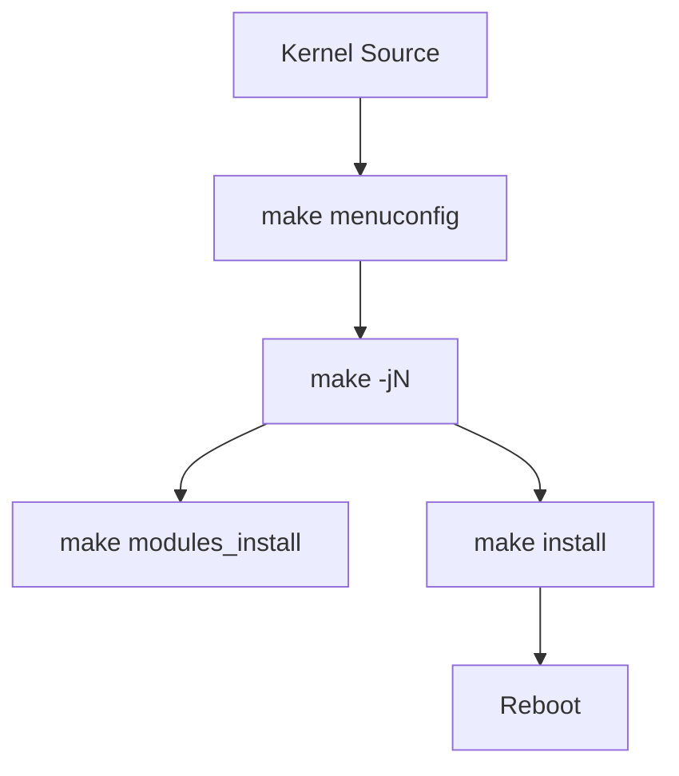
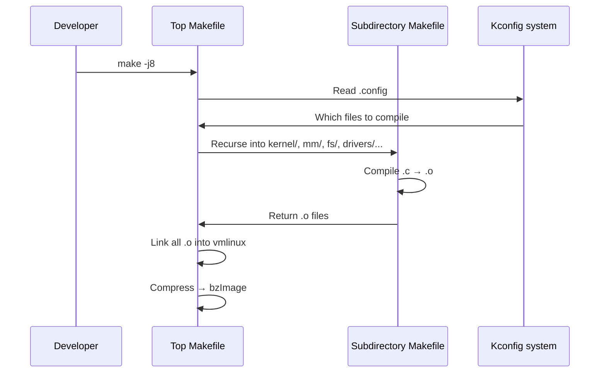

# 02 — Building the Linux Kernel

## 1. Definition

Building the kernel means **compiling the source code** into a binary that can be loaded and executed by the bootloader. It involves configuration, compilation, and installation steps.

---

## 2. Prerequisites (Ubuntu/Debian)

```bash
sudo apt-get install \
    build-essential \
    libncurses-dev \
    libssl-dev \
    libelf-dev \
    flex \
    bison \
    bc \
    dwarves \
    git \
    make \
    gcc
```

---

## 3. Build Process Overview

```mermaid
flowchart TD
    Src[Kernel Source Code] --> Config[1. Configure\nmake menuconfig]
    Config --> DotConfig[.config file]
    DotConfig --> Compile[2. Compile\nmake -j\$(nproc\)]
    Compile --> Vmlinux[vmlinux\nuncompressed kernel ELF]
    Compile --> Modules[*.ko module files]
    Vmlinux --> BzImage[arch/x86/boot/bzImage\ncompressed bootable kernel]
    BzImage --> Install[3. Install\nmake install]
    Modules --> ModInstall[4. Install modules\nmake modules_install]
    Install --> GRUB[5. Update GRUB\nupdate-grub]
    ModInstall --> GRUB
    GRUB --> Boot[6. Boot new kernel]
```

---

## 4. Step-by-Step Build

### Step 1: Get the Source
```bash
git clone https://git.kernel.org/pub/scm/linux/kernel/git/torvalds/linux.git
cd linux
```

### Step 2: Configure
```bash
# Option A: Use current running kernel's config (recommended for beginners)
cp /boot/config-$(uname -r) .config
make olddefconfig         # Accept defaults for new options

# Option B: Interactive TUI menu
make menuconfig

# Option C: Minimal config for testing (not for production)
make allnoconfig
make tinyconfig

# Option D: Defconfig (architecture default)
make defconfig            # x86_64 defaults
```

### Step 3: Compile
```bash
# Compile with all CPU cores
make -j$(nproc)

# Or specify core count
make -j8

# Cross-compile for ARM64
ARCH=arm64 CROSS_COMPILE=aarch64-linux-gnu- make -j$(nproc)
```

### Step 4: Install Modules
```bash
sudo make modules_install
# Installs to /lib/modules/$(kernelversion)/
```

### Step 5: Install Kernel
```bash
sudo make install
# Copies bzImage to /boot/
# Copies System.map to /boot/
# Runs update-grub automatically (on many distros)
```

### Step 6: Update Bootloader
```bash
sudo update-grub      # Debian/Ubuntu
# or
sudo grub2-mkconfig -o /boot/grub2/grub.cfg   # Fedora/RHEL
```

### Step 7: Reboot
```bash
sudo reboot
# Select new kernel in GRUB menu
uname -r         # Verify new kernel is running
```

---

## 5. Build Artifacts


```

| File | Location | Purpose |
|------|----------|---------|
| `vmlinux` | `linux/` | Full uncompressed ELF kernel (for debugging, crash analysis) |
| `bzImage` | `arch/x86/boot/bzImage` | Compressed bootable kernel (what GRUB loads) |
| `System.map` | `linux/` | Kernel symbol → address mapping |
| `.config` | `linux/` | Your current configuration |
| `*.ko` | Throughout source | Loadable kernel modules |

---

## 6. Kernel Build System (Kbuild)

The kernel uses a custom build system called **Kbuild** based on GNU Make.

### How Kbuild works:


### Makefile in a subdirectory:
```makefile
# drivers/char/Makefile
obj-y         += mem.o random.o        # Always compiled in
obj-$(CONFIG_TTY) += tty_io.o          # Compiled if CONFIG_TTY=y in .config
obj-m         += mydriver.o            # Compiled as module
```

| Kbuild variable | Meaning |
|----------------|---------|
| `obj-y` | Compile into kernel image |
| `obj-m` | Compile as loadable module |
| `obj-$(CONFIG_FOO)` | Compile based on config option |

---

## 7. Cross-Compilation

Cross-compilation builds a kernel for a **different architecture** than the host machine.

```bash
# Install cross-compiler
sudo apt-get install gcc-aarch64-linux-gnu

# Build for ARM64
export ARCH=arm64
export CROSS_COMPILE=aarch64-linux-gnu-

make defconfig
make -j$(nproc)
```

### Common ARCH values
| ARCH | Target |
|------|--------|
| `x86_64` or `x86` | Intel/AMD 64-bit |
| `arm64` or `aarch64` | ARM 64-bit |
| `arm` | ARM 32-bit |
| `riscv` | RISC-V |
| `mips` | MIPS |

---

## 8. Important Make Targets

| Target | Description |
|--------|-------------|
| `make menuconfig` | Interactive TUI configuration |
| `make olddefconfig` | Accept defaults for new config options |
| `make defconfig` | Architecture default config |
| `make` / `make all` | Build kernel + modules |
| `make -j$(nproc)` | Parallel build |
| `make modules` | Build modules only |
| `make modules_install` | Install modules to /lib/modules/ |
| `make install` | Install kernel to /boot/ |
| `make clean` | Remove built objects |
| `make mrproper` | Remove built objects + .config |
| `make distclean` | `mrproper` + remove editor files |
| `make tags` | Generate ctags for code navigation |
| `make cscope` | Generate cscope database |
| `make htmldocs` | Build HTML documentation |
| `make dtbs` | Build device tree blobs (ARM/embedded) |

---

## 9. Speeding Up Builds

```bash
# Use ccache (compiler cache — dramatic speedup on rebuilds)
sudo apt-get install ccache
export CC="ccache gcc"
make -j$(nproc)

# Incremental build — only changed files
make -j$(nproc)     # Run again after small change — much faster

# Out-of-tree build (keep source clean)
mkdir /tmp/kernel-build
make O=/tmp/kernel-build menuconfig
make O=/tmp/kernel-build -j$(nproc)
```

---

## 10. Build Time Reference

| System | Cores | Approx Build Time |
|--------|-------|-------------------|
| Modern laptop (i7) | 8 | ~5-10 minutes |
| VM (2 cores) | 2 | ~30-60 minutes |
| Raspberry Pi 4 | 4 | ~2 hours (native) |
| Cross-compile on server | 32 | ~2-3 minutes |

---

## 11. Related Concepts
- [03_Kernel_Configuration.md](./03_Kernel_Configuration.md) — Deep dive into Kconfig
- [04_Installing_The_Kernel.md](./04_Installing_The_Kernel.md) — Installation details
- [../16_Devices_And_Modules/02_Kernel_Modules.md](../16_Devices_And_Modules/02_Kernel_Modules.md) — Building out-of-tree modules
