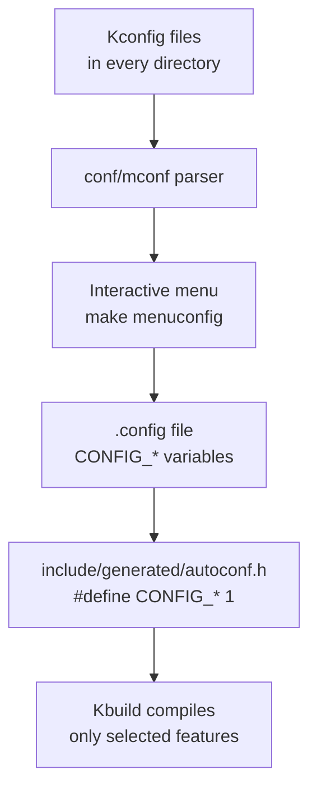
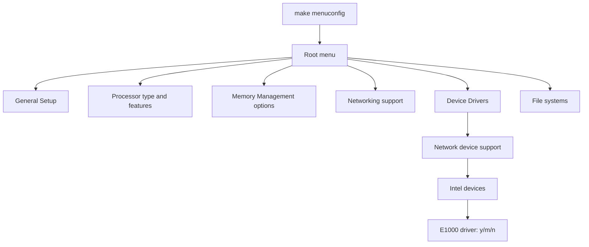

# 03 — Kernel Configuration (Kconfig)

## 1. Definition

The **Kconfig system** allows the kernel to be configured — enabling or disabling features, choosing between implementations, and setting parameters — before compilation. Configuration produces the `.config` file that Kbuild reads.

---

## 2. Configuration Flow



---

## 3. Kconfig Interfaces

| Command | Interface | Best for |
|---------|-----------|---------|
| `make menuconfig` | TUI (ncurses) | Interactive configuration |
| `make xconfig` | Qt GUI | Graphical exploration |
| `make gconfig` | GTK GUI | Graphical exploration |
| `make nconfig` | Newer TUI | Alternative to menuconfig |
| `make oldconfig` | Command line | Upgrade from old .config |
| `make olddefconfig` | Automatic | Accept new options as defaults |
| `make defconfig` | Automatic | Start from arch defaults |
| `make allnoconfig` | Automatic | Disable everything |
| `make allyesconfig` | Automatic | Enable everything |

---

## 4. The `.config` File

After running `make menuconfig`, a `.config` file is created:

```bash
# .config example (excerpt)
CONFIG_SMP=y                    # y = compiled into kernel
CONFIG_MODULES=y                # y = module support enabled
CONFIG_EXT4_FS=y                # y = ext4 built-in
CONFIG_BTRFS_FS=m               # m = btrfs as loadable module
# CONFIG_MINIX_FS is not set   # Not compiled (disabled)
CONFIG_HZ=250                   # Numeric value
CONFIG_LOCALVERSION="-mykernel" # String value
```

### Config Option States
| Value | Meaning |
|-------|---------|
| `y` | Compiled directly into the kernel image |
| `m` | Compiled as a loadable module (`.ko`) |
| `n` / not set | Not compiled at all |
| `"string"` | String value |
| `123` | Integer/hex value |

---

## 5. Kconfig File Syntax

Every directory that has configurable options has a `Kconfig` file:

```kconfig
# drivers/net/Kconfig (simplified)

menu "Network device support"

config NET_VENDOR_INTEL
    bool "Intel devices"
    default y
    help
      If you have a network card from Intel, say Y.

config E1000
    tristate "Intel(R) PRO/1000 Gigabit Ethernet support"
    depends on PCI
    select NET_VENDOR_INTEL
    help
      Driver for Intel e1000 network cards.
      Say M to build as a module.

config E1000E
    tristate "Intel(R) PRO/1000 PCI-Express Gigabit Ethernet support"
    depends on PCI && !S390
    select NET_VENDOR_INTEL
    select PTP_1588_CLOCK
    help
      Driver for Intel e1000e network cards.

endmenu
```

### Kconfig Keywords

| Keyword | Meaning |
|---------|---------|
| `bool` | Option: `y` or `n` only |
| `tristate` | Option: `y`, `m`, or `n` |
| `string` | String value |
| `int` | Integer value |
| `hex` | Hex value |
| `depends on` | Only show if dependency is met |
| `select` | Automatically enable another option |
| `default` | Default value |
| `help` | Help text shown in menuconfig |
| `if` / `endif` | Conditional block |
| `menu` / `endmenu` | Group options visually |
| `source` | Include another Kconfig file |

---

## 6. Using `menuconfig`


```

### Navigation Keys in menuconfig
| Key | Action |
|-----|--------|
| `↑↓` | Navigate |
| `Enter` | Enter submenu / toggle |
| `Y` | Enable (compiled in) |
| `M` | Enable as module |
| `N` | Disable |
| `?` | Help for option |
| `/` | Search |
| `Esc Esc` | Back / Exit |
| Save | Save to `.config` |

---

## 7. Important Configuration Options

### General Setup
```
CONFIG_LOCALVERSION          # Append to kernel version string
CONFIG_PREEMPT               # Kernel preemption model
CONFIG_HZ                    # Timer frequency (100/250/1000 Hz)
CONFIG_MODULES               # Enable loadable module support
CONFIG_MODULE_UNLOAD         # Allow module unloading
```

### Memory Management
```
CONFIG_TRANSPARENT_HUGEPAGE  # THP support
CONFIG_MEMCG                 # Memory control groups
CONFIG_SWAP                  # Swap space support
CONFIG_NUMA                  # NUMA topology support
```

### Debugging (important for development!)
```
CONFIG_DEBUG_KERNEL          # Enable kernel debugging
CONFIG_DEBUG_INFO            # Compile with debug symbols
CONFIG_KGDB                  # Kernel GDB debugger
CONFIG_LOCKDEP               # Lock dependency checker (finds deadlocks)
CONFIG_KASAN                 # Kernel Address SANitizer (finds memory bugs)
CONFIG_UBSAN                 # Undefined Behavior SANitizer
CONFIG_KCSAN                 # Kernel Concurrency SANitizer
CONFIG_PROVE_LOCKING         # Locking correctness prover
CONFIG_DYNAMIC_DEBUG         # Dynamic debug messages
```

---

## 8. Managing Configurations

```bash
# Merge a fragment into existing .config
./scripts/kconfig/merge_config.sh .config my_additions.config

# Extract config for a specific driver
grep "E1000" .config

# Check if an option is enabled
grep "^CONFIG_EXT4" .config

# Find where an option is defined
grep -r "config E1000" --include=Kconfig .

# Use scripts/config helper
./scripts/config --enable CONFIG_MODULES
./scripts/config --module CONFIG_E1000
./scripts/config --disable CONFIG_MINIX_FS
./scripts/config --set-val CONFIG_HZ 1000
```

---

## 9. autoconf.h — How Config Reaches C Code

After configuration, headers are auto-generated:

```c
// include/generated/autoconf.h (auto-generated, don't edit)
#define CONFIG_SMP 1
#define CONFIG_MODULES 1
#define CONFIG_HZ 250
#define CONFIG_EXT4_FS 1
// CONFIG_MINIX_FS is not defined
```

In kernel C code, this is used:
```c
// drivers/net/ethernet/intel/e1000/e1000_main.c
#ifdef CONFIG_PM
static int e1000_suspend(struct pci_dev *pdev, pm_message_t state)
{
    /* ... power management code ... */
}
#endif  /* CONFIG_PM */
```

---

## 10. Related Concepts
- [02_Building_The_Kernel.md](./02_Building_The_Kernel.md) — How .config feeds into compilation
- [../16_Devices_And_Modules/02_Kernel_Modules.md](../16_Devices_And_Modules/02_Kernel_Modules.md) — Module-specific config options
