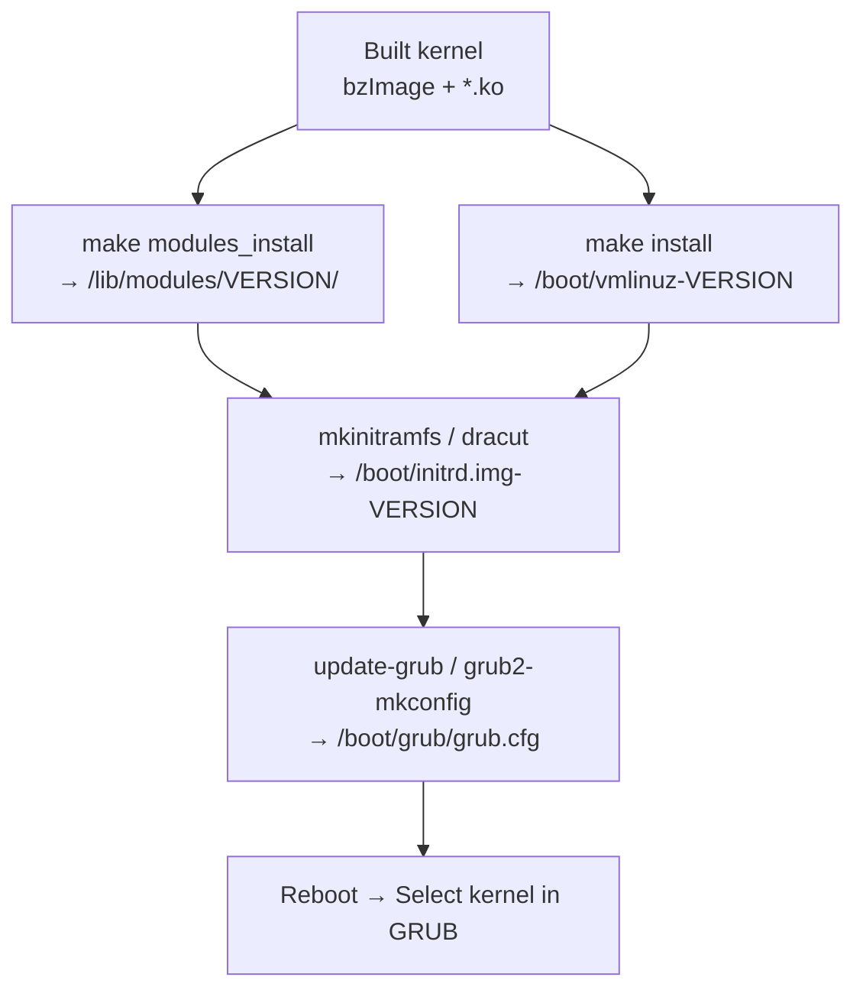
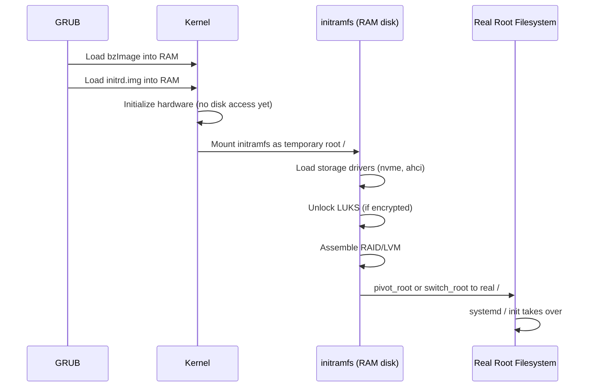

# 04 — Installing the Kernel

## 1. Definition

After building the kernel, you need to **install** it — placing the kernel image, modules, and configuration into the right locations so the bootloader can load it.

---

## 2. Installation Overview



---

## 3. Install Modules

```bash
sudo make modules_install
```

This copies all `.ko` files to:
```
/lib/modules/<kernel-version>/
├── kernel/                 # Modules matching source tree layout
│   ├── drivers/
│   ├── fs/
│   ├── net/
│   └── ...
├── modules.dep             # Module dependency map
├── modules.alias           # Module alias → name map
├── modules.builtin         # Modules compiled into kernel
└── modules.order           # Load order
```

The `depmod` command is run automatically to generate `modules.dep`.

---

## 4. Install the Kernel Image

```bash
sudo make install
```

On a Debian/Ubuntu system this copies:
```
/boot/vmlinuz-<version>        # Compressed kernel image
/boot/System.map-<version>     # Symbol table
/boot/config-<version>         # .config snapshot
```

And typically also runs `update-initramfs` and `update-grub` automatically.

---

## 5. initramfs — Why It's Needed



**WHY initramfs?** The kernel needs drivers to access the disk, but drivers might be modules stored on disk. initramfs is a chicken-and-egg solution — it's a small RAM-based filesystem that contains essential drivers.

### Generating initramfs manually
```bash
# Debian/Ubuntu
sudo update-initramfs -c -k $(uname -r)   # create
sudo update-initramfs -u -k $(uname -r)   # update

# Fedora/RHEL  
sudo dracut --force /boot/initramfs-$(uname -r).img $(uname -r)
```

---

## 6. GRUB Configuration

```mermaid
flowchart TD
    GrubD[/etc/grub.d/ scripts] --> GrubCFG[/boot/grub/grub.cfg]
    DefaultGrub[/etc/default/grub] --> GrubCFG
    GrubCFG --> Boot[Boot menu]
```

```bash
# Regenerate grub.cfg (Ubuntu/Debian)
sudo update-grub

# Regenerate grub.cfg (Fedora/RHEL)
sudo grub2-mkconfig -o /boot/grub2/grub.cfg

# View current default kernel
sudo grub-reboot --list   # or cat /etc/default/grub
```

### GRUB Menu Entry Example
```bash
# Auto-generated by update-grub in /boot/grub/grub.cfg
menuentry 'Ubuntu, with Linux 6.8.0-mykernel' {
    linux   /boot/vmlinuz-6.8.0-mykernel root=/dev/sda1 ro quiet
    initrd  /boot/initrd.img-6.8.0-mykernel
}
```

---

## 7. Booting the New Kernel

```bash
sudo reboot
# At GRUB menu: 'Advanced options for Ubuntu' → select your kernel
# Or set as default:
sudo grub-set-default "Ubuntu, with Linux 6.8.0-mykernel"
sudo update-grub
```

### Verify After Boot
```bash
uname -r                    # e.g. 6.8.0-mykernel
uname -a                    # Full info
cat /proc/version           # Full kernel version + build info
dmesg | head -20            # Kernel boot messages
```

---

## 8. Installing on Embedded Systems

For embedded Linux (e.g., Raspberry Pi, custom board):

```bash
# Cross-compile
ARCH=arm64 CROSS_COMPILE=aarch64-linux-gnu- make -j$(nproc)

# Copy kernel image
scp arch/arm64/boot/Image pi@raspberrypi:/boot/kernel8.img

# Or for Device Tree + modules
scp arch/arm64/boot/dts/broadcom/*.dtb pi@raspberrypi:/boot/
sudo make ARCH=arm64 CROSS_COMPILE=aarch64-linux-gnu- \
     INSTALL_MOD_PATH=/mnt/rootfs modules_install
```

---

## 9. Removing an Old Kernel

```bash
# Debian/Ubuntu
sudo apt-get remove linux-image-6.7.0-mykernel
sudo update-grub

# Manual removal
sudo rm /boot/vmlinuz-6.7.0-mykernel
sudo rm /boot/initrd.img-6.7.0-mykernel
sudo rm /boot/System.map-6.7.0-mykernel
sudo rm -rf /lib/modules/6.7.0-mykernel/
sudo update-grub
```

---

## 10. Related Concepts
- [02_Building_The_Kernel.md](./02_Building_The_Kernel.md) — Build step before installation
- [../17_Debugging/03_Printk_And_Log_Levels.md](../17_Debugging/03_Printk_And_Log_Levels.md) — Reading boot messages
