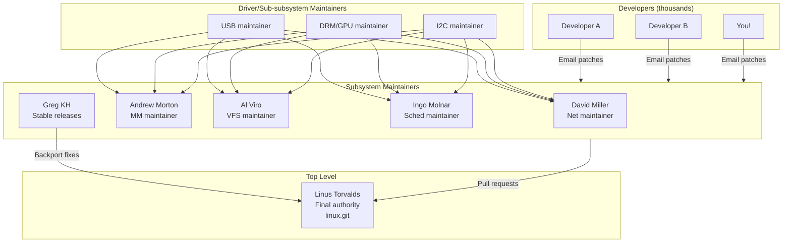
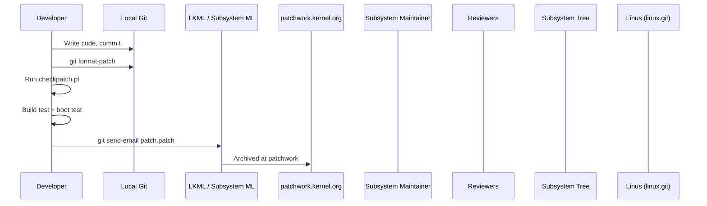
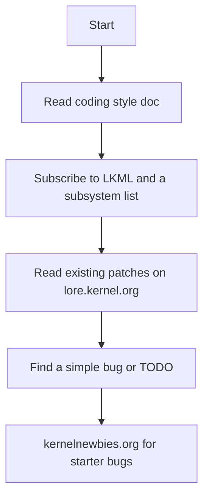

# 05 — Kernel Development Community

## 1. Definition

The Linux kernel is developed by thousands of contributors worldwide using **email-based patch submission workflow**. Understanding the community process is essential for contributing and understanding how kernel code is reviewed and merged.

---

## 2. Community Structure



---

## 3. The Patch Submission Workflow


    LKML->>Review: Community reviews
    Review->>LKML: Reviewed-by / Acked-by / Comments
    Dev->>LKML: Resend v2/v3 with fixes
    Maint->>Tree: Apply accepted patch
    Tree->>Linus: Pull request (merge window)
    Linus->>Linus: Merge into linux.git
```

---

## 4. Key Communication Channels

| Channel | Purpose | URL |
|---------|---------|-----|
| **LKML** | Linux Kernel Mailing List — primary channel | `linux-kernel@vger.kernel.org` |
| **Subsystem MLs** | Per-subsystem lists | `linux-mm@kvack.org`, `netdev@vger.kernel.org` etc. |
| **Patchwork** | Patch tracking system | `patchwork.kernel.org` |
| **Lore** | LKML archive | `lore.kernel.org` |
| **Bugzilla** | Bug tracking | `bugzilla.kernel.org` |
| **IRC** | Real-time chat | `#kernelnewbies` on libera.chat |

---

## 5. Kernel Coding Style

The kernel has a strict coding style documented in `Documentation/process/coding-style.rst`.

### Indentation
```c
/* Use TABS, not spaces. 8-space tab width. */
int kernel_function(int arg)
{
        if (arg > 0) {
                return do_something(arg);
        }
        return -EINVAL;
}
```

### Naming Conventions
```c
/* Functions: lowercase with underscores */
int get_page_count(void);
void free_page(struct page *page);

/* Macros: UPPERCASE */
#define PAGE_SIZE 4096
#define MAX_ORDER 11

/* Types: descriptive names */
typedef unsigned long pgoff_t;

/* No Hungarian notation */
/* WRONG: */  int iSomeInteger;
/* RIGHT: */  int count;
```

### Braces
```c
/* Opening brace at end of line for functions: exception — on same line */
int function(void)
{               /* ← brace on new line for functions */
        if (x) {    /* ← brace on same line for everything else */
                ...
        } else {
                ...
        }
}

/* Single-line: no braces needed */
if (condition)
        single_statement();
```

### Line Length
```c
/* Maximum 80 columns (soft limit, up to 100 sometimes accepted) */
```

### Comments
```c
/*
 * Multi-line comments use this style.
 * No C++ // comments in kernel code (historically).
 */

/* Single line like this */
```

---

## 6. Writing a Patch

### Step 1: Make Changes and Commit
```bash
# Create a branch
git checkout -b fix-bug-12345

# Edit files
vim drivers/net/ethernet/realtek/r8169_main.c

# Stage and commit
git add drivers/net/ethernet/realtek/r8169_main.c
git commit -s    # -s adds Signed-off-by automatically
```

### Commit Message Format
```
subsystem: brief description (imperative, ≤72 chars)

Longer description explaining:
- What the problem is
- Why this is the correct fix
- Any relevant background

If this fixes a reported bug:
Fixes: abc1234def5 ("commit that introduced the bug")
Reported-by: Someone Name <email@example.com>
Reviewed-by: Reviewer Name <reviewer@example.com>
Acked-by: Maintainer Name <maintainer@example.com>
Signed-off-by: Your Name <your@email.com>
```

### Step 2: Check the Patch
```bash
# Kernel coding style checker
perl scripts/checkpatch.pl --strict 0001-fix-bug.patch

# Build test
make -j$(nproc) drivers/net/ethernet/realtek/

# Test on hardware or QEMU
```

### Step 3: Find Maintainers
```bash
perl scripts/get_maintainer.pl 0001-fix-bug.patch
# Output: name, email, type (maintainer/reviewer/list)
```

### Step 4: Send the Patch
```bash
# Configure git send-email first
git config --global sendemail.smtpserver smtp.example.com
git config --global sendemail.smtpuser you@example.com

# Format patch
git format-patch -1 HEAD    # Creates 0001-fix-bug.patch

# Dry run first
git send-email --dry-run --to=maintainer@example.com \
               --cc=linux-driver-list@vger.kernel.org \
               0001-fix-bug.patch

# Send for real
git send-email --to=maintainer@example.com \
               --cc=linux-driver-list@vger.kernel.org \
               --cc=linux-kernel@vger.kernel.org \
               0001-fix-bug.patch
```

---

## 7. Patch Tags Explained

| Tag | Meaning |
|-----|---------|
| `Signed-off-by:` | Author certifies DCO (Developer Certificate of Origin) |
| `Reviewed-by:` | Reviewer checked the code |
| `Acked-by:` | Acknowledges the patch is acceptable |
| `Tested-by:` | Confirmed working on hardware |
| `Reported-by:` | Who reported the bug |
| `Fixes:` | Which commit introduced the bug |
| `Link:` | Link to discussion, bug report |
| `Co-developed-by:` | Credit to co-author |

---

## 8. DCO — Developer Certificate of Origin

By adding `Signed-off-by`, you confirm:

```
I wrote this code (or have rights to submit it), and I agree to
license it under the kernel's GPLv2 license.
```

This is legally important and required for all kernel patches.

---

## 9. Getting Started as a New Contributor


    F --> G[Write fix + checkpatch + build test]
    G --> H[Send patch to list]
    H --> I[Address review comments]
    I --> J[Accepted!\nSigned-off-by tag in linux.git]
```

### Resources for Beginners
| Resource | URL |
|----------|-----|
| KernelNewbies | `kernelnewbies.org` |
| Kernel docs process | `docs.kernel.org/process/` |
| Lore (LKML archive) | `lore.kernel.org` |
| Patchwork | `patchwork.kernel.org` |
| Bootlin Elixir (source cross-ref) | `elixir.bootlin.com` |

---

## 10. Related Concepts
- [01_Kernel_Source_Tree_Layout.md](./01_Kernel_Source_Tree_Layout.md) — Finding the code to patch
- [../17_Debugging/01_Kernel_Bug_Reporting.md](../17_Debugging/01_Kernel_Bug_Reporting.md) — Reporting and fixing bugs
