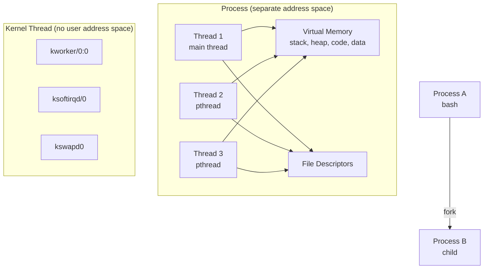
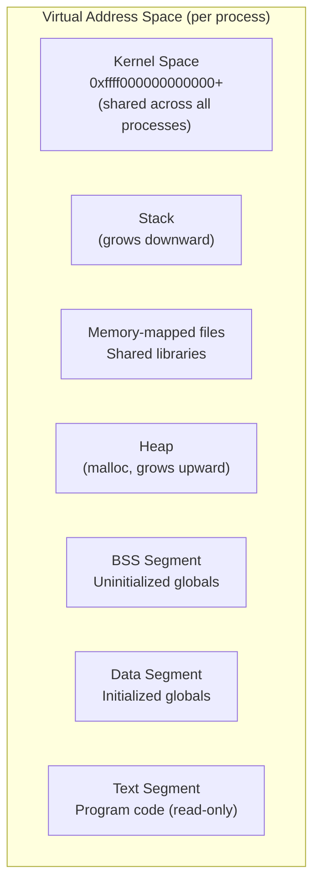
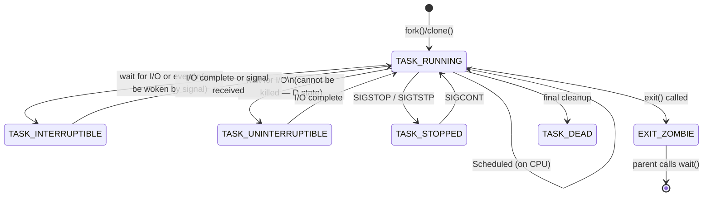
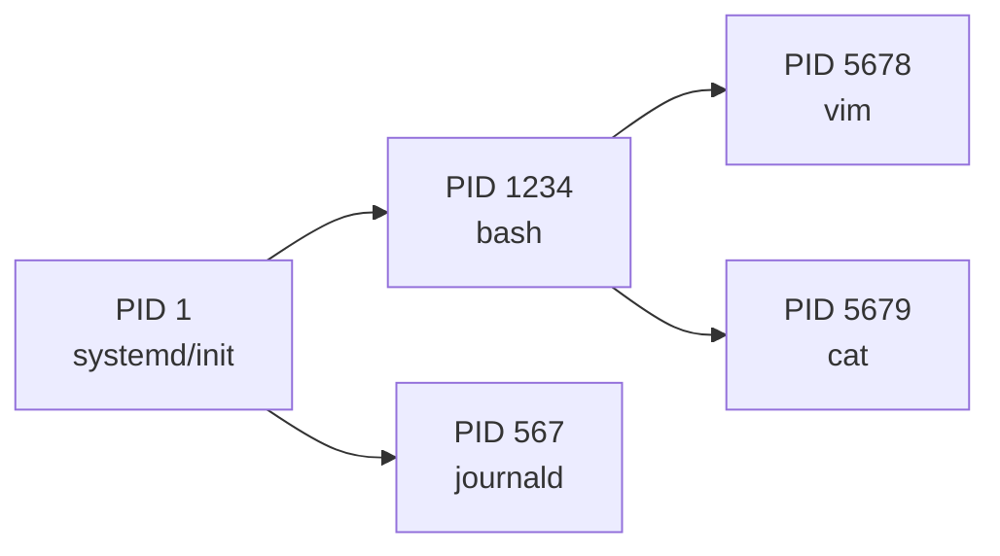

# 01 — What Is a Process?

## 1. Definition

A **process** is a program in execution. It is the fundamental unit of work in the Linux kernel. Every process has:

- Its own **virtual address space** (private memory)
- One or more **threads of execution**
- Open **file descriptors**
- Associated **resources** (network sockets, timers, signals)
- A unique **PID** (Process ID)

The kernel manages processes — creating, scheduling, and terminating them.

---

## 2. Process vs Thread vs Kernel Thread



| Type | Address Space | Runs in | Example |
|------|--------------|---------|---------|
| **Process** | Own virtual AS | User + Kernel space | `bash`, `nginx`, `python` |
| **Thread** | Shared with parent process | User + Kernel space | `pthread_create` threads |
| **Kernel Thread** | No user AS (kernel-only) | Kernel space only | `kworker`, `kswapd`, `ksoftirqd` |

> **Key insight:** In Linux, **threads and processes are handled identically** by the kernel. A thread is just a process that shares the address space of its parent. There is only **one kernel abstraction: `task_struct`**.

---

## 3. Virtual Address Space

Every process has its own **virtual address space**:



The virtual-to-physical address translation is done by the **MMU (Memory Management Unit)** using **page tables**. Each process has its own page tables, so they cannot access each other's memory.

---

## 4. Process State Machine



### State Values in Source Code
```c
/* include/linux/sched.h */
#define TASK_RUNNING            0x00000000  /* Ready to run or running */
#define TASK_INTERRUPTIBLE      0x00000001  /* Sleeping, can be woken by signal */
#define TASK_UNINTERRUPTIBLE    0x00000002  /* Sleeping, cannot be interrupted */
#define __TASK_STOPPED          0x00000004  /* Stopped by signal/debugger */
#define __TASK_TRACED           0x00000008  /* Being traced (ptrace) */
#define EXIT_DEAD               0x00000010  /* Being removed */
#define EXIT_ZOMBIE             0x00000020  /* Terminated, parent not yet waited */
```

---

## 5. Process Identification



| Identifier | Name | Type | Description |
|-----------|------|------|-------------|
| `pid` | PID | `pid_t` | Process ID — unique per process |
| `tgid` | Thread Group ID | `pid_t` | Same as PID for main thread; all threads share this |
| `ppid` | Parent PID | derived | PID of parent process |
| `pgid` | Process Group ID | `pid_t` | Process group (for signals to groups) |
| `sid` | Session ID | `pid_t` | Terminal session |

```c
/* Getting PIDs in kernel code */
current->pid            /* PID of current process/thread */
current->tgid           /* Thread Group ID (= PID for main thread) */
task_pid_nr(task)       /* Get PID of a given task */
task_tgid_nr(task)      /* Get TGID of a given task */

/* User-space equivalents */
getpid()   /* returns tgid (process ID as user sees it) */
gettid()   /* returns pid (thread ID within process) */
```

---

## 6. The `current` Macro

In kernel code, the currently executing process/thread is accessed via the `current` macro:

```c
/* Usage in kernel code */
printk("Current process: %s (PID %d)\n", current->comm, current->pid);

/* How it works (simplified) */
/* On x86-64: current is derived from the kernel stack pointer */
/* The top of each task's kernel stack contains a thread_info struct */
/* which has a pointer back to task_struct */
```

```mermaid
flowchart LR
    CPU[CPU executing\ncurrent task] --> KStack[Kernel Stack\n(8KB per task)]
    KStack --> |bottom of stack| TI[struct thread_info\n.task pointer]
    TI --> TS[struct task_struct]
```

---

## 7. `ps` Output vs Kernel Internals

```bash
$ ps aux
USER    PID  %CPU %MEM    VSZ   RSS  STAT START   COMMAND
root      1   0.0  0.1 169936  13444  Ss  boot  systemd
nil    1234   0.0  0.0  23756   5896  Ss  10:00 bash
nil    5678   0.0  0.1  81900  12000  Sl  10:01 vim

# STAT column maps to kernel states:
# S = TASK_INTERRUPTIBLE (sleeping)
# R = TASK_RUNNING (running or ready)
# D = TASK_UNINTERRUPTIBLE (uninterruptible sleep — I/O)
# T = __TASK_STOPPED
# Z = EXIT_ZOMBIE
# s = session leader
# l = multi-threaded
```

---

## 8. Related Concepts
- [02_Process_Descriptor_task_struct.md](./02_Process_Descriptor_task_struct.md) — Full task_struct breakdown
- [../03_Process_Scheduling/01_Scheduling_Policy_And_Priority.md](../03_Process_Scheduling/01_Scheduling_Policy_And_Priority.md) — How processes get CPU time
