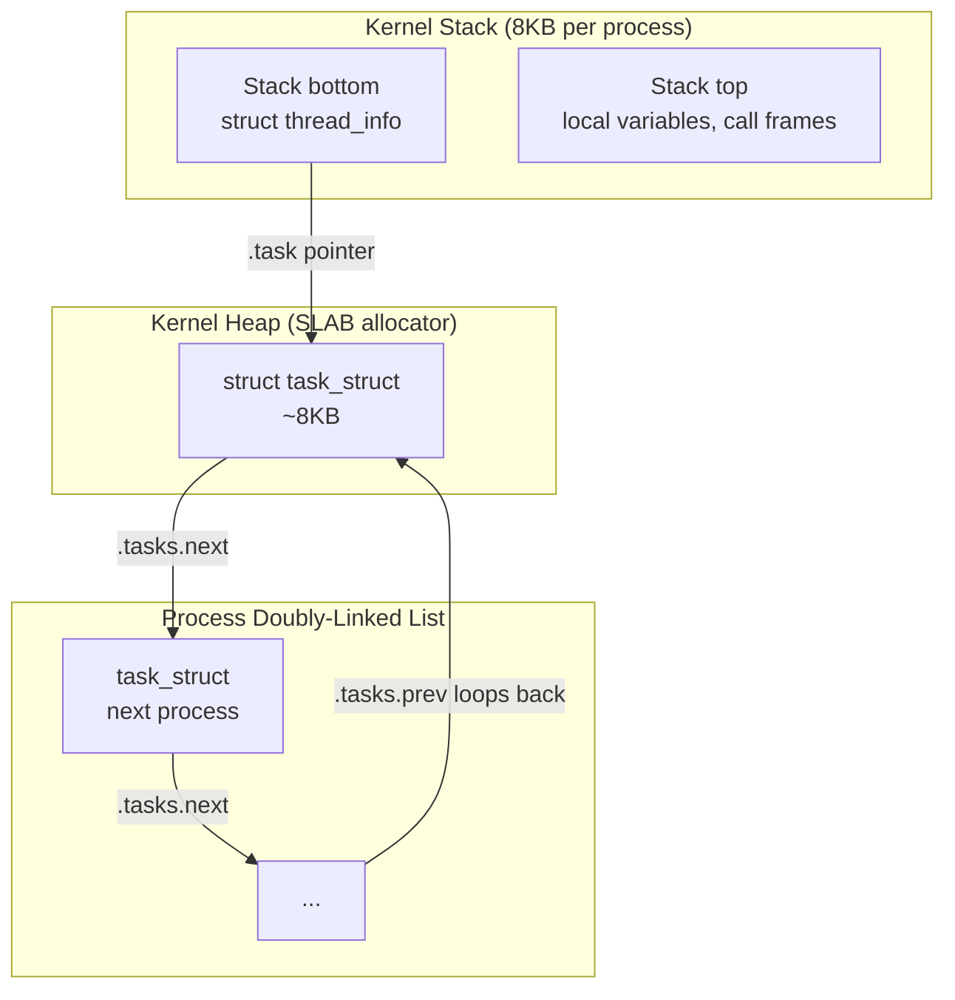
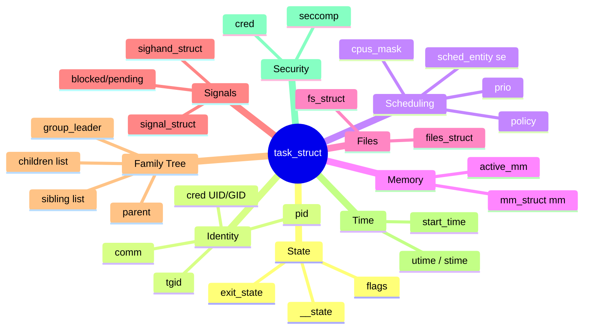
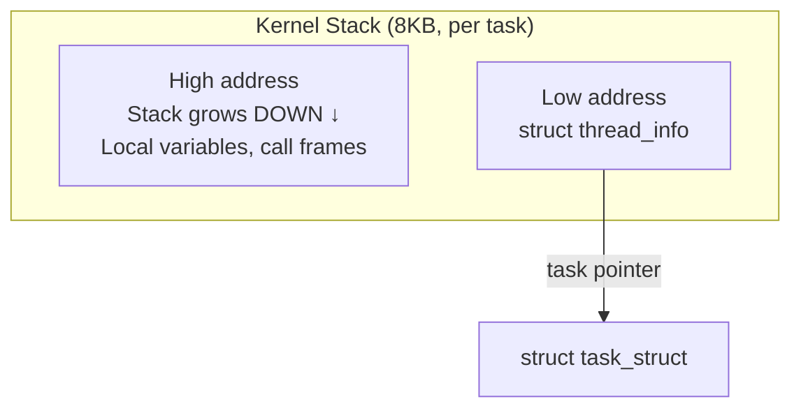
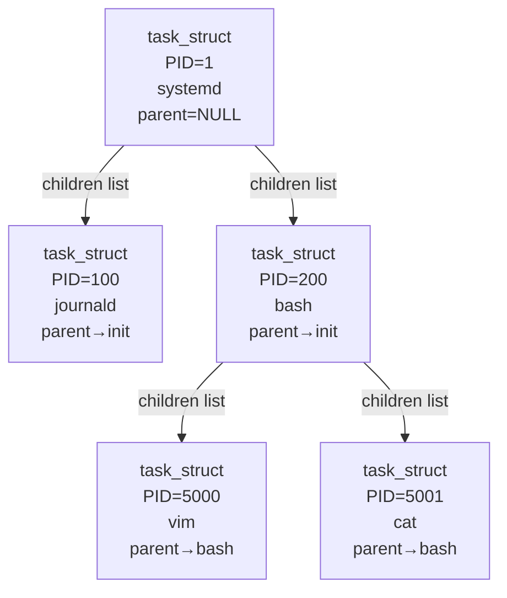

# 02 — Process Descriptor: struct task_struct

## 1. Definition

`struct task_struct` is the **kernel's representation of a process or thread**. It is the most important data structure in the entire kernel. Every process/thread has exactly one `task_struct`. It contains everything the kernel needs to know about a process.

- Defined in: `include/linux/sched.h`
- Size: ~8KB (it's large!)
- Stored on the **kernel heap** (allocated via `kmem_cache`)

---

## 2. Where task_struct Lives



---

## 3. Key Fields of task_struct

```c
/* include/linux/sched.h (simplified, key fields) */
struct task_struct {
    /*
     * --- Process State ---
     */
    unsigned int        __state;       /* TASK_RUNNING, TASK_INTERRUPTIBLE, etc. */
    
    /*
     * --- Stack ---
     */
    void                *stack;        /* Pointer to kernel stack */
    
    /*
     * --- Scheduling ---
     */
    int                 prio;          /* Dynamic priority */
    int                 static_prio;   /* Nice value based priority */
    int                 normal_prio;   /* Priority without real-time boost */
    unsigned int        rt_priority;   /* Real-time priority (0-99) */
    const struct sched_class *sched_class;  /* Scheduler class (fair/rt/idle) */
    struct sched_entity se;            /* Schedulable entity for CFS */
    struct sched_rt_entity rt;         /* RT scheduling entity */
    unsigned int        policy;        /* SCHED_NORMAL, SCHED_FIFO, SCHED_RR */
    int                 nr_cpus_allowed; /* CPUs this task can run on */
    cpumask_t           cpus_mask;     /* CPU affinity mask */

    /*
     * --- Process Tree (Relations) ---
     */
    struct task_struct __rcu *parent;  /* Parent process */
    struct list_head    children;      /* List of children */
    struct list_head    sibling;       /* Sibling list */
    struct task_struct  *group_leader; /* Thread group leader */

    /*
     * --- Process List ---
     */
    struct list_head    tasks;         /* Doubly-linked list of all tasks */
    
    /*
     * --- Process IDs ---
     */
    pid_t               pid;           /* Process ID (unique per thread) */
    pid_t               tgid;          /* Thread Group ID (= main thread PID) */
    struct pid          *thread_pid;   /* Pointer to PID structure */

    /*
     * --- Memory ---
     */
    struct mm_struct    *mm;           /* User-space memory map (NULL for kthreads) */
    struct mm_struct    *active_mm;    /* Active mm (kthreads borrow one) */
    
    /*
     * --- File System ---
     */
    struct fs_struct    *fs;           /* Filesystem info (root, cwd) */
    struct files_struct *files;        /* Open file descriptors */

    /*
     * --- Signals ---
     */
    struct signal_struct    *signal;   /* Signal state shared by thread group */
    struct sighand_struct   *sighand;  /* Signal handlers */
    sigset_t                blocked;   /* Blocked signals */
    sigset_t                pending;   /* Pending signals */

    /*
     * --- Credentials / Security ---
     */
    const struct cred   *cred;         /* UID, GID, capabilities */
    
    /*
     * --- Execution Info ---
     */
    char                comm[TASK_COMM_LEN]; /* Command name (16 bytes) */
    unsigned long       start_time;    /* Process start time (boot-relative) */
    
    /*
     * --- CPU Time Accounting ---
     */
    u64                 utime;         /* User mode CPU time */
    u64                 stime;         /* Kernel mode CPU time */
    
    /*
     * --- IPC ---
     */
    struct sysv_sem     sysvsem;       /* SysV semaphore state */
    
    /*
     * --- ptrace (debugging) ---
     */
    unsigned long       ptrace;        /* PT_TRACED if being traced */
    
    /*
     * --- Kernel Stack Pointer ---
     */
    /* Architecture-specific registers stored here on context switch */
    struct thread_struct    thread;    /* CPU state on context switch */
};
```

---

## 4. task_struct Field Groups (Visual)



---

## 5. Process Descriptor Allocation

```c
/* Allocation via dedicated slab cache for speed */
/* kernel/fork.c */
static struct kmem_cache *task_struct_cachep;

/* During boot */
task_struct_cachep = kmem_cache_create("task_struct",
                                        arch_task_struct_size,
                                        align,
                                        SLAB_PANIC|SLAB_ACCOUNT,
                                        NULL);

/* Allocating a new task_struct */
struct task_struct *tsk = alloc_task_struct_node(node);

/* Freeing */
free_task_struct(tsk);
```

---

## 6. Accessing task_struct Fields

```c
/* In kernel code, 'current' macro gives current task_struct */
#include <linux/sched.h>

/* Get PID */
pid_t my_pid = current->pid;

/* Get process name */
char *name = current->comm;   /* e.g. "bash" */

/* Get UID */
kuid_t uid = current_uid();   /* from current->cred->uid */

/* Iterate over ALL processes */
struct task_struct *task;
rcu_read_lock();
for_each_process(task) {
    printk("Process: %s PID: %d\n", task->comm, task->pid);
}
rcu_read_unlock();

/* Iterate over all threads in a process */
struct task_struct *thread;
rcu_read_lock();
for_each_thread(current, thread) {
    printk("Thread: PID %d\n", thread->pid);
}
rcu_read_unlock();
```

---

## 7. Thread Info and Kernel Stack



```c
/* include/linux/thread_info.h */
struct thread_info {
    struct task_struct  *task;      /* pointer back to task_struct */
    unsigned long       flags;      /* Low-level flags (TIF_SIGPENDING etc.) */
    int                 preempt_count;  /* Preemption counter (0 = preemptible) */
    /* ... */
};

/* Getting thread_info from stack pointer */
#define current_thread_info()  ((struct thread_info *)current_stack_pointer & ~(THREAD_SIZE-1))
```

---

## 8. Process Descriptor in the Process Tree



### Navigating the tree in kernel code:
```c
/* Get parent */
struct task_struct *parent = current->real_parent;

/* Walk up to root */
struct task_struct *task = current;
while (task->pid != 1)
    task = task->real_parent;

/* Iterate children */
struct task_struct *child;
list_for_each_entry(child, &current->children, sibling) {
    printk("Child PID: %d\n", child->pid);
}
```

---

## 9. Important Flags in task_struct

```c
/* task_struct.flags field */
#define PF_IDLE         0x00000002  /* I am an idle thread */
#define PF_EXITING      0x00000004  /* Getting shut down */
#define PF_KTHREAD      0x00200000  /* I am a kernel thread */
#define PF_RANDOMIZE    0x00400000  /* Randomize virtual address space */
#define PF_SWAPWRITE    0x00800000  /* Allowed to write to swap */
#define PF_NO_SETAFFINITY 0x04000000 /* Userland is not allowed to meddle with cpus_mask */
```

---

## 10. Related Concepts
- [01_What_Is_A_Process.md](./01_What_Is_A_Process.md) — Process concepts
- [03_Process_Creation_fork_clone.md](./03_Process_Creation_fork_clone.md) — How task_struct is created
- [../03_Process_Scheduling/02_CFS_Completely_Fair_Scheduler.md](../03_Process_Scheduling/02_CFS_Completely_Fair_Scheduler.md) — sched_entity in task_struct
- [../11_Memory_Management/01_Pages_Zones_Nodes.md](../11_Memory_Management/01_Pages_Zones_Nodes.md) — mm_struct in task_struct
