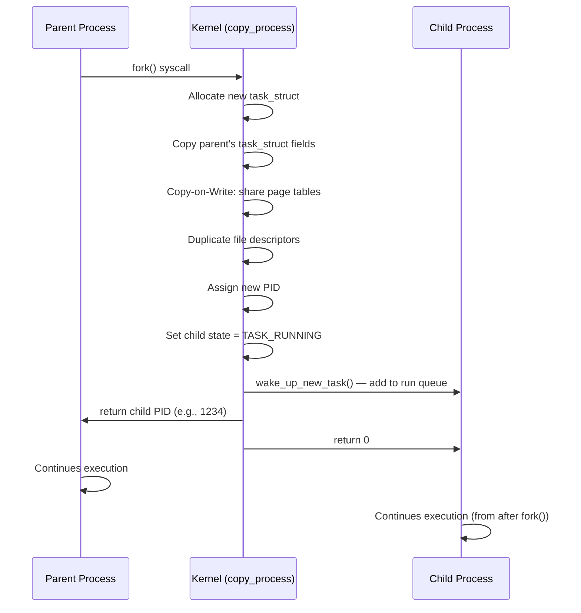
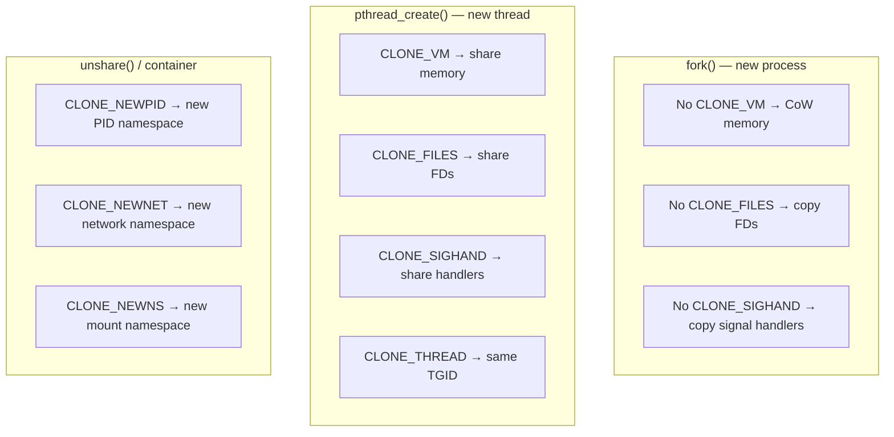
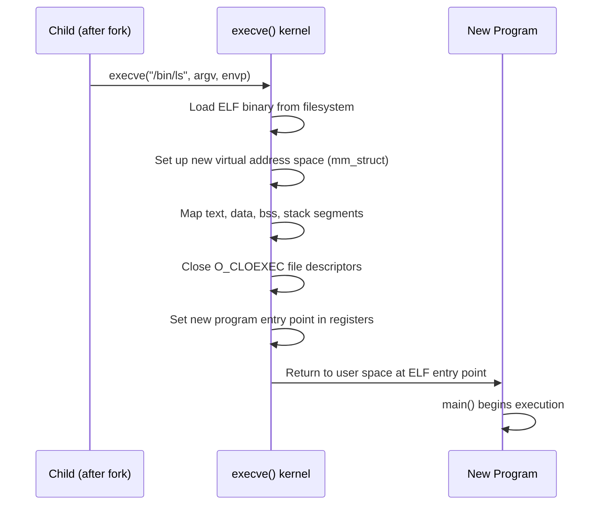

# 03 — Process Creation: fork(), vfork(), clone()

## 1. Definition

Process creation in Linux is done via **`fork()`**, **`vfork()`**, or **`clone()`** system calls. All of them ultimately call the kernel function **`copy_process()`** which creates a new `task_struct` by duplicating the parent's.

---

## 2. System Call Hierarchy

```mermaid
flowchart TD
    Fork[fork\(\) system call] --> KFork[kernel_clone\(\)]
    Vfork[vfork\(\) system call] --> KFork
    Clone[clone\(\) system call] --> KFork
    PThread[pthread_create\(\)\nlibc] --> Clone
    KFork --> CP[copy_process\(\)\nkernel/fork.c]
    CP --> NewTask[New task_struct]
    NewTask --> Sched[Scheduler\nwake_up_new_task\(\)]
```

| Syscall | Shares memory? | Shares files? | Notes |
|---------|---------------|--------------|-------|
| `fork()` | No (CoW) | No (copied) | Traditional Unix fork |
| `vfork()` | Yes (blocks parent) | Yes | Legacy — parent waits for exec |
| `clone()` | Configurable via flags | Configurable | Used for threads and containers |

---

## 3. fork() Deep Dive



### fork() in User Space:
```c
#include <unistd.h>
pid_t pid = fork();
if (pid < 0) {
    /* Error */
    perror("fork");
} else if (pid == 0) {
    /* Child process — fork returned 0 */
    execve("/bin/ls", args, envp);
} else {
    /* Parent process — fork returned child's PID */
    waitpid(pid, &status, 0);
}
```

---

## 4. copy_process() — The Core Function

`copy_process()` in `kernel/fork.c` does the heavy lifting:

```mermaid
flowchart TD
    CP[copy_process\(\)] --> A[dup_task_struct\(\)\nAllocate new task_struct + kernel stack]
    A --> B[Copy scheduling info\npriority, policy, etc.]
    B --> C[copy_creds\(\)\nCopy credentials]
    C --> D[copy_files\(\)\nCopy/share file descriptors]
    D --> E[copy_fs\(\)\nCopy/share filesystem info]
    E --> F[copy_sighand\(\)\nCopy signal handlers]
    F --> G[copy_signal\(\)\nCopy signal state]
    G --> H[copy_mm\(\)\nCopy/share memory map]
    H --> I[copy_namespaces\(\)\nCopy namespaces]
    I --> J[copy_io\(\)\nCopy I/O context]
    J --> K[copy_thread\(\)\nArch: setup CPU registers]
    K --> L[alloc_pid\(\)\nAllocate new PID]
    L --> M[Attach to parent's children list]
    M --> N[Return new task_struct]
```

### Key Steps Explained:

#### `dup_task_struct()`
```c
/* kernel/fork.c */
static struct task_struct *dup_task_struct(struct task_struct *orig, int node)
{
    struct task_struct *tsk;
    tsk = alloc_task_struct_node(node);   /* Allocate from task_struct slab cache */
    if (!tsk)
        return NULL;
    
    /* Copy the entire task_struct */
    err = arch_dup_task_struct(tsk, orig);
    
    /* Allocate new kernel stack */
    tsk->stack = alloc_thread_stack_node(tsk, node);
    
    return tsk;
}
```

#### `copy_mm()` — Key for fork+CoW
```c
/* For fork(): CLONE_VM is NOT set → duplicate mm_struct with CoW */
/* For threads: CLONE_VM IS set → share mm_struct */

static int copy_mm(unsigned long clone_flags, struct task_struct *tsk)
{
    if (clone_flags & CLONE_VM) {
        /* Thread: share parent's mm */
        mmget(oldmm);       /* increment reference count */
        tsk->mm = oldmm;
        return 0;
    }
    /* Process: duplicate with Copy-on-Write */
    return dup_mm(tsk, current->mm);
}
```

---

## 5. clone() Flags — What Gets Shared

`clone()` is the most flexible — you control what the child shares:

```c
/* include/uapi/linux/sched.h */
#define CLONE_VM        0x00000100  /* Share virtual memory */
#define CLONE_FS        0x00000200  /* Share filesystem info (cwd, root) */
#define CLONE_FILES     0x00000400  /* Share file descriptor table */
#define CLONE_SIGHAND   0x00000800  /* Share signal handlers */
#define CLONE_THREAD    0x00010000  /* Same thread group (= pthread) */
#define CLONE_NEWNS     0x00020000  /* New mount namespace */
#define CLONE_NEWPID    0x20000000  /* New PID namespace */
#define CLONE_NEWNET    0x40000000  /* New network namespace */
#define CLONE_NEWUSER   0x10000000  /* New user namespace */
```

### How fork/thread/container differ via clone flags:



---

## 6. exec() — Replacing the Process Image

After `fork()`, the child typically calls `exec()` to run a new program:



### What exec() does NOT change:
- PID (stays the same)
- Open file descriptors (except O_CLOEXEC)
- Signal mask
- UID/GID
- Current directory
- Nice value

---

## 7. fork() + exec() = The Unix Process Model

```mermaid
flowchart LR
    Shell[bash\nPID 100] --> |fork| Child[child process\nPID 101\ncopy of bash]
    Child --> |exec\("/bin/ls"\)| LS[ls\nPID 101\nnew address space]
    Shell --> |waitpid\(101\)| WM[Wait for ls to finish]
    LS --> |exit\(0\)| WM
    WM --> Shell
```

This fork+exec pattern is used for every command you run in a shell.

---

## 8. vfork() — Legacy Optimization

`vfork()` was created before Copy-on-Write existed:

```c
pid_t pid = vfork();
if (pid == 0) {
    /* Child: shares parent's address space directly */
    /* Parent is BLOCKED until child calls exec() or exit() */
    execve("/bin/ls", args, envp);
    /* If exec fails: MUST call _exit(), not exit() */
    _exit(1);
}
/* Parent resumes here after child exec()s */
```

> **Modern advice:** Never use `vfork()`. Use `fork()` + `exec()`. `vfork()` is fragile — writing to any variable before exec corrupts the parent.

---

## 9. Kernel Threads

Kernel threads are processes with no user address space (`mm = NULL`):

```c
/* Creating a kernel thread */
#include <linux/kthread.h>

/* Define the thread function */
static int my_thread_fn(void *data)
{
    while (!kthread_should_stop()) {
        /* Do kernel work */
        schedule();   /* Yield CPU */
    }
    return 0;
}

/* Start the thread */
struct task_struct *task = kthread_run(my_thread_fn, NULL, "my_kthread");
if (IS_ERR(task)) {
    printk(KERN_ERR "kthread_run failed\n");
    return PTR_ERR(task);
}

/* Stop the thread */
kthread_stop(task);
```

### Examples of kernel threads
```bash
$ ps aux | grep '\['
root    1  kthreadd        # Parent of all kernel threads
root    2  kworker/0:0     # Work queue worker
root    3  ksoftirqd/0     # Softirq handler CPU 0
root    6  kswapd0         # Page reclaim daemon
root    7  kdevtmpfs       # Device tmpfs
```

---

## 10. Performance Considerations

| Operation | Cost | Reason |
|-----------|------|--------|
| `fork()` | Fast | CoW — page tables copied, not actual pages |
| `exec()` | Moderate | ELF loading, address space setup |
| `vfork()` | Fastest | No copy at all (but dangerous) |
| `clone()` (thread) | Fast | Shares most resources |
| `fork()` on large process | Moderate | Many page table entries to copy |

---

## 11. Related Concepts
- [04_Copy_On_Write.md](./04_Copy_On_Write.md) — How CoW works in detail
- [05_Process_Termination.md](./05_Process_Termination.md) — How processes die
- [../04_System_Calls/01_What_Are_System_Calls.md](../04_System_Calls/01_What_Are_System_Calls.md) — How fork/clone reach the kernel
- [../11_Memory_Management/](../11_Memory_Management/) — mm_struct, page tables
