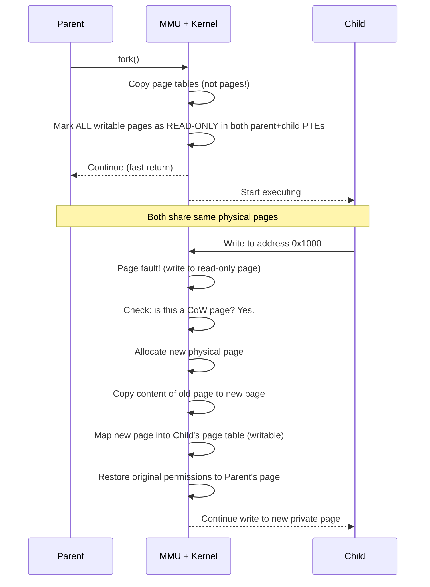
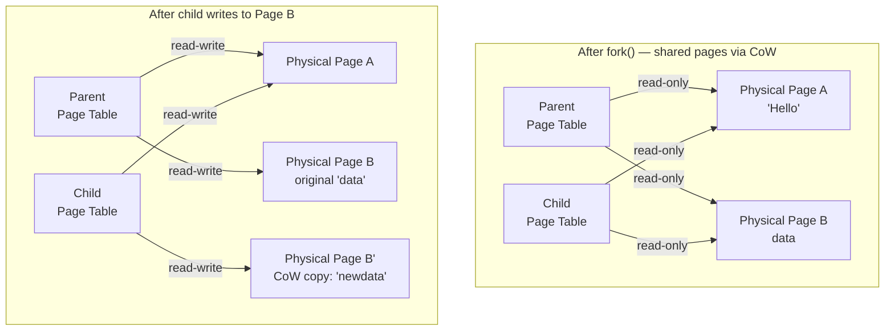
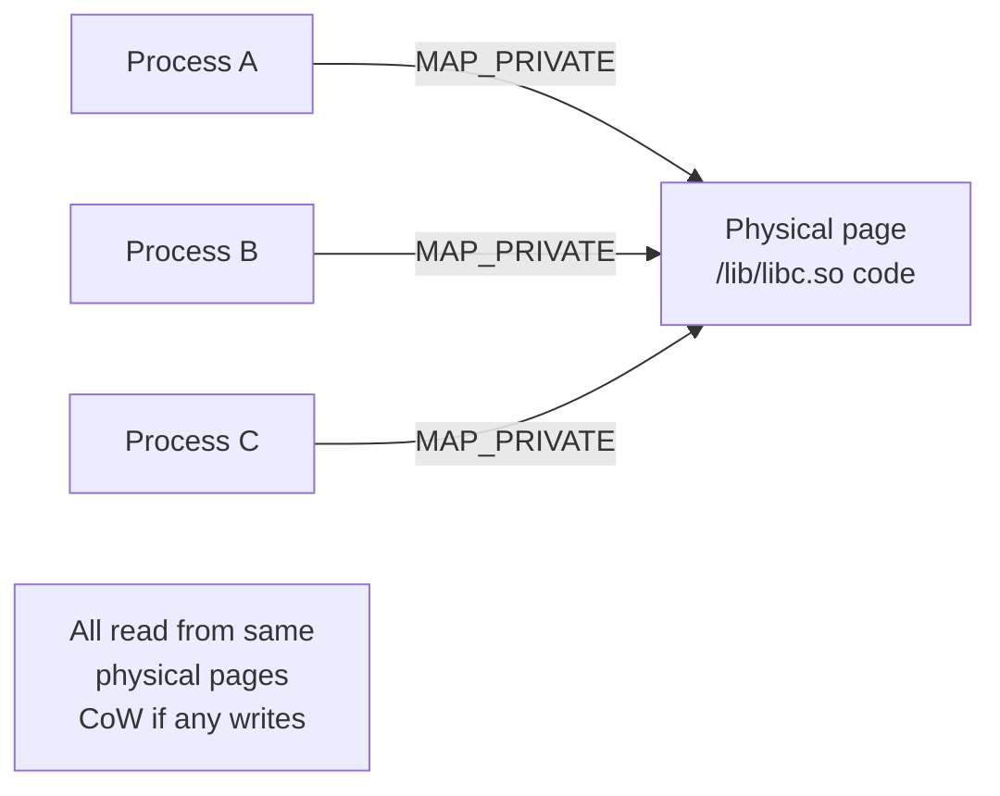

# 04 — Copy-on-Write (CoW)

## 1. Definition

**Copy-on-Write (CoW)** is an optimization technique used by `fork()`. Instead of duplicating all of a parent's memory pages for the child, the kernel marks all pages as **shared and read-only**. Pages are only **copied when either the parent or child tries to write to them**.

This makes `fork()` extremely fast — especially for the common `fork()` + `exec()` pattern where the child never writes to parent memory before calling `exec()`.

---

## 2. Without CoW vs With CoW


---

## 3. How CoW Works Step by Step



---

## 4. Page Table Mechanics



---

## 5. Kernel Implementation

### Page Fault Handler
```c
/* mm/memory.c */
static vm_fault_t do_wp_page(struct vm_fault *vmf)
{
    struct vm_area_struct *vma = vmf->vma;
    struct page *old_page = vmf->page;
    struct page *new_page;

    /* Check if this is a private CoW mapping */
    if (PageAnon(old_page)) {
        /* If only one reference, no need to copy */
        if (page_count(old_page) == 1) {
            /* Make page writable directly */
            wp_page_reuse(vmf);
            return 0;
        }
        /* Multiple references — must copy */
        new_page = alloc_page_vma(GFP_HIGHUSER_MOVABLE, vma, vmf->address);
        copy_user_highpage(new_page, old_page, vmf->address, vma);
        
        /* Install new page in child's page table */
        set_pte_at(vma->vm_mm, vmf->address, vmf->pte,
                   mk_pte(new_page, vma->vm_page_prot));
    }
    return 0;
}
```

### Page Reference Counting
```c
/* The key mechanism: pages are shared by incrementing reference count */
struct page {
    atomic_t _refcount;   /* Number of processes mapping this page */
    /* ... */
};

/* After fork(), shared CoW page has refcount >= 2 */
/* When refcount drops to 1, it can become writable without copying */
```

---

## 6. CoW and the Page Fault Flow

```mermaid
flowchart TD
    Write[Process writes to address] --> PF[Page Fault\nexception raised]
    PF --> Check[do_page_fault\(\)]
    Check --> CoWCheck{Is this a\nCoW page?}
    CoWCheck --> |Yes| RefCheck{refcount == 1?}
    CoWCheck --> |No| OtherFault[Handle other fault\nalloc, swap-in, etc.]
    RefCheck --> |Yes, only user| MakeWritable[Make page\nwritable in PTE\nno copy needed]
    RefCheck --> |No, shared| AllocCopy[Allocate new page\nCopy content\nUpdate child PTE]
    MakeWritable --> Resume[Resume write]
    AllocCopy --> Resume
```

---

## 7. CoW and exec()

The most common use of `fork()` is immediately followed by `exec()`:

```bash
bash → fork() → child → exec("/bin/ls")
```

In this case:
- Child never writes to any parent page before `exec()`
- `exec()` discards all pages anyway (new address space)
- **Zero pages are ever copied** — maximum efficiency
- This is why `fork()` + `exec()` is so fast despite the apparent copy

---

## 8. CoW for Memory-Mapped Files

CoW is also used for shared libraries and file mappings:



When you run 100 copies of `bash`, they all share the same physical pages for the bash executable via CoW.

---

## 9. Copy-on-Write vs Copy-on-Fork

| Aspect | Detail |
|--------|--------|
| **Trigger** | Write to a shared CoW page |
| **Granularity** | Per page (4KB typically) |
| **Cost of fork()** | O(number of page table entries) not O(memory size) |
| **Cost of write** | One page fault + one page allocation + copy |
| **Memory saved** | All pages that are never written after fork |
| **Use case** | shell commands, containers, Python multiprocessing |

---

## 10. Common Gotchas

### CoW and Databases
- Databases using `fork()` for snapshotting (Redis, PostgreSQL) can see high memory usage
- If the writer continues writing pages, many CoW copies are made
- Solution: `MADV_DONTFORK`, huge pages, or use `fork()` + freeze writes

### CoW and Memory Overcommit
```bash
# Linux allows over-committing memory because of CoW
# A process can malloc() more than available RAM
# Pages only allocated on actual write (CoW touches)
cat /proc/sys/vm/overcommit_memory
# 0 = heuristic, 1 = always allow, 2 = strict
```

---

## 11. Related Concepts
- [03_Process_Creation_fork_clone.md](./03_Process_Creation_fork_clone.md) — fork() internals
- [../14_Process_Address_Space/04_Page_Tables.md](../14_Process_Address_Space/04_Page_Tables.md) — Page table structure
- [../11_Memory_Management/01_Pages_Zones_Nodes.md](../11_Memory_Management/01_Pages_Zones_Nodes.md) — Physical page management
