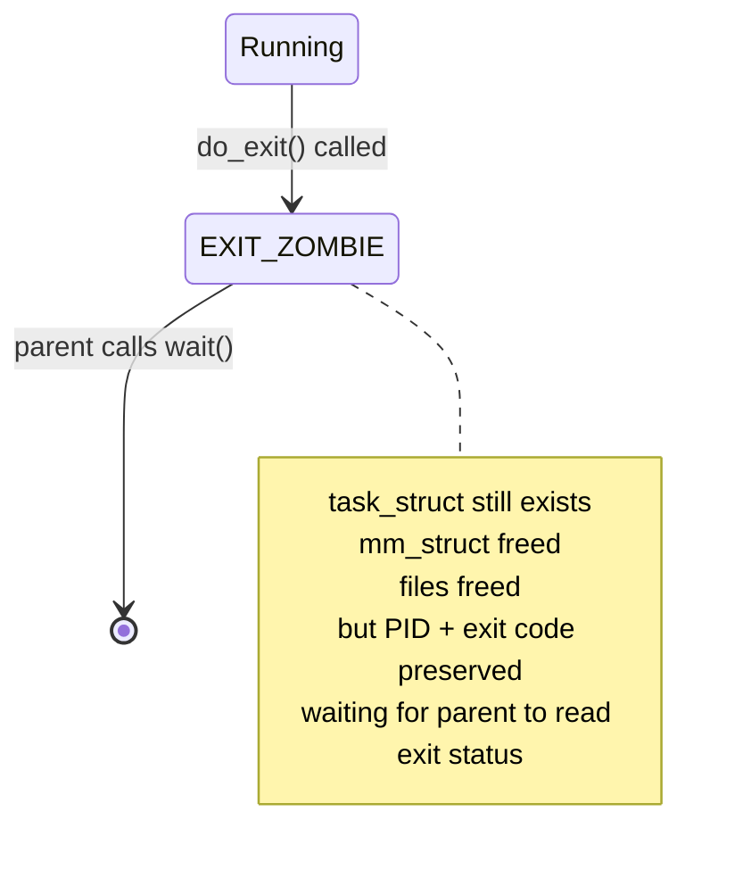
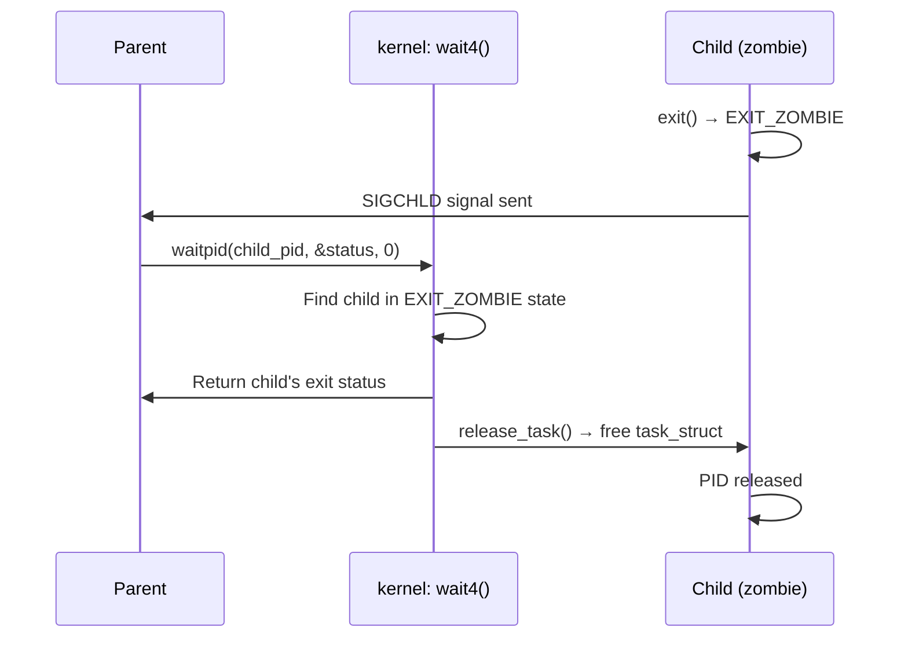
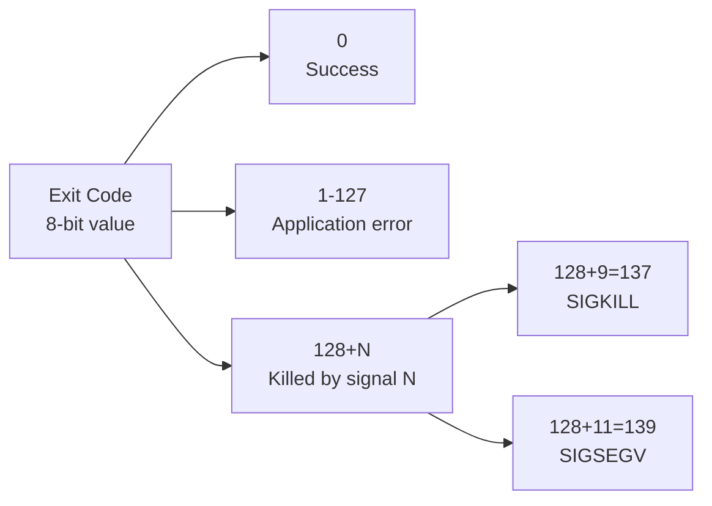

# 05 — Process Termination

## 1. Definition

Process termination in Linux is a two-phase process:
1. **`do_exit()`** — The process cleans up its resources and becomes a zombie
2. **`wait()`** — The parent reaps the zombie, freeing the process descriptor

---

## 2. Termination Overview

```mermaid
flowchart TD
    Causes[Termination Causes] --> Exit[exit\(\) called]
    Causes --> Signal[Fatal signal received\nSIGKILL, SIGSEGV...]
    Causes --> Return[main\(\) returns]
    Exit --> DoExit[do_exit\(\)\nkernel/exit.c]
    Signal --> DoExit
    Return --> LibCExit[libc: __libc_start_main\ncalls exit\(\)] --> DoExit
    DoExit --> Cleanup[Resource cleanup]
    Cleanup --> Zombie[EXIT_ZOMBIE state\nWaiting for parent]
    Zombie --> ParentWait[Parent calls wait\(\)/waitpid\(\)]
    ParentWait --> Release[release_task\(\)\nFree task_struct]
    Release --> Gone[Process fully gone]
```

---

## 3. do_exit() — Step by Step

```c
/* kernel/exit.c */
void __noreturn do_exit(long code)
{
    struct task_struct *tsk = current;
    
    /* 1. Set exit code */
    tsk->exit_code = code;
    
    /* 2. Set PF_EXITING flag — prevents new signals */
    tsk->flags |= PF_EXITING;
    
    /* 3. Call exit_signals() — stop handling signals */
    exit_signals(tsk);
    
    /* 4. Release mm_struct (virtual memory) */
    exit_mm();
    
    /* 5. Release semaphores */
    sem_exit();
    
    /* 6. Release file descriptors */
    exit_files(tsk);
    
    /* 7. Release filesystem references (cwd, root) */
    exit_fs(tsk);
    
    /* 8. Release namespaces */
    exit_task_namespaces(tsk);
    
    /* 9. Remove from timer lists, release timers */
    exit_itimers(tsk);
    
    /* 10. Notify parent via SIGCHLD */
    do_notify_parent(tsk, tsk->exit_signal);
    
    /* 11. Re-parent children to init (PID 1) or subreaper */
    forget_original_parent(tsk);
    
    /* 12. Set state to EXIT_ZOMBIE */
    tsk->exit_state = EXIT_ZOMBIE;
    
    /* 13. Schedule — this task never runs again */
    schedule();
    BUG();  /* Never reached */
}
```

---

## 4. Zombie Processes



### What is a Zombie?
- A process that has completed execution but whose `task_struct` has **not yet been freed**
- The kernel preserves it so the **parent can read the exit status** via `wait()`
- A zombie holds almost no resources — just the `task_struct` and PID

```bash
# Seeing zombie processes
$ ps aux | grep 'Z'
root  12345  0.0  0.0  0  0  Z  10:00  0:00 [defunct]

# STAT Z = EXIT_ZOMBIE
```

### Why Zombies Are a Problem
- Each zombie occupies a PID slot
- System has a finite PID limit (`/proc/sys/kernel/pid_max`)
- A leak of zombie processes (forgetting to call `wait()`) is a bug

---

## 5. wait() — The Parent Reaps the Child



### User-Space Usage
```c
#include <sys/wait.h>

pid_t pid = fork();
if (pid == 0) {
    /* Child */
    exit(42);
} else {
    /* Parent */
    int status;
    pid_t dead = waitpid(pid, &status, 0);
    
    if (WIFEXITED(status))
        printf("Child exited with: %d\n", WEXITSTATUS(status));  /* 42 */
    else if (WIFSIGNALED(status))
        printf("Child killed by signal: %d\n", WTERMSIG(status));
}
```

### wait() Variants
| Function | Description |
|----------|-------------|
| `wait(&status)` | Wait for any child |
| `waitpid(pid, &status, opts)` | Wait for specific child |
| `waitid(idtype, id, &info, opts)` | POSIX, more flexible |
| `wait3(&status, opts, &usage)` | + resource usage |
| `wait4(pid, &status, opts, &usage)` | + resource usage + pid |

---

## 6. Orphan Processes and Reparenting

If a parent dies before its children, the children become **orphans**:

```mermaid
flowchart TD
    Parent[Parent\nPID 100] --> Child1[Child 1\nPID 200]
    Parent --> Child2[Child 2\nPID 300]
    Parent --> |dies| Dead[💀 Parent gone]
    Dead --> |reparenting| Init[PID 1 systemd\nnew parent of 200, 300]
    Init --> |wait\(\) for| Child1
    Init --> |wait\(\) for| Child2
```

### Subreaper
Since Linux 3.4, a process can register itself as a **subreaper** — orphans are reparented to it instead of PID 1:
```c
/* Make current process the subreaper for its subtree */
prctl(PR_SET_CHILD_SUBREAPER, 1);
```
Used by process managers like `systemd`, `supervisord`, container runtimes.

---

## 7. release_task() — Final Cleanup

After the parent calls `wait()`, `release_task()` runs:

```c
/* kernel/exit.c */
void release_task(struct task_struct *p)
{
    /* Remove from PID hash tables */
    detach_pid(p, PIDTYPE_PID);
    
    /* Remove from the global task list */
    list_del_rcu(&p->tasks);
    
    /* Drop reference to parent */
    put_task_struct_rcu_user(p);
    
    /* The task_struct is freed when its RCU grace period expires */
    put_task_struct(p);
}
```

---

## 8. Exit Codes



```bash
# In shell
./myprogram
echo $?          # Print exit code of last command

# Common exit codes
0    # Success
1    # General error
2    # Misuse of shell builtins
126  # Command found but not executable
127  # Command not found
130  # Terminated by Ctrl+C (SIGINT = 2, so 128+2=130)
137  # Killed by SIGKILL
139  # Segfault (SIGSEGV = 11, so 128+11=139)
```

---

## 9. Signal-Induced Termination

```mermaid
flowchart TD
    Signal[Signal delivered to process] --> Handler{Is there\na signal handler?}
    Handler --> |Yes| RunHandler[Run signal handler\nprocess may survive]
    Handler --> |No| Default{Default action?}
    Default --> |Terminate| DoExit[do_exit\(\)\nwith signal info]
    Default --> |CoreDump| Core[Write core file\nthen do_exit\(\)]
    Default --> |Ignore| Ignore[Signal ignored]
    Default --> |Stop| Stop[TASK_STOPPED]
```

### Fatal Signals (default: terminate)
| Signal | Number | Cause |
|--------|--------|-------|
| `SIGKILL` | 9 | Unconditional kill (cannot be caught) |
| `SIGTERM` | 15 | Polite termination request |
| `SIGSEGV` | 11 | Segmentation fault |
| `SIGFPE` | 8 | Floating point exception |
| `SIGBUS` | 7 | Bus error |
| `SIGILL` | 4 | Illegal instruction |
| `SIGABRT` | 6 | Abort (from `abort()`) |

---

## 10. Related Concepts
- [01_What_Is_A_Process.md](./01_What_Is_A_Process.md) — Process states
- [02_Process_Descriptor_task_struct.md](./02_Process_Descriptor_task_struct.md) — task_struct fields involved
- [06_Threads_In_Linux.md](./06_Threads_In_Linux.md) — Thread termination
