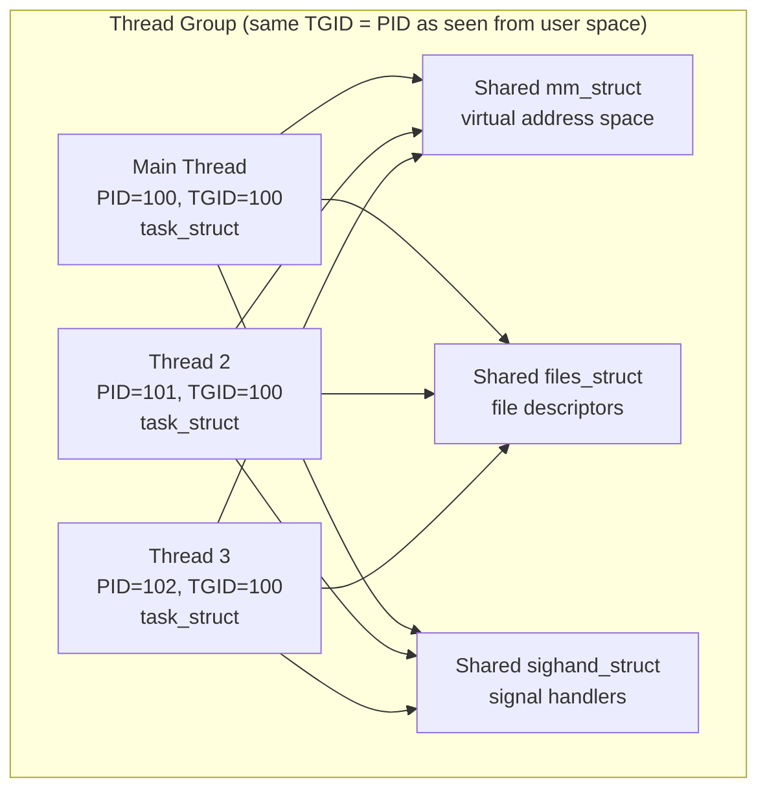
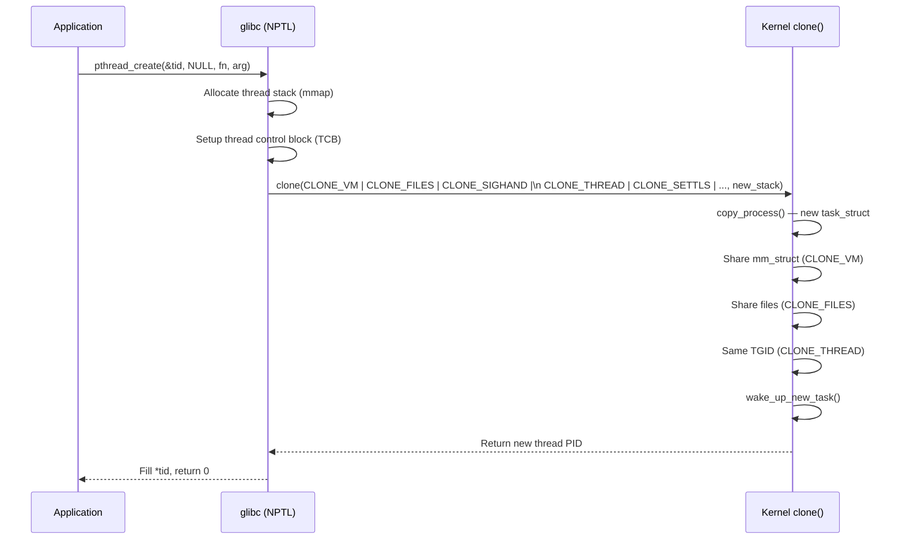
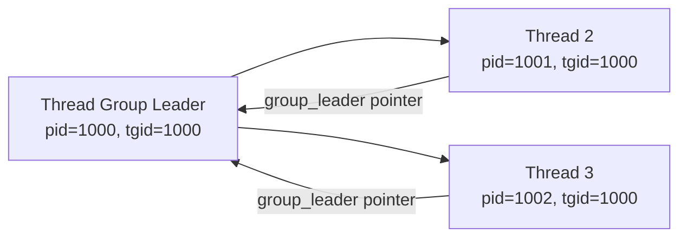
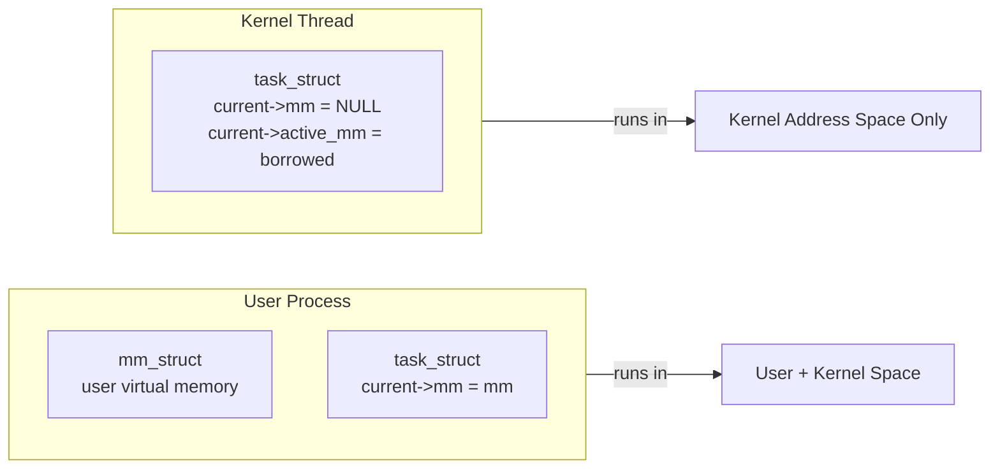
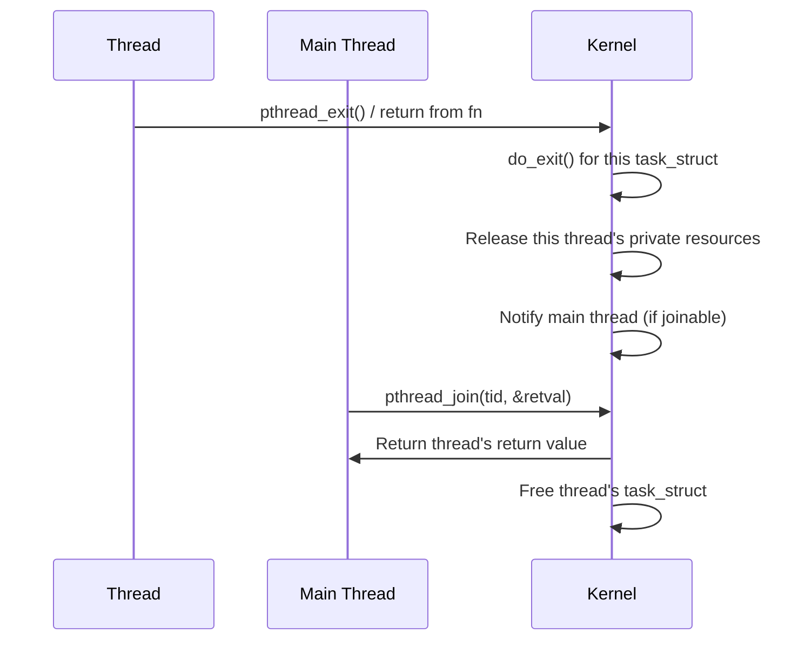

# 06 — Threads in Linux

## 1. Definition

In Linux, **threads are not a separate concept from processes** at the kernel level. A thread is simply a **process that shares certain resources** (address space, file descriptors, signal handlers) with other processes.

The kernel mechanism that enables threads is the **`clone()` system call** with sharing flags.

---

## 2. The Linux Thread Model



---

## 3. Threads vs Processes — The Kernel View

| Aspect | Process (`fork()`) | Thread (`clone()` with CLONE_VM) |
|--------|-------------------|----------------------------------|
| `task_struct` | Separate | Separate (one per thread!) |
| `mm_struct` | Private copy (CoW) | Shared (`CLONE_VM`) |
| `files_struct` | Copied | Shared (`CLONE_FILES`) |
| `sighand_struct` | Copied | Shared (`CLONE_SIGHAND`) |
| `pid` | New PID | New PID (but same TGID) |
| `tgid` | New (= own PID) | Same as main thread |
| Scheduler | Separate `sched_entity` | Separate `sched_entity` |

> **Key point:** Each thread has its OWN `task_struct` and is scheduled independently. The kernel doesn't know about "threads" — it only knows about tasks (processes).

---

## 4. Creating Threads with pthreads

```c
#include <pthread.h>
#include <stdio.h>

void *thread_function(void *arg) {
    printf("Thread running, TID: %ld\n", syscall(SYS_gettid));
    return NULL;
}

int main() {
    pthread_t tid;
    
    /* Creates a new thread — calls clone() internally */
    pthread_create(&tid, NULL, thread_function, NULL);
    
    pthread_join(tid, NULL);  /* Wait for thread to finish */
    return 0;
}
```

### What pthread_create does internally:


---

## 5. Thread Identification

```c
#include <unistd.h>
#include <sys/syscall.h>

/* User-space perspective */
getpid()    /* Returns TGID — same for all threads in process */
gettid()    /* Returns PID (kernel) — unique per thread */

/* In kernel code */
current->pid    /* Thread's individual PID */
current->tgid   /* Thread group ID = main thread's PID */

/* Check if current task is the thread group leader */
thread_group_leader(current)   /* Returns true if pid == tgid */
```

---

## 6. Thread-Group Leader

The **first thread** in a process is the **thread group leader**:
- Its `pid == tgid`
- All other threads have `tgid == leader's pid`
- When you call `kill(pid, signal)` it targets the thread group leader by default



---

## 7. NPTL — Native POSIX Thread Library

Linux's modern threading implementation:

| Library | Model | Linux version |
|---------|-------|--------------|
| LinuxThreads (old) | 1:1 but broken | Kernel 2.0–2.4 |
| **NPTL** (current) | 1:1 (one kernel task per thread) | Kernel 2.6+ |

**1:1 model:** Each POSIX thread maps directly to one kernel `task_struct`. This means:
- Full SMP parallelism — threads run on different CPUs simultaneously
- Blocking one thread doesn't block others
- Kernel scheduler sees and schedules each thread independently

---

## 8. Kernel Threads

Kernel threads are processes with **no user address space** (`mm = NULL`):



```c
/* Creating a kernel thread */
#include <linux/kthread.h>

static int worker_fn(void *data)
{
    while (!kthread_should_stop()) {
        /* ... do kernel work ... */
        if (need_to_sleep)
            schedule_timeout(HZ);  /* sleep 1 second */
    }
    return 0;
}

/* Start */
struct task_struct *kthread = kthread_run(worker_fn, NULL, "myworker/%d", id);

/* Stop */
kthread_stop(kthread);
```

### Common Kernel Threads
| Kernel Thread | Purpose |
|--------------|---------|
| `kthreadd` | PID 2 — creates all other kernel threads |
| `ksoftirqd/N` | Processes softirqs on CPU N |
| `kworker/N:M` | Runs deferred work (work queues) |
| `kswapd0` | Frees memory pages when low |
| `jbd2/sdaN-8` | ext4 journaling thread |
| `migration/N` | Migrates tasks between CPUs |
| `watchdog/N` | Detects kernel hangs (lockup detector) |

---

## 9. Thread Termination



### Thread Exit Options
```c
/* Thread exits normally */
void *fn(void *arg) { return (void*)42; }

/* Thread exits explicitly */
pthread_exit((void*)42);

/* Terminate entire process (kills all threads) */
exit(0);
_exit(0);   /* skips atexit handlers */
abort();    /* sends SIGABRT */
```

---

## 10. Thread Safety and Shared State

Since threads share the address space:
```c
/* PROBLEM: Race condition */
int counter = 0;

void *increment(void *arg) {
    for (int i = 0; i < 1000000; i++)
        counter++;   /* NOT atomic — data race! */
    return NULL;
}

/* SOLUTION: Use mutex */
pthread_mutex_t lock = PTHREAD_MUTEX_INITIALIZER;

void *increment_safe(void *arg) {
    for (int i = 0; i < 1000000; i++) {
        pthread_mutex_lock(&lock);
        counter++;
        pthread_mutex_unlock(&lock);
    }
    return NULL;
}
```

> For kernel thread synchronization, see Chapter 08 and 09 (Kernel Synchronization Methods).

---

## 11. Related Concepts
- [03_Process_Creation_fork_clone.md](./03_Process_Creation_fork_clone.md) — clone() flags for threads
- [../03_Process_Scheduling/](../03_Process_Scheduling/) — How threads are scheduled
- [../08_Intro_To_Kernel_Synchronization/](../08_Intro_To_Kernel_Synchronization/) — Thread synchronization in kernel
