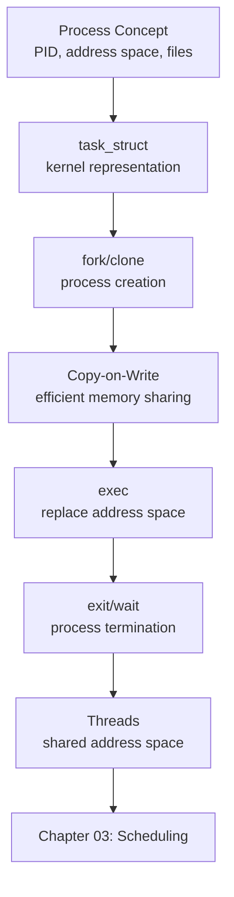

# Chapter 02 — Process Management

> **Book:** Linux Kernel Development — Robert Love (3rd Edition)  
> **Goal:** Understand what processes and threads are in the Linux kernel, how they are represented, created, and terminated.

---

## Learning Objectives
- Understand the process descriptor (`task_struct`)
- Understand how `fork()`, `clone()`, `exec()` work at kernel level
- Understand Copy-on-Write (CoW)
- Understand how threads differ from processes in Linux
- Understand process termination and cleanup

---

## Topic Index

| File | Description |
|------|-------------|
| [01_What_Is_A_Process.md](./01_What_Is_A_Process.md) | Processes, threads, kernel threads |
| [02_Process_Descriptor_task_struct.md](./02_Process_Descriptor_task_struct.md) | struct task_struct in depth |
| [03_Process_Creation_fork_clone.md](./03_Process_Creation_fork_clone.md) | fork(), vfork(), clone(), copy_process() |
| [04_Copy_On_Write.md](./04_Copy_On_Write.md) | CoW mechanism for memory efficiency |
| [05_Process_Termination.md](./05_Process_Termination.md) | do_exit(), wait4(), zombie processes |
| [06_Threads_In_Linux.md](./06_Threads_In_Linux.md) | Threads as processes, NPTL, kernel threads |

---

## Chapter Flow

