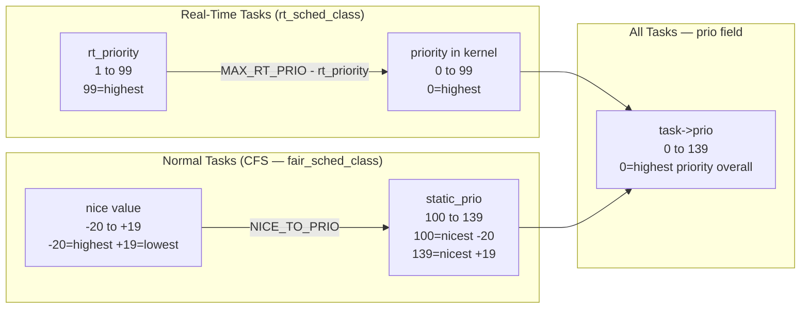
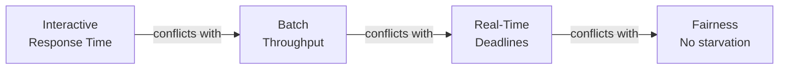

# 01 — Scheduling Policy and Priority

## 1. Definition

The **scheduler** is the kernel subsystem that decides **which task runs on the CPU next** and **for how long**. The scheduler's goals:

1. **Fairness** — every task gets its fair share of CPU time
2. **Responsiveness** — interactive tasks (UI, shell) feel fast
3. **Throughput** — maximize total work done (batch/CPU-bound tasks)
4. **Scalability** — work efficiently with thousands of tasks and many CPUs
5. **Real-time** — guarantee deadlines for RT tasks

---

## 2. Scheduling Classes

Linux uses a **modular scheduler design** — multiple scheduler classes, each handling different types of tasks:

```mermaid
flowchart TB
    Schedule[schedule\(\)] --> |pick_next_task| Check

    subgraph Classes["Scheduler Classes (priority order — highest first)"]
        Stop[stop_sched_class\nHighest priority\nstop_machine tasks]
        DL[dl_sched_class\nDeadline scheduling\nSCHED_DEADLINE]
        RT[rt_sched_class\nReal-time\nSCHED_FIFO / SCHED_RR]
        Fair[fair_sched_class\nCFS — normal processes\nSCHED_NORMAL / SCHED_BATCH]
        Idle[idle_sched_class\nLowest priority\nIdle thread]
    end

    Check --> Stop
    Stop --> |no task?| DL
    DL --> |no task?| RT
    RT --> |no task?| Fair
    Fair --> |no task?| Idle
```

| Class | Policy | Use Case |
|-------|--------|---------|
| `stop_sched_class` | N/A | Internal: hotplug, migration |
| `dl_sched_class` | `SCHED_DEADLINE` | Tasks with hard deadlines |
| `rt_sched_class` | `SCHED_FIFO`, `SCHED_RR` | Real-time audio, industrial control |
| `fair_sched_class` | `SCHED_NORMAL`, `SCHED_BATCH`, `SCHED_IDLE` | Regular user processes |
| `idle_sched_class` | N/A | CPU idle loop |

---

## 3. Scheduling Policies

```c
/* include/uapi/linux/sched.h */
#define SCHED_NORMAL    0   /* Default — CFS fair scheduler */
#define SCHED_FIFO      1   /* Real-time FIFO (no time slice) */
#define SCHED_RR        2   /* Real-time Round-Robin (time slice) */
#define SCHED_BATCH     3   /* CPU-bound batch jobs (lower priority within CFS) */
#define SCHED_IDLE      5   /* Very low priority background tasks */
#define SCHED_DEADLINE  6   /* Earliest Deadline First */
```

---

## 4. Priority System

Linux has **two orthogonal priority concepts**:



### Priority Number Mapping

| Range | Type | Description |
|-------|------|-------------|
| 0–99 | Real-time | RT tasks: `sched_priority` 99→prio 0, `sched_priority` 1→prio 98 |
| 100–139 | Normal | CFS tasks: nice -20→prio 100, nice 0→prio 120, nice +19→prio 139 |

```c
/* Conversion macros */
#define MAX_RT_PRIO         100
#define DEFAULT_PRIO        (MAX_RT_PRIO + 20)    /* = 120 (nice 0) */

/* nice to static_prio */
#define NICE_TO_PRIO(nice)  (MAX_RT_PRIO + (nice) + 20)
/* nice 0  → static_prio 120 */
/* nice -20 → static_prio 100 */
/* nice +19 → static_prio 139 */
```

---

## 5. The `nice` Value

**nice** determines how "nice" a process is to others — higher nice = lower priority = more generous:

```bash
# Run a command at nice value +10 (lower priority)
nice -n 10 make -j8

# Change nice of running process
renice -n 5 -p 1234    # Increase nice (lower priority) by 5

# View nice values
ps -eo pid,ni,comm     # ni = nice value
top                     # NI column
```

```c
/* In kernel: getting/setting nice */
int nice = task_nice(current);         /* Get nice value */
set_user_nice(current, 10);           /* Set nice value */

/* nice value stored as static_prio */
int static_prio = current->static_prio;   /* 100–139 */
int nice = PRIO_TO_NICE(static_prio);     /* -20 to +19 */
```

### Effect of nice on CFS
- nice -20: gets ~4x more CPU time than nice 0
- nice +19: gets ~4x less CPU time than nice 0
- The relationship is **non-linear** (geometric progression)

---

## 6. task_struct Scheduling Fields

```c
struct task_struct {
    int                     prio;           /* effective priority (0-139) */
    int                     static_prio;    /* nice-based priority (100-139) */
    int                     normal_prio;    /* without RT boost */
    unsigned int            rt_priority;    /* RT priority 0-99 */
    
    const struct sched_class *sched_class;  /* which scheduler class */
    struct sched_entity      se;            /* CFS scheduler entity */
    struct sched_rt_entity   rt;            /* RT scheduler entity */
    struct sched_dl_entity   dl;            /* Deadline scheduler entity */
    
    unsigned int             policy;        /* SCHED_NORMAL etc. */
    int                      nr_cpus_allowed; /* allowed CPUs */
    cpumask_t                cpus_mask;     /* CPU affinity */
    
    unsigned int             time_slice;    /* remaining time slice (RT RR) */
};
```

---

## 7. Scheduler API

### Setting Policy/Priority
```c
/* User space: sched_setscheduler() syscall */
struct sched_param param = { .sched_priority = 50 };
sched_setscheduler(pid, SCHED_FIFO, &param);

/* Get current policy */
sched_getscheduler(pid);

/* Kernel space */
sched_setscheduler_nocheck(task, SCHED_NORMAL, &param);
```

### Yielding CPU
```c
/* User space: voluntarily give up CPU */
sched_yield();

/* Kernel space */
schedule();         /* Put current task to sleep if needed */
cond_resched();     /* Schedule only if needed (preempt point) */
yield();            /* Voluntarily yield CPU */
```

---

## 8. Scheduling Goals Tradeoffs



Linux resolves this with:
- **CFS** handles interactive + batch with automatic detection
- **RT classes** handle real-time with explicit policy
- **SCHED_IDLE** handles very background tasks explicitly

---

## 9. Related Concepts
- [02_CFS_Completely_Fair_Scheduler.md](./02_CFS_Completely_Fair_Scheduler.md) — How CFS implements fairness
- [06_Real_Time_Scheduling.md](./06_Real_Time_Scheduling.md) — FIFO and RR in depth
- [../02_Process_Management/02_Process_Descriptor_task_struct.md](../02_Process_Management/02_Process_Descriptor_task_struct.md) — Scheduling fields in task_struct
