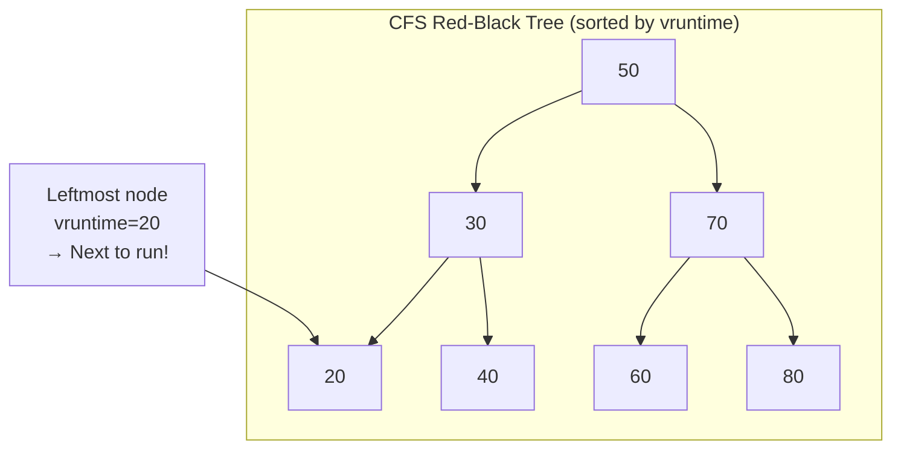
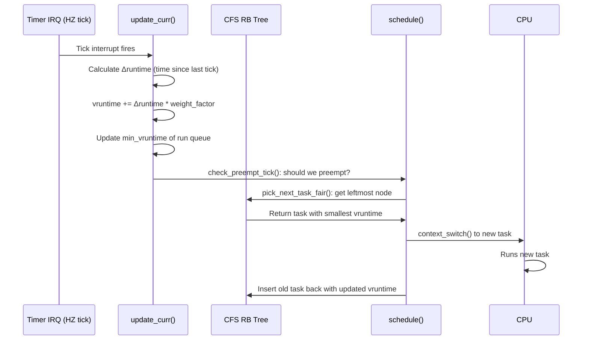
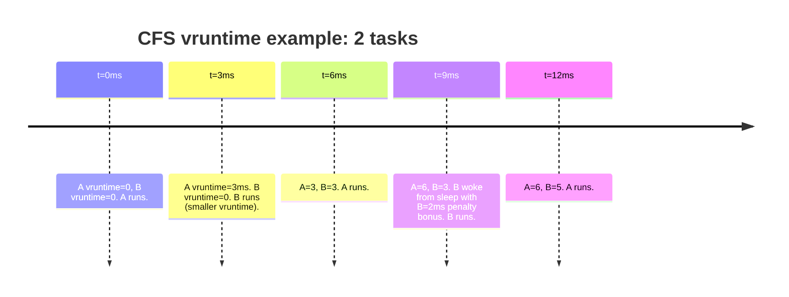

# 02 — CFS: The Completely Fair Scheduler

## 1. Definition

**CFS (Completely Fair Scheduler)** is the default scheduler for normal (`SCHED_NORMAL`) processes in Linux since kernel 2.6.23. It replaced the older O(1) scheduler.

**Core idea:** Every process should receive exactly **1/N of CPU time** (where N is the number of runnable processes). CFS models this on an "ideal multi-tasking CPU" that runs all processes simultaneously and uses **virtual runtime (`vruntime`)** to track how much CPU time each task has received.

---

## 2. Virtual Runtime (`vruntime`)

`vruntime` is the **amount of time a task has run, normalized by its weight (priority)**:

$$\text{vruntime} += \frac{\Delta\text{runtime} \times NICE\_0\_WEIGHT}{\text{task\_weight}}$$

Where:
- `Δruntime` = actual time spent on CPU (nanoseconds)  
- `NICE_0_WEIGHT` = 1024 (weight for nice 0)
- `task_weight` = weight derived from nice value

**Consequence:**
- Higher-priority tasks (lower nice) have **lower weight divisor → vruntime grows slower** → they run more
- Lower-priority tasks (higher nice) have **higher weight divisor → vruntime grows faster** → they run less

### Nice Value to Weight Mapping

```c
/* kernel/sched/core.c */
const int sched_prio_to_weight[40] = {
 /* -20 */  88761, 71755, 56483, 46273, 36291,
 /* -15 */  29154, 23254, 18705, 14949, 11916,
 /* -10 */   9548,  7620,  6100,  4904,  3906,
 /*  -5 */   3121,  2501,  1991,  1586,  1277,
 /*   0 */   1024,   820,   655,   526,   423,
 /*   5 */    335,   272,   215,   172,   137,
 /*  10 */    110,    87,    70,    56,    45,
 /*  15 */     36,    29,    23,    18,    15,
};
/* nice 0 = 1024, nice -1 ≈ 1.25x, each step ≈ 1.25x multiplier */
```

---

## 3. The Red-Black Tree

CFS keeps all runnable tasks in a **red-black tree**, sorted by `vruntime`:



**Rule:** The **leftmost node** in the tree has the smallest `vruntime` — it has received the least CPU time — it is the **task that runs next**.

### Red-Black Tree Properties
- Balanced binary search tree
- Lookup, insert, delete: all O(log N)
- Leftmost node cached: O(1) to pick next task
- Self-balancing — no degeneration to O(N)

---

## 4. CFS Scheduling Decision: Pick Next Task

```mermaid
flowchart TD
    Schedule[schedule\(\) called] --> PickNext[pick_next_task_fair\(\)]
    PickNext --> LeftMost[Get leftmost node\nfrom RB tree]
    LeftMost --> CurrentVR[Compare vruntime:\ncurrent vs leftmost]
    CurrentVR --> |current.vruntime > leftmost.vruntime + threshold| Switch[Context switch\nto leftmost task]
    CurrentVR --> |current.vruntime still smallest| Continue[Current task\ncontinues running]
    Switch --> UpdateVR[Update vruntimes]
    UpdateVR --> InsertRB[Re-insert old task\ninto RB tree at new vruntime position]
```

---

## 5. sched_entity — CFS's View of a Task

```c
/* include/linux/sched.h */
struct sched_entity {
    struct load_weight      load;           /* Task weight (from nice value) */
    struct rb_node          run_node;       /* Node in CFS RB tree */
    struct list_head        group_node;     /* Node in task groups */
    unsigned int            on_rq;          /* 1 if on run queue */

    u64                     exec_start;     /* Time of last schedule in */
    u64                     sum_exec_runtime; /* Total runtime so far */
    u64                     vruntime;       /* Virtual runtime (KEY FIELD) */
    u64                     prev_sum_exec_runtime; /* For context switch accounting */

    u64                     nr_migrations;  /* Times migrated between CPUs */

    struct sched_statistics statistics;     /* Scheduling stats (CONFIG_SCHED_DEBUG) */
};
```

---

## 6. CFS Algorithm — Full Flow



---

## 7. min_vruntime — Handling New/Woken Tasks

**Problem:** If a new task starts with `vruntime = 0`, it would dominate the CPU for a long time.

**Solution:** New tasks are given `vruntime = min_vruntime` of the run queue — they start from the current minimum, not 0:

```c
/* kernel/sched/fair.c */
static void place_entity(struct cfs_rq *cfs_rq, struct sched_entity *se, int initial)
{
    u64 vruntime = cfs_rq->min_vruntime;

    if (initial && sched_feat(START_DEBIT))
        vruntime += sched_vslice(cfs_rq, se);   /* New tasks start ahead */

    /* Waking tasks get a small bonus */
    if (!initial)
        vruntime -= sched_latency_ns / 2;

    se->vruntime = max_vruntime(se->vruntime, vruntime);
}
```

---

## 8. Scheduling Latency and Time Slice

CFS doesn't use fixed time slices. Instead it uses **scheduling latency** — a target period in which every task should run at least once:

```c
/* kernel/sched/fair.c */
/* sysctl_sched_latency: default 6ms, min 0.75ms */
unsigned int sysctl_sched_latency = 6000000ULL;        /* 6ms */
unsigned int sysctl_sched_min_granularity = 750000ULL; /* 0.75ms */

/* Time slice for each task = (weight/total_weight) * latency */
/* With 2 tasks of equal priority: each gets 3ms */
/* With 10 tasks: each gets 0.6ms (clamped to min_granularity) */
```

### Tunable Parameters
```bash
# View/modify CFS parameters
cat /proc/sys/kernel/sched_latency_ns         # Target latency (nanoseconds)
cat /proc/sys/kernel/sched_min_granularity_ns # Minimum time slice
cat /proc/sys/kernel/sched_wakeup_granularity_ns # Wakeup preemption threshold
```

---

## 9. CFS Run Queue: struct cfs_rq

```c
/* kernel/sched/sched.h */
struct cfs_rq {
    struct load_weight      load;       /* Total weight of all tasks */
    unsigned int            nr_running; /* Number of runnable tasks */

    u64                     min_vruntime; /* Monotonically increasing min */

    struct rb_root_cached   tasks_timeline; /* Red-black tree */

    struct sched_entity     *curr;      /* Currently running entity */
    struct sched_entity     *next;      /* Next to run (skip buddy) */
    struct sched_entity     *last;      /* Last ran entity */
    struct sched_entity     *skip;      /* Entity to skip */
    
    /* ... group scheduling, throttling ... */
};
```

---

## 10. CFS and Interactivity

CFS handles interactive processes well because:
- **Sleeping tasks** don't accumulate CPU debt
- When a **waking task** has low `vruntime` (slept a lot) it gets scheduled quickly
- Interactive processes (waiting for keystrokes) sleep often → low vruntime → preempt CPU-bound tasks immediately when woken



---

## 11. Related Concepts
- [03_Run_Queue_And_Red_Black_Tree.md](./03_Run_Queue_And_Red_Black_Tree.md) — struct rq and RB tree operations
- [04_Scheduler_Entry_Points.md](./04_Scheduler_Entry_Points.md) — How schedule() calls CFS
- [01_Scheduling_Policy_And_Priority.md](./01_Scheduling_Policy_And_Priority.md) — Priority and weights
