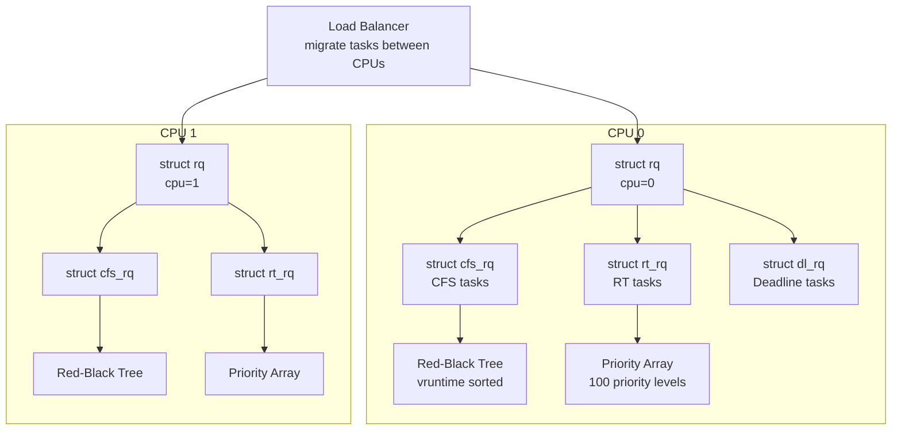
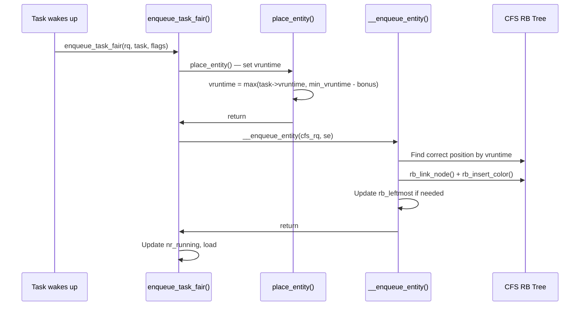
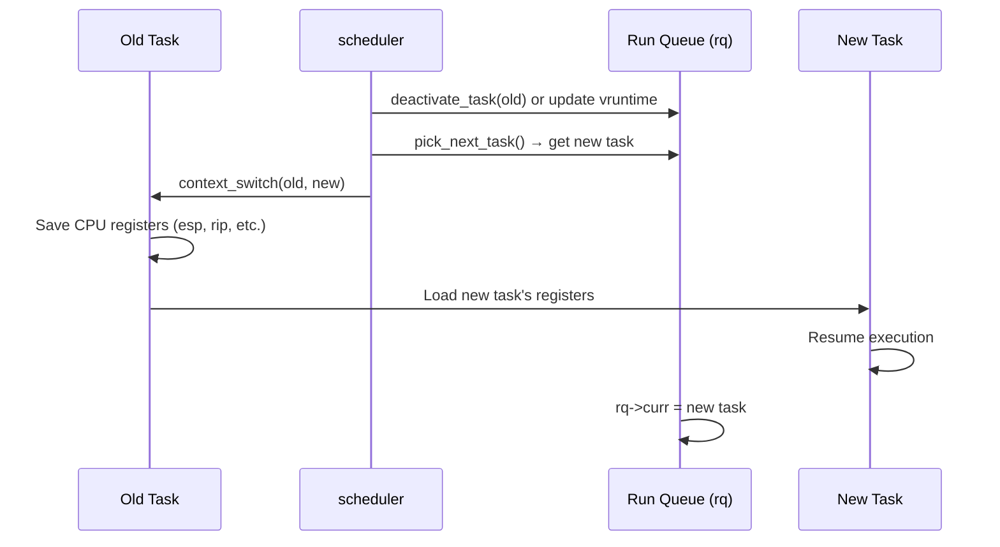

# 03 — Run Queue and Red-Black Tree

## 1. Definition

The **run queue** (`struct rq`) is the per-CPU data structure that holds all runnable tasks for a given CPU. Each CPU has its own run queue. The CFS component of the run queue uses a **red-black tree** sorted by virtual runtime.

---

## 2. struct rq — Per-CPU Run Queue

```c
/* kernel/sched/sched.h (simplified) */
struct rq {
    raw_spinlock_t      lock;           /* Queue lock */

    unsigned int        nr_running;     /* Total runnable tasks on this CPU */
    
    u64                 nr_switches;    /* Number of context switches */

    struct cfs_rq       cfs;            /* CFS run queue */
    struct rt_rq        rt;             /* RT run queue */
    struct dl_rq        dl;             /* Deadline run queue */

    struct task_struct  *curr;          /* Currently running task */
    struct task_struct  *idle;          /* Idle task for this CPU */
    struct task_struct  *stop;          /* Stop task (highest priority) */

    u64                 clock;          /* Queue's local clock */
    u64                 clock_task;     /* Task-specific clock */

    /* Load tracking */
    struct sched_avg    avg_rt;
    struct sched_avg    avg_dl;
    struct sched_avg    avg_thermal;

    /* Migration */
    int                 cpu;            /* Which CPU this rq belongs to */
    int                 online;         /* Is this CPU online? */

    /* ... */
};

/* Array of run queues, one per CPU */
DEFINE_PER_CPU_SHARED_ALIGNED(struct rq, runqueues);

/* Convenience macro */
#define cpu_rq(cpu)     (&per_cpu(runqueues, (cpu)))
#define this_rq()       this_cpu_ptr(&runqueues)
#define task_rq(p)      cpu_rq(task_cpu(p))
```

---

## 3. Run Queue Structure Diagram



---

## 4. Red-Black Tree Properties

A red-black tree is a **self-balancing binary search tree** with these invariants:

```
1. Every node is RED or BLACK
2. The root is BLACK
3. Every leaf (NIL) is BLACK
4. If a node is RED, both children are BLACK
5. All paths from any node to its descendant NIL leaves
   have the same number of BLACK nodes
```

These invariants guarantee: **height ≤ 2·log₂(n+1)** → O(log n) operations.

### Red-Black Tree Example (CFS)

```
                   [50, BLACK]
                  /             \
        [30, RED]               [70, BLACK]
        /       \               /          \
  [20,BLACK] [40,BLACK]   [60,RED]      [80,RED]
  
  vruntime values: 20, 30, 40, 50, 60, 70, 80
  Next to run: leftmost = 20
```

---

## 5. Red-Black Tree API in Kernel

```c
/* include/linux/rbtree.h */

/* Node embedded in each data structure */
struct rb_node {
    unsigned long __rb_parent_color;
    struct rb_node *rb_right;
    struct rb_node *rb_left;
};

/* Root of the tree */
struct rb_root {
    struct rb_node *rb_node;
};

/* Root with cached leftmost node (O(1) pick_next) */
struct rb_root_cached {
    struct rb_root rb_root;
    struct rb_node *rb_leftmost;   /* Cached! */
};

/* Operations */
void rb_insert_color(struct rb_node *node, struct rb_root *root);
void rb_erase(struct rb_node *node, struct rb_root *root);
struct rb_node *rb_first(const struct rb_root *root); /* Leftmost */
struct rb_node *rb_last(const struct rb_root *root);  /* Rightmost */
struct rb_node *rb_next(const struct rb_node *node);
struct rb_node *rb_prev(const struct rb_node *node);
```

---

## 6. CFS RB Tree Insert: enqueue_task_fair()



### `__enqueue_entity()` in code:
```c
/* kernel/sched/fair.c */
static void __enqueue_entity(struct cfs_rq *cfs_rq, struct sched_entity *se)
{
    struct rb_node **link = &cfs_rq->tasks_timeline.rb_root.rb_node;
    struct rb_node *parent = NULL;
    struct sched_entity *entry;
    bool leftmost = true;

    /* Find correct position: walk tree comparing vruntimes */
    while (*link) {
        parent = *link;
        entry = rb_entry(parent, struct sched_entity, run_node);
        if (entity_before(se, entry)) {
            link = &parent->rb_left;
        } else {
            link = &parent->rb_right;
            leftmost = false;
        }
    }

    rb_link_node(&se->run_node, parent, link);
    rb_insert_color_cached(&se->run_node,
                           &cfs_rq->tasks_timeline, leftmost);
}
```

---

## 7. CFS RB Tree Remove: dequeue_task_fair()

```c
/* kernel/sched/fair.c */
static void __dequeue_entity(struct cfs_rq *cfs_rq, struct sched_entity *se)
{
    rb_erase_cached(&se->run_node, &cfs_rq->tasks_timeline);
}

static void dequeue_task_fair(struct rq *rq, struct task_struct *p, int flags)
{
    struct cfs_rq *cfs_rq;
    struct sched_entity *se = &p->se;

    /* Walk up the scheduling hierarchy (for group scheduling) */
    for_each_sched_entity(se) {
        cfs_rq = cfs_rq_of(se);
        dequeue_entity(cfs_rq, se, flags);
        /* ... group scheduling updates ... */
    }
    /* ... */
}
```

---

## 8. Pick Next Task: pick_next_task_fair()

```c
/* kernel/sched/fair.c (simplified) */
static struct task_struct *
pick_next_task_fair(struct rq *rq, struct task_struct *prev, struct rq_flags *rf)
{
    struct cfs_rq *cfs_rq = &rq->cfs;
    struct sched_entity *se;
    struct task_struct *p;

    /* Get leftmost entity (smallest vruntime) */
    se = pick_next_entity(cfs_rq, NULL);
    
    /* Convert sched_entity to task_struct */
    p = task_of(se);    /* container_of(se, struct task_struct, se) */
    
    /* Set as current */
    set_next_entity(cfs_rq, se);
    
    return p;
}
```

---

## 9. RT Run Queue: struct rt_rq

```c
struct rt_rq {
    struct rt_prio_array    active;     /* Bitmap + list per priority */
    unsigned int            rt_nr_running;
    unsigned int            rr_nr_running;  /* SCHED_RR tasks */
    /* ... */
};

/* 100-priority array */
struct rt_prio_array {
    DECLARE_BITMAP(bitmap, MAX_RT_PRIO + 1);  /* Bitmap of non-empty lists */
    struct list_head queue[MAX_RT_PRIO];       /* One FIFO queue per priority */
};
```

RT task selection: **find highest set bit in bitmap** → O(1) using `sched_find_first_bit`.

---

## 10. Context Switch and Run Queue Update



---

## 11. Related Concepts
- [02_CFS_Completely_Fair_Scheduler.md](./02_CFS_Completely_Fair_Scheduler.md) — CFS algorithm
- [04_Scheduler_Entry_Points.md](./04_Scheduler_Entry_Points.md) — schedule() and context switching
- [07_Load_Balancing.md](./07_Load_Balancing.md) — Moving tasks between run queues
- [../05_Kernel_Data_Structures/04_Red_Black_Trees.md](../05_Kernel_Data_Structures/04_Red_Black_Trees.md) — RB tree in depth
