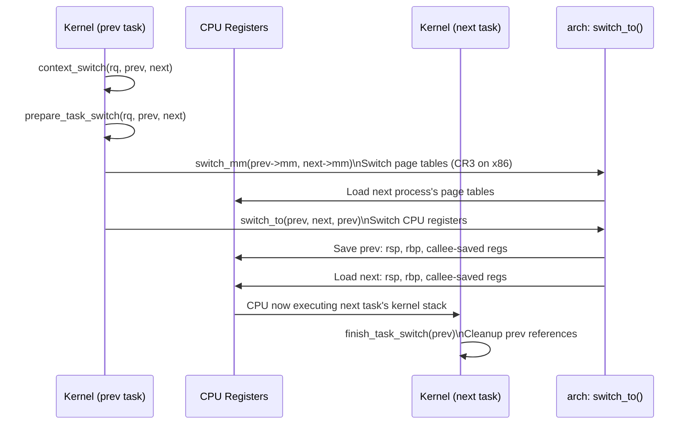
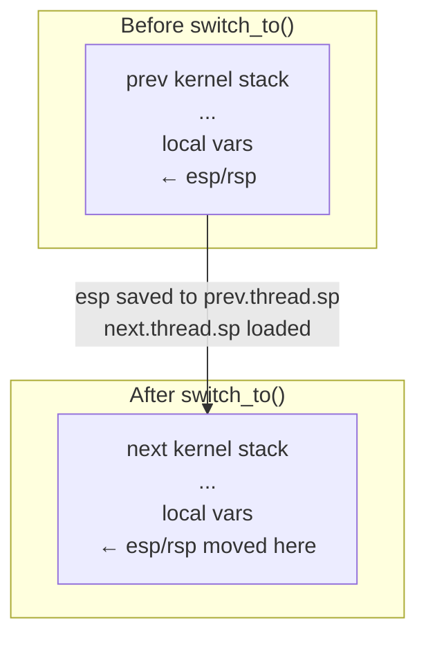

# 04 — Scheduler Entry Points and Context Switch

## 1. Definition

`schedule()` is the **main entry point** to the scheduler. It decides which task runs next and performs the **context switch** — saving the current CPU state and restoring the next task's state.

---

## 2. When schedule() Is Called

```mermaid
flowchart TD
    A[Voluntary\nTask blocks or sleeps] --> Sched[schedule\(\)]
    B[Preemption\nHigher priority task wakes] --> Sched
    C[Timer tick\nTime slice exhausted] --> Sched
    D[System call return\nTIF_NEED_RESCHED set] --> Sched
    E[Interrupt return\nTIF_NEED_RESCHED set] --> Sched
    Sched --> CS[Context Switch]
```

### TIF_NEED_RESCHED Flag
When the scheduler wants a reschedule, it sets **`TIF_NEED_RESCHED`** in the current task's `thread_info.flags`. The reschedule happens at the next safe preemption point:

```c
/* Set by: set_tsk_need_resched(task), resched_curr(rq) */
/* Checked at: system call return, interrupt return, explicit schedule() call */

/* Check if rescheduling needed */
if (need_resched())
    schedule();
```

---

## 3. `__schedule()` — The Core Scheduler

```c
/* kernel/sched/core.c */
static void __sched notrace __schedule(unsigned int sched_mode)
{
    struct task_struct *prev, *next;
    struct rq_flags rf;
    struct rq *rq;
    int cpu;

    cpu = smp_processor_id();
    rq = cpu_rq(cpu);
    prev = rq->curr;    /* Currently running task */

    /* 1. Disable preemption, lock run queue */
    rq_lock(rq, &rf);
    update_rq_clock(rq);

    /* 2. Update task state — if sleeping, dequeue */
    if (!(sched_mode & SM_MASK_PREEMPT) && prev->state) {
        if (signal_pending_state(prev->state, prev)) {
            prev->state = TASK_RUNNING;
        } else {
            deactivate_task(rq, prev, DEQUEUE_SLEEP | DEQUEUE_NOCLOCK);
            /* ... */
        }
    }

    /* 3. Pick next task from highest-priority scheduler class */
    next = pick_next_task(rq, prev, &rf);
    
    /* 4. Clear TIF_NEED_RESCHED */
    clear_tsk_need_resched(prev);

    /* 5. If same task, no switch needed */
    if (likely(prev != next)) {
        rq->nr_switches++;
        rq->curr = next;

        /* 6. Context switch! */
        context_switch(rq, prev, next, &rf);
    } else {
        rq_unlock_irq(rq, &rf);
    }
}
```

---

## 4. pick_next_task() — Walk Scheduler Classes

```c
/* kernel/sched/core.c */
static inline struct task_struct *
pick_next_task(struct rq *rq, struct task_struct *prev, struct rq_flags *rf)
{
    const struct sched_class *class;
    struct task_struct *p;
    
    /* Fast path: if only CFS tasks, use CFS directly */
    if (likely(prev->sched_class <= &fair_sched_class &&
               rq->nr_running == rq->cfs.h_nr_running)) {
        p = pick_next_task_fair(rq, prev, rf);
        if (likely(p))
            return p;
    }

    /* Slow path: walk all classes in priority order */
    for_each_class(class) {
        p = class->pick_next_task(rq);
        if (p)
            return p;
    }
    
    /* Should never reach here — idle is always available */
    BUG();
}
```

---

## 5. Context Switch



### x86_64 context_switch breakdown:
```c
/* kernel/sched/core.c */
static __always_inline struct rq *
context_switch(struct rq *rq, struct task_struct *prev,
               struct task_struct *next, struct rq_flags *rf)
{
    /* 1. Switch virtual memory (page tables) */
    if (!next->mm) {
        /* next is kernel thread — borrow prev's mm */
        next->active_mm = prev->active_mm;
    } else {
        switch_mm_irqs_off(prev->active_mm, next->mm, next);
    }

    /* 2. Switch CPU registers and stack pointer */
    /* This is where execution jumps to the NEW task */
    switch_to(prev, next, prev);
    
    /* NOTE: after switch_to(), we are now running in 'next' task's context */
    /* The 'prev' variable here refers to the task that was running before us */

    /* 3. Finish cleanup */
    barrier();
    return finish_task_switch(prev);
}
```

### switch_to() — Architecture Specific (x86_64)
```c
/* arch/x86/include/asm/switch_to.h */
#define switch_to(prev, next, last)                                 \
do {                                                                \
    ((last) = __switch_to_asm((prev), (next)));                     \
} while (0)
```

```asm
/* arch/x86/entry/entry_64.S */
SYM_FUNC_START(__switch_to_asm)
    /* Save callee-saved registers of 'prev' on its kernel stack */
    pushq   %rbp
    pushq   %rbx
    pushq   %r12
    pushq   %r13
    pushq   %r14
    pushq   %r15

    /* Save prev's stack pointer */
    movq    %rsp, TASK_threadsp(%rdi)

    /* Load next's stack pointer */
    movq    TASK_threadsp(%rsi), %rsp

    /* Restore next's callee-saved registers */
    popq    %r15
    popq    %r14
    popq    %r13
    popq    %r12
    popq    %rbx
    popq    %rbp

    jmp     __switch_to       /* Final C-level switch */
SYM_FUNC_END(__switch_to_asm)
```

---

## 6. The Context Switch — What Actually Happens



**What is saved/restored:**
- **Stack pointer** (rsp/esp) — switches us to the new stack
- **Instruction pointer** (rip) — implicitly via call/ret
- **Callee-saved registers** — rbp, rbx, r12-r15
- **FPU/SSE state** — lazily saved when first used
- **Page tables** — CR3 register updated when switching address spaces
- **TLS** (Thread Local Storage) — GS segment

**Not saved per context switch:**
- **General purpose registers** (rax, rcx, rdx, rdi, rsi, r8-r11) — NOT callee-saved; tasks save these themselves at system call/interrupt entry

---

## 7. Voluntary vs Involuntary Context Switches

```bash
# View context switches
cat /proc/1234/status | grep ctxt

# voluntary_ctxt_switches   — task called schedule() itself (blocked on I/O)
# nonvoluntary_ctxt_switches — preempted by scheduler

# Using pidstat
pidstat -w 1    # Watch context switches per second per process
```

---

## 8. Scheduling Latency Measurement

```bash
# /proc/schedstat — scheduler statistics
cat /proc/schedstat

# Per-task stats (if CONFIG_SCHEDSTATS enabled)
cat /proc/PID/schedstat
# Output: runtime(ns) wait_time(ns) timeslices

# Using ftrace for scheduler tracing
echo 1 > /sys/kernel/debug/tracing/events/sched/sched_switch/enable
cat /sys/kernel/debug/tracing/trace
```

---

## 9. Related Concepts
- [02_CFS_Completely_Fair_Scheduler.md](./02_CFS_Completely_Fair_Scheduler.md) — CFS algorithm
- [05_Preemption.md](./05_Preemption.md) — When preemption triggers schedule()
- [../10_Timers_And_Time_Management/02_HZ_And_Jiffies.md](../10_Timers_And_Time_Management/02_HZ_And_Jiffies.md) — Timer tick that drives scheduling
