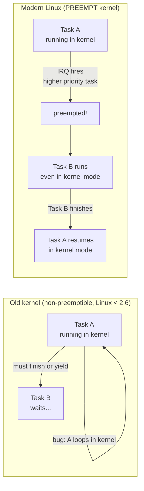
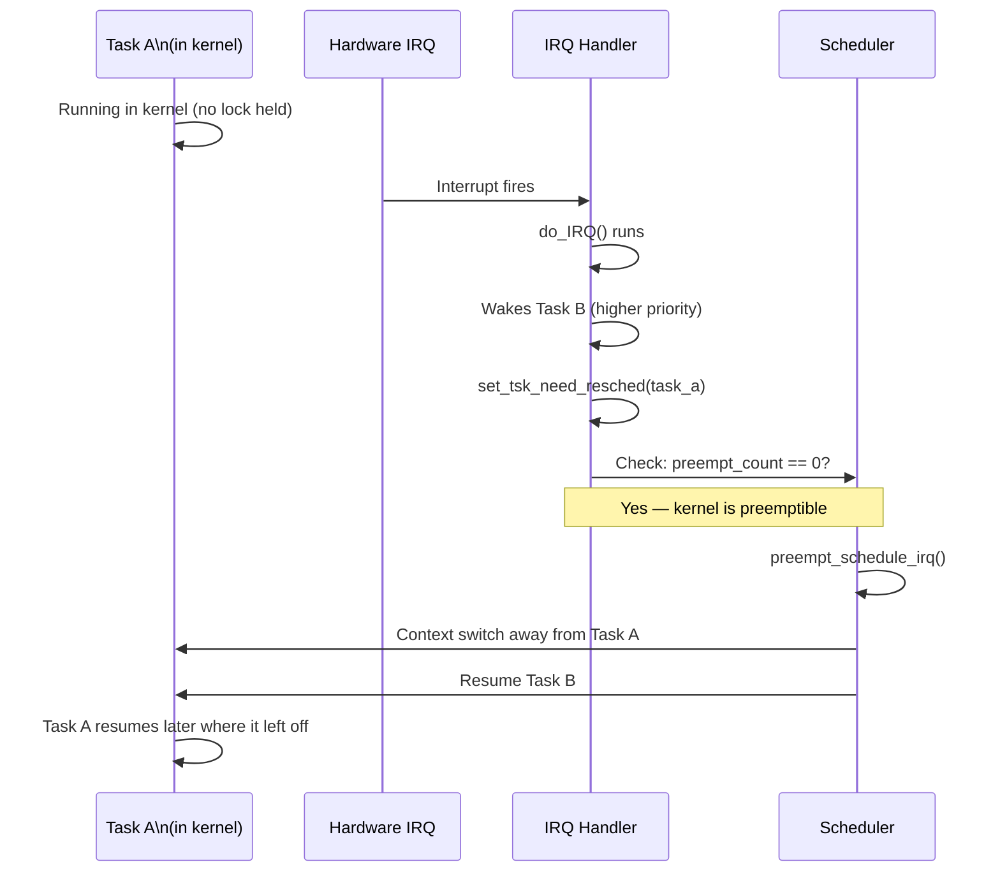

# 05 — Preemption

## 1. Definition

**Preemption** is the scheduler's ability to **forcibly remove a running task from the CPU** and switch to another task — without the running task's cooperation.

Linux supports two levels of preemption:
- **User preemption** (always supported) — kernel preempts a process returning to user space
- **Kernel preemption** (since 2.6) — kernel preempts a task running in kernel mode

---

## 2. User Preemption

User preemption happens when the kernel is about to return to **user space** and `TIF_NEED_RESCHED` is set:

```mermaid
flowchart TD
    A[Running in user space] --> |syscall or interrupt| B[Kernel mode]
    B --> |Do work| C[Ready to return to user space]
    C --> D{TIF_NEED_RESCHED set?}
    D --> |Yes| E[Call schedule()]
    D --> |No| F[Return to user space\nResume task]
    E --> G[Choose new task]
    G --> |maybe same task| F
    G --> |different task| H[Context switch\nNew task returns to user space]
```

**User preemption check points:**
1. Return from system call
2. Return from interrupt handler
3. Explicit `schedule()` call

---

## 3. Kernel Preemption (non-preemptible vs preemptible)



---

## 4. `preempt_count` — The Gatekeeper

The `preempt_count` field in `thread_info` controls whether kernel preemption is allowed:

```c
/* include/linux/preempt.h */
/* preempt_count field layout:
 *
 *         PREEMPT_MASK:  0x000000ff (bits 0-7)   — preempt_disable() nesting
 *         SOFTIRQ_MASK:  0x0000ff00 (bits 8-15)  — softirq nesting
 *         HARDIRQ_MASK:  0x000f0000 (bits 16-19) — hardirq (interrupt) nesting
 *         NMI_MASK:      0x00100000 (bit 20)      — NMI nesting
 */

#define preemptible()   (preempt_count() == 0 && !irqs_disabled())
```

| preempt_count value | Preemptible? | Reason |
|--------------------|-------------|--------|
| 0 | ✅ Yes | Normal task context |
| 1+ | ❌ No | preempt_disable() was called |
| SOFTIRQ bits set | ❌ No | In softirq handler |
| HARDIRQ bits set | ❌ No | In interrupt handler |
| NMI bit set | ❌ No | In NMI handler |

---

## 5. preempt_disable() / preempt_enable()

```c
/* Disable preemption */
preempt_disable();
/* ... critical section - preemption not allowed ... */
preempt_enable();   /* Re-enable + check TIF_NEED_RESCHED */

/* Example: Per-CPU data access */
preempt_disable();
cpu = smp_processor_id();   /* Safe: won't migrate to another CPU */
data = per_cpu(my_data, cpu);
preempt_enable();

/* Or use get_cpu() / put_cpu() convenience wrappers */
int cpu = get_cpu();        /* disables preemption + returns CPU */
data = per_cpu(my_data, cpu);
put_cpu();                  /* re-enables preemption */
```

---

## 6. Kernel Preemption Flow



---

## 7. Preemption Models (CONFIG_PREEMPT_*)

Linux has configurable preemption models:

| Config | Name | RT Latency | Throughput | Use Case |
|--------|------|-----------|-----------|---------|
| `CONFIG_PREEMPT_NONE` | No preemption | Worst | Best | Servers, batch |
| `CONFIG_PREEMPT_VOLUNTARY` | Voluntary | Medium | Good | Desktop (default) |
| `CONFIG_PREEMPT` | Full preempt | Good | Moderate | Desktop/embedded |
| `CONFIG_PREEMPT_RT` | RT preempt | Best | Moderate | Real-time systems |

### PREEMPT_VOLUNTARY
- Adds explicit `might_resched()` calls at strategic points
- More preemption points than NO_PREEMPT, still not full preemption

### Full PREEMPT
- Any task in kernel mode can be preempted at any point where `preempt_count == 0`
- Spin locks held → `preempt_count > 0` → no preemption

### PREEMPT_RT (Real-Time patch)
- Converts most spin locks to RT mutexes (which can sleep)
- Interrupts run as kernel threads (can be preempted)
- Extremely low latency — used in audio, industrial

---

## 8. Sleeping in Kernel Code

A task can **voluntarily** give up the CPU from kernel space:

```c
/* Sleep for 1 second (interruptible) */
ssleep(1);

/* Sleep for N jiffies (interruptible) */
schedule_timeout_interruptible(HZ);

/* Sleep until condition is true */
wait_event_interruptible(my_waitqueue, condition_is_true);

/* Low-level: set state and yield */
set_current_state(TASK_INTERRUPTIBLE);
schedule();     /* Voluntarily yield; another task runs */
/* We wake up here when someone calls wake_up() on our waitqueue */
```

---

## 9. The `need_resched()` Path at Interrupt Return

```mermaid
flowchart TD
    IRQ[Interrupt fires] --> Entry[entry_64.S: IRQ entry]
    Entry --> Handler[Run IRQ handler]
    Handler --> Return[Prepare to return from interrupt]
    Return --> Check{Thread flags:\nTIF_NEED_RESCHED?}
    Check --> |Yes, and in kernel mode| KPreempt{preempt_count == 0?}
    Check --> |Yes, returning to user| UserPreempt[preempt_schedule()\ncall schedule()]
    Check --> |No| RestoreRegs[Restore registers\niretq — return to interrupted code]
    KPreempt --> |Yes| KernelPreempt[preempt_schedule_irq()\ncall schedule()]
    KPreempt --> |No| RestoreRegs
    UserPreempt --> RestoreRegs
    KernelPreempt --> RestoreRegs
```

---

## 10. Common Gotchas

### Sleeping while holding a spin lock
```c
/* BUG! Spin lock disables preemption but not sleeping */
spin_lock(&my_lock);
msleep(100);    /* BUG: might sleep, but spin lock held */
spin_unlock(&my_lock);
/* Use mutex instead if you need to sleep */
```

### Checking IN_INTERRUPT()
```c
if (in_interrupt()) {
    /* Running in interrupt context (hardirq or softirq) */
    /* Cannot sleep, cannot call schedule() */
}

if (in_atomic()) {
    /* In any non-sleepable context */
    /* preempt_count > 0 */
}
```

---

## 11. Related Concepts
- [04_Scheduler_Entry_Points.md](./04_Scheduler_Entry_Points.md) — schedule() internals
- [../06_Interrupts_And_Interrupt_Handlers/](../06_Interrupts_And_Interrupt_Handlers/) — Interrupts that trigger preemption
- [../09_Kernel_Synchronization_Methods/02_Spin_Locks.md](../09_Kernel_Synchronization_Methods/02_Spin_Locks.md) — Spin locks and preempt_count
