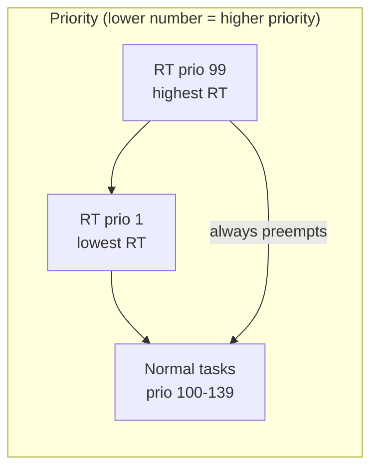
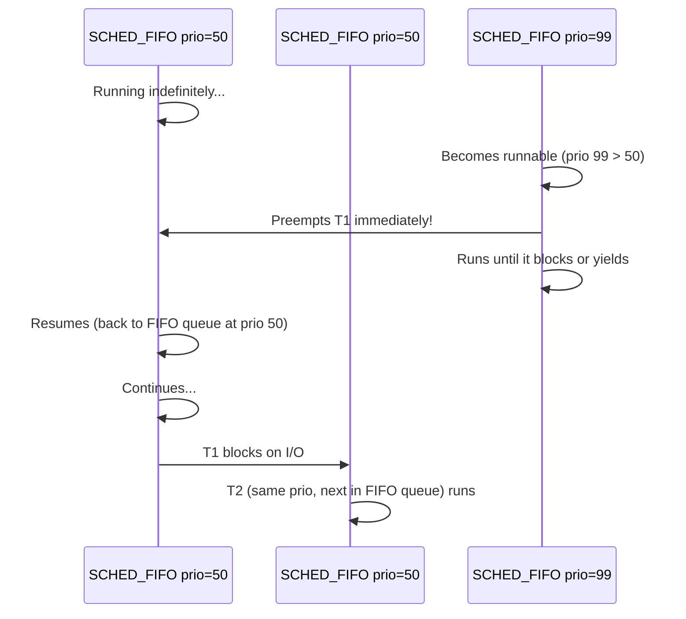
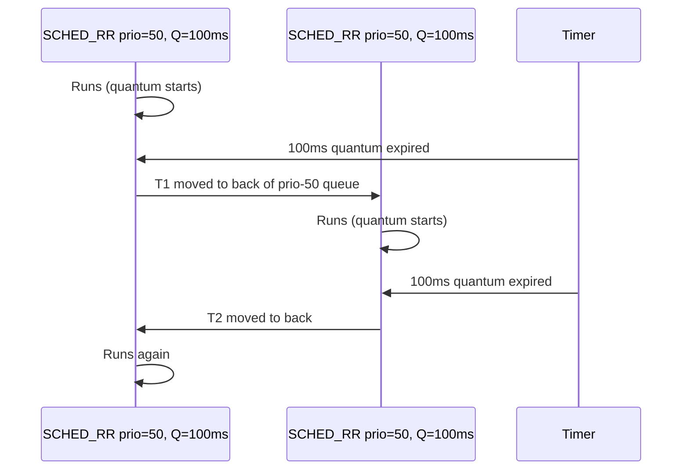

# 06 — Real-Time Scheduling

## 1. Definition

**Real-time (RT) scheduling** guarantees that a task will run within a bounded time after it becomes runnable. Linux provides two POSIX-compliant RT scheduling policies: **SCHED_FIFO** and **SCHED_RR**.

RT tasks have **strict priority** over all normal (CFS) tasks — a runnable RT task will **always preempt** any normal task.

---

## 2. RT vs Normal Scheduling



---

## 3. SCHED_FIFO

- **No time slice** — once an RT-FIFO task starts running, it continues until:
  1. It blocks (I/O, sleep)
  2. A **higher priority** RT task preempts it
  3. It voluntarily yields (`sched_yield()`)
- Tasks of the same priority are in a FIFO queue



---

## 4. SCHED_RR (Round-Robin)

- Like SCHED_FIFO but with a **time quantum** (default: 100ms)
- When time quantum expires, task is moved to the **back** of its priority queue
- Same-priority tasks share CPU in round-robin fashion



---

## 5. RT Priority Values

```c
/* RT priorities: 1–99 (99 = highest) */
/* kernel representation: prio = MAX_RT_PRIO - 1 - rt_priority */
/* So rt_priority 99 → kernel prio 0 (most urgent) */

#define MAX_RT_PRIO     100
/* rt_priority 99 → prio 0  (highest) */
/* rt_priority  1 → prio 98 (lowest RT) */
/* normal tasks → prio 100-139 */
```

---

## 6. Using RT Scheduling (User Space)

```c
#include <sched.h>

/* Set SCHED_FIFO with priority 50 */
struct sched_param param;
param.sched_priority = 50;     /* 1-99 */
if (sched_setscheduler(0, SCHED_FIFO, &param) != 0) {
    perror("sched_setscheduler");
    /* Requires CAP_SYS_NICE or root */
}

/* SCHED_RR with priority 30 */
param.sched_priority = 30;
sched_setscheduler(0, SCHED_RR, &param);

/* Get priority range */
int min = sched_get_priority_min(SCHED_FIFO);  /* = 1 */
int max = sched_get_priority_max(SCHED_FIFO);  /* = 99 */

/* Get current RR time quantum */
struct timespec ts;
sched_rr_get_interval(0, &ts);    /* Get time quantum of current process */
```

---

## 7. RT Run Queue: struct rt_rq

```mermaid
graph TB
    subgraph rt_rq["struct rt_rq"]
        Bitmap[DECLARE_BITMAP\n100-bit bitmap\nwhich priorities have tasks]
        subgraph Queues["struct list_head queue[100]"]
            Q99[prio 99 list\ntask C → task D]
            Q50[prio 50 list\ntask A → task B]
            Q1[prio 1 list]
        end
        Bitmap --> Queues
    end
    Next[pick_next_task_rt: \nfind_first_bit → get head of list\nO\(1\) operation]
    rt_rq --> Next
```

```c
/* RT task selection: O(1) */
static struct task_struct *pick_next_task_rt(struct rq *rq)
{
    /* Find highest non-empty priority level */
    int idx = sched_find_first_bit(rq->rt.active.bitmap);
    struct list_head *queue = &rq->rt.active.queue[idx];
    /* Pick first task in that priority's FIFO queue */
    struct sched_rt_entity *rt_se = list_entry(queue->next,
                                    struct sched_rt_entity, run_list);
    return rt_task_of(rt_se);
}
```

---

## 8. RT Throttling (Avoiding Starvation)

A runaway RT process could starve all normal tasks (and even the kernel watchdog). Linux prevents this with **RT throttling**:

```c
/* RT tasks can only use rt_period_us * rt_runtime_us of CPU time per period */
/* Default: 950ms out of every 1000ms → RT tasks get max 95% CPU */

cat /proc/sys/kernel/sched_rt_period_us    /* = 1000000 (1 second) */
cat /proc/sys/kernel/sched_rt_runtime_us   /* = 950000 (950ms) */

/* Disable RT throttling (dangerous): */
echo -1 > /proc/sys/kernel/sched_rt_runtime_us
```

---

## 9. SCHED_DEADLINE

The most advanced RT policy — based on **Earliest Deadline First (EDF)**:

```c
/* SCHED_DEADLINE parameters */
struct sched_attr attr = {
    .size           = sizeof(attr),
    .sched_policy   = SCHED_DEADLINE,
    .sched_runtime  = 5 * 1000 * 1000,    /* 5ms: task needs 5ms CPU per period */
    .sched_deadline = 10 * 1000 * 1000,   /* 10ms: must complete within 10ms */
    .sched_period   = 10 * 1000 * 1000,   /* 10ms: period */
};
sched_setattr(0, &attr, 0);
```

EDF: **the task with the earliest absolute deadline runs first**.

---

## 10. RT Use Cases

| Application | Policy | Why |
|-------------|--------|-----|
| JACK audio server | SCHED_FIFO 95 | Low latency audio processing |
| PulseAudio | SCHED_RR 5 | Audio mixing, moderate RT |
| Industrial robot control | SCHED_FIFO 99 | Hard real-time deadlines |
| Waveform generator | SCHED_DEADLINE | Periodic execution guarantee |
| Kernel watchdog/0 | SCHED_FIFO 99 | Must not be starved |

---

## 11. Related Concepts
- [01_Scheduling_Policy_And_Priority.md](./01_Scheduling_Policy_And_Priority.md) — Priority numbers
- [03_Run_Queue_And_Red_Black_Tree.md](./03_Run_Queue_And_Red_Black_Tree.md) — RT run queue structure
- [05_Preemption.md](./05_Preemption.md) — How RT tasks preempt normal tasks
