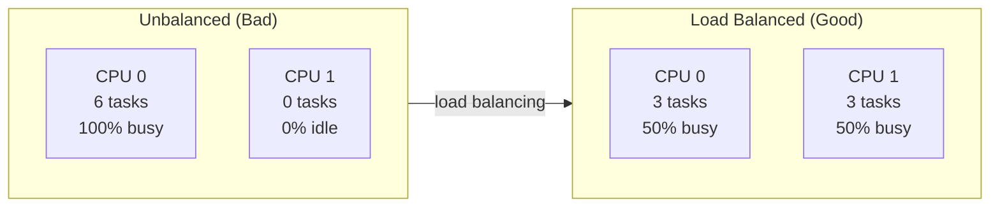
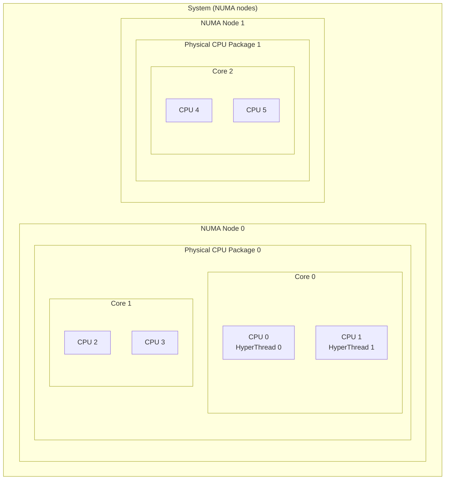
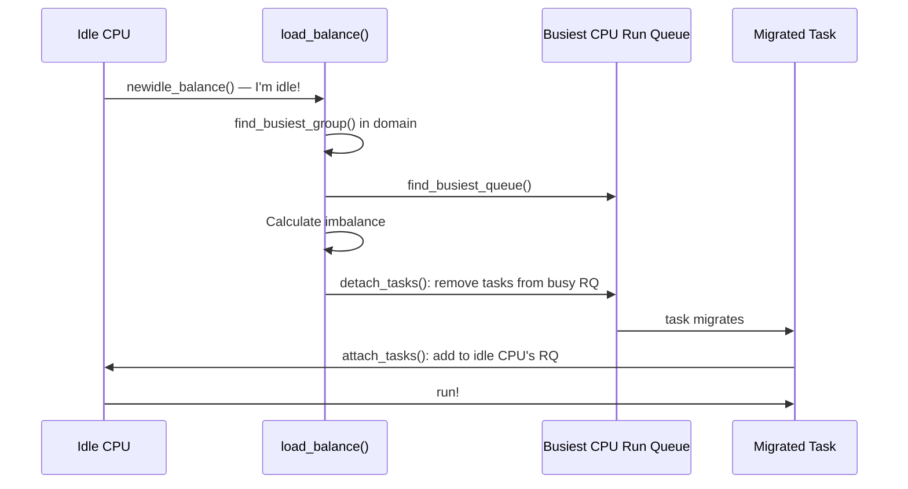
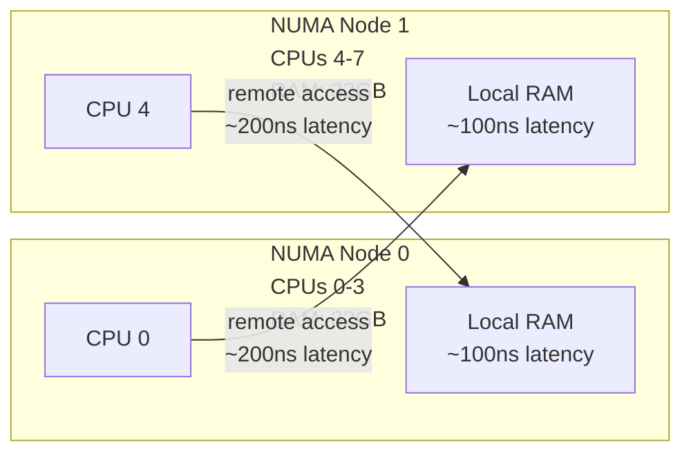

# 07 — Load Balancing (SMP)

## 1. Definition

**Load balancing** is the process of distributing tasks across multiple CPUs to ensure all CPUs are utilized efficiently. Linux has a sophisticated load balancer built into the CFS scheduler that runs periodically and during task wakeup.

---

## 2. The Problem: Unbalanced Load



---

## 3. CPU Topology and Scheduling Domains

Linux models CPU topology as **scheduling domains** — a hierarchy that reflects hardware topology:



| Domain Level | Scope | Cost to migrate |
|-------------|-------|----------------|
| SMT | Sibling hyperthreads | Very cheap (shared L1/L2) |
| MC (Multi-Core) | Cores in same package | Cheap (shared L3) |
| DIE/PKG | Full CPU package | Moderate |
| NUMA | Cross-socket | Expensive (remote RAM) |

---

## 4. When Load Balancing Runs

```mermaid
flowchart TD
    A[Periodic tick\nevery few ms] --> PeriodicLB[run_rebalance_domains\(\)\nPeriodic load balance]
    B[Task wakes up] --> SelectRQ[select_task_rq_fair\(\)\nPick best CPU for wakeup]
    C[CPU goes idle] --> IdleLB[newidle_balance\(\)\nPull tasks immediately]
    D[Process fork] --> SelectFork[select_task_rq_fair\(\)\nPick CPU for new task]
    PeriodicLB --> FindBusy[Find busiest CPU\nin scheduling domain]
    IdleLB --> FindBusy
    FindBusy --> Migrate[migrate_tasks\(\)\nmove tasks to idle CPU]
```

---

## 5. select_task_rq_fair() — Choosing a CPU at Wakeup

When a task wakes up, the scheduler picks the best CPU:

```c
/* kernel/sched/fair.c (simplified) */
static int select_task_rq_fair(struct task_struct *p, int prev_cpu, int wake_flags)
{
    int cpu = smp_processor_id();
    int new_cpu = prev_cpu;
    
    /* Try to keep task on same CPU (cache warm) */
    if (cpus_share_cache(prev_cpu, cpu)) {
        new_cpu = prev_cpu;
    }
    
    /* Find idle CPU in same domain */
    new_cpu = find_idlest_cpu(...);
    
    /* Or use wake-up affinity heuristic */
    new_cpu = wake_affine(sd, p, prev_cpu, this_cpu, sync);
    
    return new_cpu;
}
```

---

## 6. load_balance() — Moving Tasks Between CPUs



---

## 7. Migration Constraints

Not all tasks can migrate freely:

```c
/* CPU affinity — task pinned to specific CPUs */
/* User space */
cpu_set_t cpuset;
CPU_ZERO(&cpuset);
CPU_SET(0, &cpuset);
CPU_SET(1, &cpuset);
sched_setaffinity(pid, sizeof(cpuset), &cpuset);  /* Pin to CPU 0 and 1 */

/* Kernel space */
set_cpus_allowed_ptr(task, cpumask_of(cpu));  /* Pin to single CPU */
kthread_bind(kthread, cpu);                    /* Bind kthread to CPU */

/* IRQ affinity (hardware interrupts) */
echo 3 > /proc/irq/24/smp_affinity    /* IRQ 24 handled by CPU 0 and 1 */
```

---

## 8. NUMA-Aware Scheduling

On NUMA systems, accessing remote memory is expensive:



**NUMA balancing:** Linux's automatic NUMA balancing (`CONFIG_NUMA_BALANCING`) tracks which NUMA node a task's memory is on and migrates the task (or its memory) to keep them together.

```bash
# Check NUMA topology
numactl --hardware

# Control NUMA policy
numactl --membind=0 --cpunodebind=0 ./myapp   # Bind to node 0
```

---

## 9. Load Balancing Sysctl Tunables

```bash
# Key scheduler tunables
/proc/sys/kernel/sched_migration_cost_ns    # Cost threshold for migration
/proc/sys/kernel/sched_nr_migrate           # Max tasks migrated per balance
/proc/sys/kernel/numa_balancing             # Enable/disable NUMA balancing

# View scheduler statistics per CPU
cat /proc/schedstat
```

---

## 10. Observing Load Balancing

```bash
# CPU utilization per CPU
mpstat -P ALL 1      # Per-CPU stats every 1 second

# perf: scheduler migration events
perf record -e sched:sched_migrate_task -a sleep 5
perf report

# ftrace: sched_migrate_task
echo 'sched_migrate_task' >> /sys/kernel/debug/tracing/set_event
cat /sys/kernel/debug/tracing/trace

# numa_maps: see process memory locality
cat /proc/PID/numa_maps
```

---

## 11. Related Concepts
- [03_Run_Queue_And_Red_Black_Tree.md](./03_Run_Queue_And_Red_Black_Tree.md) — Per-CPU run queues
- [04_Scheduler_Entry_Points.md](./04_Scheduler_Entry_Points.md) — schedule() that triggers balancing
- [../11_Memory_Management/](../11_Memory_Management/) — NUMA memory management
