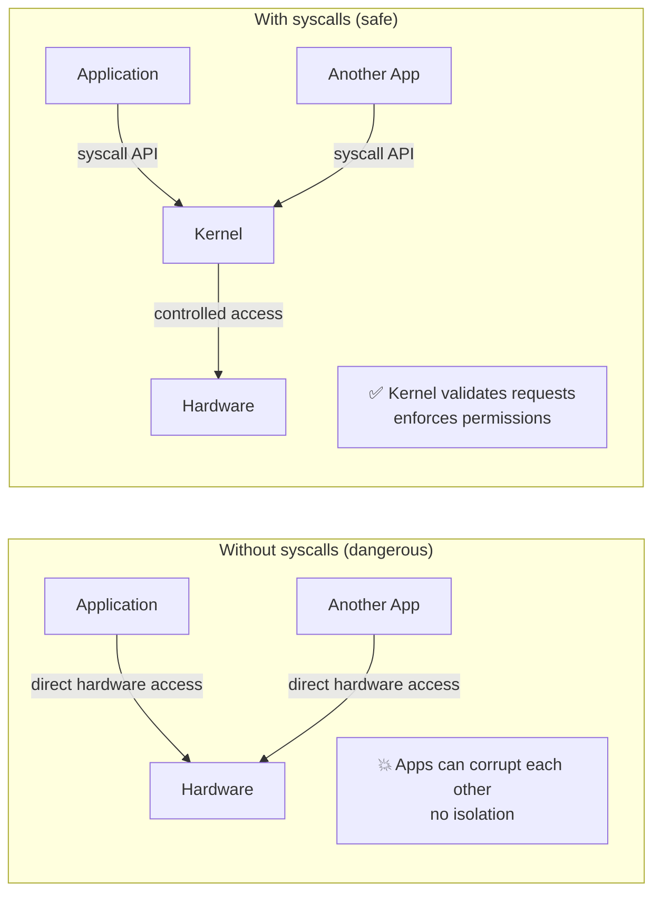
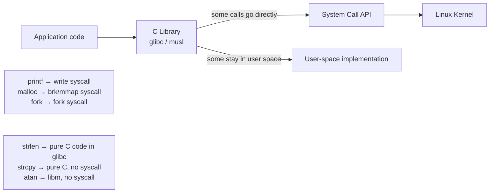

# 01 — What Are System Calls?

## 1. Definition

A **system call (syscall)** is the programmatic interface through which a user-space program requests a service from the kernel. System calls are the **only way** for user-space code to enter kernel mode and access hardware/kernel resources.

They form the boundary between **user space** and **kernel space**.

---

## 2. Why System Calls Exist



**Kernel services exposed via syscalls:**
- File I/O (`open`, `read`, `write`, `close`)
- Process management (`fork`, `exec`, `exit`, `wait`)
- Memory management (`mmap`, `brk`, `munmap`)
- Networking (`socket`, `connect`, `send`, `recv`)
- Time (`clock_gettime`, `nanosleep`)
- IPC (`pipe`, `shmget`, `mq_open`)

---

## 3. System Calls vs Library Functions



| Function | Syscall? | Notes |
|----------|---------|-------|
| `printf()` | Yes (via `write()`) | Formats then calls write syscall |
| `malloc()` | Sometimes | Uses `brk()` or `mmap()` when needing more memory |
| `fork()` | Yes | Direct syscall wrapper |
| `strlen()` | No | Pure user-space string operation |
| `gettimeofday()` | Sometimes | Often uses vDSO (no syscall) |
| `read()` | Yes | Direct syscall |

---

## 4. Linux System Call Numbers

Every syscall has a unique number (syscall number):

```c
/* arch/x86/entry/syscalls/syscall_64.tbl (x86-64) */
0   read
1   write
2   open
3   close
4   stat
5   fstat
9   mmap
11  munmap
39  getpid
56  clone
57  fork
59  execve
60  exit
62  kill
```

```bash
# View all syscalls
ausyscall --dump               # if audit installed
cat /usr/include/asm/unistd_64.h

# Trace syscalls made by a program
strace ls
strace -c ls    # Count syscalls
```

---

## 5. POSIX and System Calls

**POSIX** defines the API — system calls implement it:

| POSIX function | Linux syscall | Notes |
|----------------|--------------|-------|
| `open()` | `openat()` (nr 257) | Modern kernel uses relative variant |
| `fork()` | `clone()` | fork implemented via clone flags |
| `stat()` | `newfstatat()` | Path-based stat |
| `signal()` | `rt_sigaction()` | Real-time signal variant |
| `sleep()` | `clock_nanosleep()` | High-res sleep |

---

## 6. Checking Syscall Overhead

```bash
# Measure syscall overhead
time for i in $(seq 1 1000000); do true; done   # shell: forces many fork/exec

# Better: use perf
perf stat -e 'syscalls:sys_enter_*' ls

# Minimal syscall cost: ~100ns on modern hardware
# (privilege switch: Ring3→Ring0→Ring3, save/restore registers)
```

---

## 7. vDSO — Avoiding Syscall Overhead

Some frequent syscalls are accelerated via **vDSO (virtual Dynamic Shared Object)** — a small kernel-provided shared library mapped into every process's address space:

```mermaid
flowchart LR
    App[Application] --> |gettimeofday\(\)| Check{vDSO\navailable?}
    Check --> |Yes| vDSO[Read time from\nkernel-shared memory page\nNo privilege switch!]
    Check --> |No| Syscall[Full syscall\nRing3→Ring0→Ring3]
    vDSO --> Return[~3ns]
    Syscall --> Return2[~100ns]
```

**vDSO syscalls:** `gettimeofday`, `clock_gettime`, `getcpu`, `time`

---

## 8. Related Concepts
- [02_System_Call_Handler.md](./02_System_Call_Handler.md) — How syscalls enter the kernel
- [03_System_Call_Table.md](./03_System_Call_Table.md) — The syscall dispatch table
- [05_Parameter_Passing.md](./05_Parameter_Passing.md) — Passing data safely
