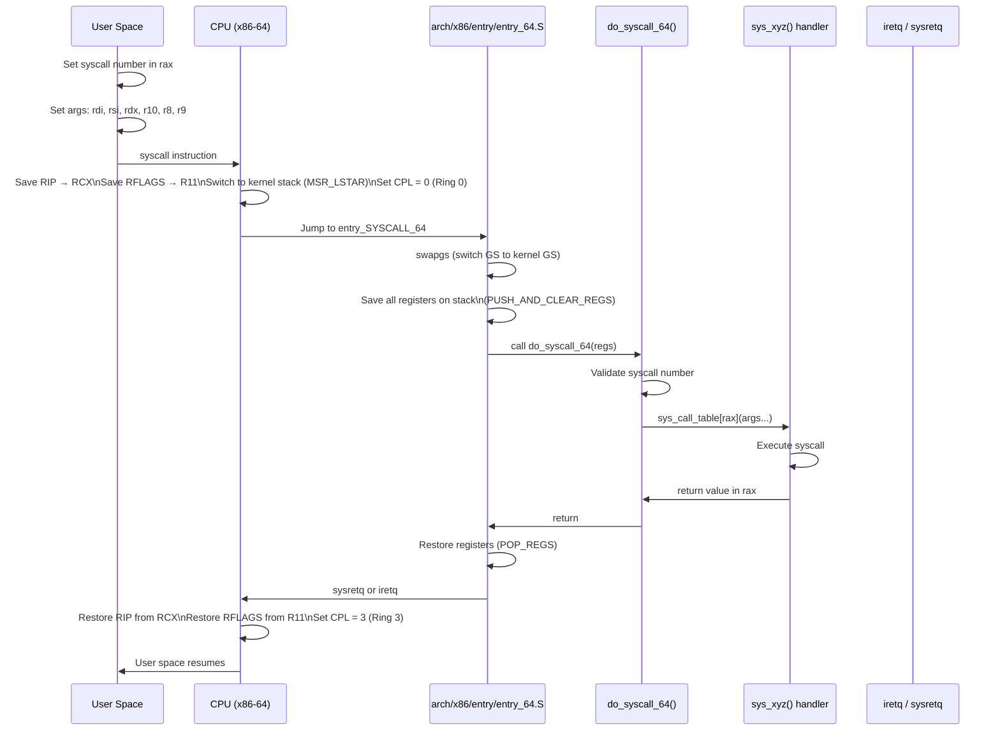

# 02 — System Call Handler

## 1. Definition

The **system call handler** is the low-level kernel entry point that handles the transition from user space to kernel space when a `syscall` instruction is executed. It saves CPU state, dispatches to the correct handler, and restores state on return.

---

## 2. x86-64 Syscall Mechanism



---

## 3. MSR_LSTAR — The Syscall Entry Point

```c
/* arch/x86/kernel/cpu/common.c */
/* During boot, the kernel registers entry_SYSCALL_64 address in MSR_LSTAR */
wrmsrl(MSR_LSTAR, (unsigned long)entry_SYSCALL_64);
```

When `syscall` instruction executes, the CPU jumps to the address in `MSR_LSTAR`.

---

## 4. entry_SYSCALL_64 Assembly

```asm
/* arch/x86/entry/entry_64.S (key parts) */
SYM_CODE_START(entry_SYSCALL_64)
    /* Switch from user GS to kernel GS */
    swapgs

    /* Save user stack pointer, switch to kernel stack */
    movq    %rsp, PER_CPU_VAR(cpu_tss_rw + TSS_sp2)
    SWITCH_TO_KERNEL_CR3 scratch_reg=%rsp
    movq    PER_CPU_VAR(cpu_current_top_of_stack), %rsp

    /* Build struct pt_regs on kernel stack */
    pushq   $__USER_DS                  /* ss */
    pushq   PER_CPU_VAR(cpu_tss_rw + TSS_sp2)  /* rsp */
    pushq   %r11                        /* rflags */
    pushq   $__USER_CS                  /* cs */
    pushq   %rcx                        /* rip */
    pushq   %rax                        /* orig_rax (syscall number) */
    PUSH_AND_CLEAR_REGS rax=$-ENOSYS    /* Save all GPRs */

    /* Call C handler */
    movq    %rsp, %rdi
    call    do_syscall_64

    /* Restore and return */
    POP_REGS pop_rdi=0
    /* sysretq or iretq depending on context */
    ...
SYM_CODE_END(entry_SYSCALL_64)
```

---

## 5. do_syscall_64() — C-Level Dispatch

```c
/* arch/x86/entry/common.c */
__visible noinstr void do_syscall_64(struct pt_regs *regs, int nr)
{
    /* 1. Enter syscall — handle seccomp, ptrace, etc. */
    nr = syscall_enter_from_user_mode(regs, nr);

    /* 2. Validate and dispatch */
    if (likely(nr < NR_syscalls)) {
        nr = array_index_nospec(nr, NR_syscalls);   /* Spectre mitigation */
        regs->ax = sys_call_table[nr](regs);         /* Call handler */
    } else {
        regs->ax = __x64_sys_ni_syscall(regs);       /* Not implemented */
    }

    /* 3. Return — handle signals, audit, seccomp on exit */
    syscall_exit_to_user_mode(regs);
}
```

---

## 6. struct pt_regs — Saved CPU State

```c
/* arch/x86/include/asm/ptrace.h */
struct pt_regs {
    unsigned long r15, r14, r13, r12;
    unsigned long rbp, rbx;
    /* Arguments (callee-saved by syscall convention): */
    unsigned long r11, r10, r9, r8;
    unsigned long rax;          /* syscall number on entry, return value on exit */
    unsigned long rcx;          /* saved user RIP (return address) */
    unsigned long rdx, rsi, rdi;
    unsigned long orig_rax;     /* original syscall number (for restart) */
    /* CPU-saved: */
    unsigned long rip;          /* = rcx on syscall entry */
    unsigned long cs;
    unsigned long eflags;       /* = r11 on syscall entry */
    unsigned long rsp;
    unsigned long ss;
};
```

---

## 7. x86-64 Syscall Calling Convention

```
Syscall number → rax
Argument 1    → rdi
Argument 2    → rsi
Argument 3    → rdx
Argument 4    → r10  (NOT rcx — rcx saved by CPU for return address)
Argument 5    → r8
Argument 6    → r9

Return value  ← rax  (negative = -errno)
```

```c
/* Example: write(1, "hello", 5) in raw assembly */
mov rax, 1          /* SYS_write = 1 */
mov rdi, 1          /* fd = 1 (stdout) */
mov rsi, msg        /* buf = "hello" */
mov rdx, 5          /* count = 5 */
syscall
/* rax now contains return value (5 on success, or -ERRNO) */
```

---

## 8. Returning Errors

```c
/* Kernel handlers return long; negative = error code */
/* e.g., return -EINVAL, -ENOMEM, -EPERM */

/* Kernel → libc translation */
/* If rax ∈ [-4096, -1] → glibc sets errno = -rax; returns -1 */
```

---

## 9. Related Concepts
- [03_System_Call_Table.md](./03_System_Call_Table.md) — sys_call_table dispatch
- [05_Parameter_Passing.md](./05_Parameter_Passing.md) — Copying user/kernel data safely
- [../06_Interrupts_And_Interrupt_Handlers/](../06_Interrupts_And_Interrupt_Handlers/) — Similar entry mechanism for interrupts
