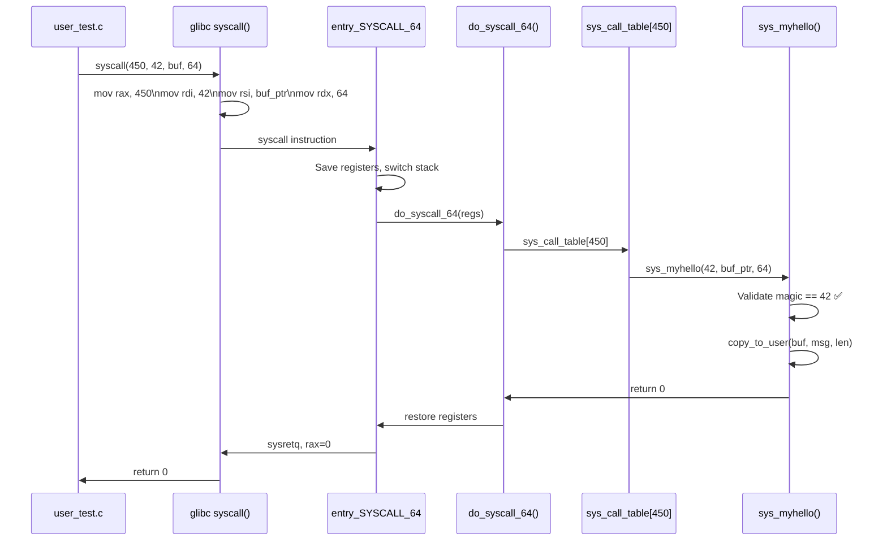

# 04 — Adding a New System Call

## 1. Overview

Adding a new system call involves 5 steps:
1. Implement the handler function
2. Add `SYSCALL_DEFINE` wrapper
3. Add entry to syscall table `.tbl` file
4. Add prototype to syscall header
5. Document it

> **Note:** In practice, adding syscalls to mainline Linux is rare and discouraged. Custom kernel functionality should use **ioctl**, **sysfs**, **netlink**, or **procfs** instead. But understanding the process clarifies how syscalls work.

---

## 2. Step-by-Step: Add sys_myhello()

### Step 1: Implement the Handler

```c
/* Add to kernel/sys.c (or a new file) */

/**
 * sys_myhello - A demo system call
 * @magic: A magic number from user space (must be 42)
 * @user_buf: User buffer to write "Hello from kernel!" into
 * @len: Length of buffer
 *
 * Returns 0 on success, negative errno on error.
 */
SYSCALL_DEFINE3(myhello, int, magic, char __user *, user_buf, size_t, len)
{
    const char msg[] = "Hello from kernel!\n";
    
    /* Validate arguments */
    if (magic != 42)
        return -EINVAL;
    
    if (len < sizeof(msg))
        return -ENOSPC;
    
    /* Check user pointer is valid + copy to user */
    if (!user_buf)
        return -EFAULT;
    
    if (copy_to_user(user_buf, msg, sizeof(msg)))
        return -EFAULT;
    
    return 0;
}
```

### Step 2: Add to Syscall Table

```
# arch/x86/entry/syscalls/syscall_64.tbl
# Add at the end with next available number (e.g., 450):
450   common   myhello   sys_myhello
```

### Step 3: Add Prototype to Header

```c
/* include/linux/syscalls.h */
asmlinkage long sys_myhello(int magic, char __user *buf, size_t len);
```

### Step 4: Add UAPI Header (for user space)

```c
/* include/uapi/asm-generic/unistd.h or arch-specific */
#define __NR_myhello   450
```

### Step 5: Rebuild

```bash
make -j$(nproc)
sudo make install
sudo reboot
```

---

## 3. Using the New Syscall from User Space

```c
/* user_test.c */
#include <stdio.h>
#include <unistd.h>
#include <sys/syscall.h>
#include <errno.h>

#define SYS_myhello 450

int main(void)
{
    char buf[64] = {0};
    long ret;
    
    ret = syscall(SYS_myhello, 42, buf, sizeof(buf));
    if (ret < 0) {
        perror("myhello syscall");
        return 1;
    }
    
    printf("Kernel says: %s\n", buf);
    return 0;
}
```

---

## 4. Complete Syscall Dispatch Flow



---

## 5. Why Not to Add Syscalls (Alternatives)

| Alternative | When to use | Example |
|-------------|------------|---------|
| **ioctl** | Device-specific operations | GPU, sound, special hardware |
| **sysfs** | Kernel parameters/stats | `/sys/class/net/eth0/mtu` |
| **procfs** | Process/system info | `/proc/cpuinfo` |
| **netlink** | Complex kernel↔user messaging | iproute2, audit |
| **seccomp BPF** | Syscall filtering | Containers, sandbox |
| **io_uring** | Async I/O operations | High-performance I/O |

---

## 6. Related Concepts
- [02_System_Call_Handler.md](./02_System_Call_Handler.md) — How syscalls enter kernel
- [03_System_Call_Table.md](./03_System_Call_Table.md) — The dispatch table
- [05_Parameter_Passing.md](./05_Parameter_Passing.md) — copy_from_user / copy_to_user
