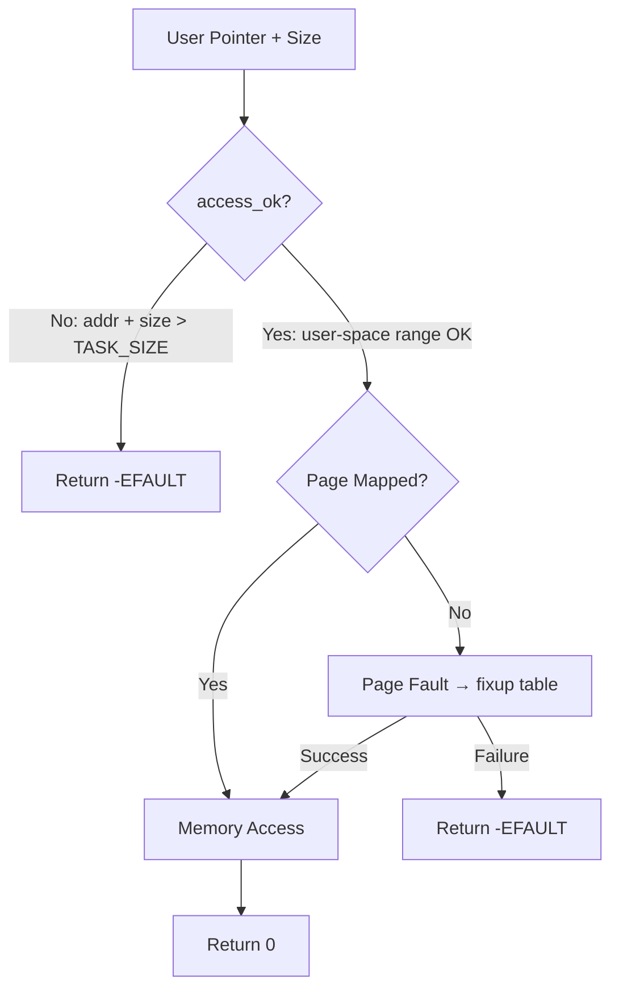
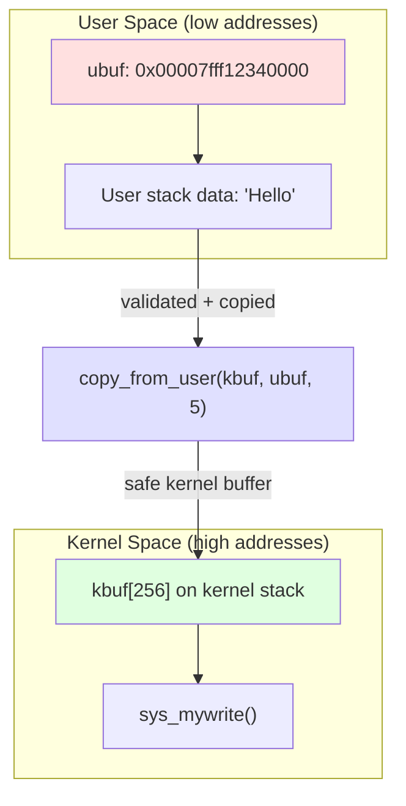
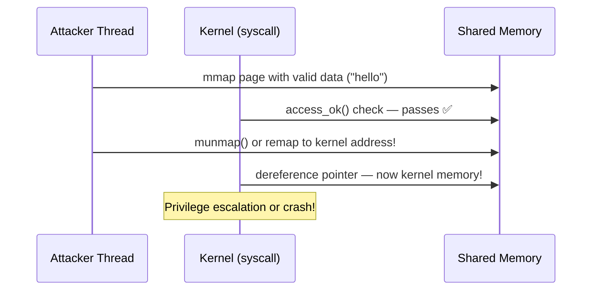

# 05 — System Call Parameter Passing

## 1. Why You Can't Dereference User Pointers Directly

The kernel and user space occupy **different virtual address spaces** and have **different privilege levels**. A user-space pointer passed to a syscall:

- **May be invalid** (null, wrong range, unmapped)
- **May be malicious** (kernel memory address — TOCTOU attacks)
- **May cause a page fault** that the kernel must handle gracefully
- **Must not allow privilege escalation**

```c
/* WRONG — NEVER DO THIS */
SYSCALL_DEFINE1(bad_read, char __user *, ptr)
{
    char c = *ptr;  /* kernel oops or security hole! */
    return c;
}

/* CORRECT */
SYSCALL_DEFINE1(good_read, char __user *, ptr)
{
    char c;
    if (get_user(c, ptr))  /* safe, atomic */
        return -EFAULT;
    return c;
}
```

---

## 2. Validation: access_ok()

Before copying, **validate the address range** is in user space:

```c
/* include/linux/uaccess.h */
bool access_ok(const void __user *addr, unsigned long size);
```

```c
/* arch/x86/include/asm/uaccess.h */
static inline bool access_ok(const void __user *addr, unsigned long size)
{
    return likely(!__range_not_ok(addr, size, TASK_SIZE_MAX));
}
```

**Note:** `copy_from_user()` and `copy_to_user()` call `access_ok()` internally, so you rarely need to call it manually unless you split the check from the copy.



---

## 3. copy_from_user() — User → Kernel

```c
/* include/linux/uaccess.h */
unsigned long copy_from_user(void *to, const void __user *from, unsigned long n);
/* Returns: 0 on success, number of bytes NOT copied on failure */
```

**Usage:**
```c
SYSCALL_DEFINE2(mywrite, const char __user *, ubuf, size_t, len)
{
    char kbuf[256];
    
    if (len > sizeof(kbuf))
        return -EINVAL;
    
    if (copy_from_user(kbuf, ubuf, len))
        return -EFAULT;  /* partial or full failure */
    
    /* Now safe to use kbuf in kernel */
    kbuf[len] = '\0';
    printk(KERN_INFO "Got from user: %s\n", kbuf);
    return len;
}
```

**Internals (x86-64):**
```c
/* arch/x86/lib/copy_user_64.S */
ENTRY(copy_user_generic_string)
    /* Uses rep movsb with SMAP/SMEP-aware access */
    /* Falls back to fixup table on page fault */
```

---

## 4. copy_to_user() — Kernel → User

```c
/* include/linux/uaccess.h */
unsigned long copy_to_user(void __user *to, const void *from, unsigned long n);
/* Returns: 0 on success, bytes NOT copied on failure */
```

**Usage:**
```c
SYSCALL_DEFINE2(myread, char __user *, ubuf, size_t, len)
{
    const char kdata[] = "Hello from kernel!";
    size_t klen = sizeof(kdata);
    
    if (len < klen)
        return -ENOSPC;
    
    if (copy_to_user(ubuf, kdata, klen))
        return -EFAULT;
    
    return klen;
}
```

---

## 5. get_user() / put_user() — Scalar Values

Optimized for copying a **single value** (char, int, long):

```c
/* get a single value from user space */
int get_user(x, ptr)
/* x: local variable (kernel). ptr: __user pointer */

/* put a single value to user space */
int put_user(x, ptr)
/* x: kernel value. ptr: __user destination */
```

**Examples:**
```c
SYSCALL_DEFINE1(get_magic, int __user *, uptr)
{
    int val;
    
    /* Copy single int from user */
    if (get_user(val, uptr))
        return -EFAULT;
    
    /* Return updated value to user */
    val += 100;
    if (put_user(val, uptr))
        return -EFAULT;
    
    return 0;
}
```

**Why faster than copy_from/to_user?**
- No loop — single inline instruction (e.g., `movl (%rdi), %eax`)
- Compiler can optimize register allocation

---

## 6. strncpy_from_user() — Strings

```c
long strncpy_from_user(char *dst, const char __user *src, long count);
/* Returns: length of string (not including NUL) on success, -EFAULT on failure */
```

**Usage (e.g., for filename args):**
```c
SYSCALL_DEFINE1(myopen, const char __user *, upath)
{
    char kpath[PATH_MAX];
    long len;
    
    len = strncpy_from_user(kpath, upath, PATH_MAX);
    if (len < 0)
        return len;  /* -EFAULT */
    if (len == PATH_MAX)
        return -ENAMETOOLONG;
    
    /* kpath now has null-terminated string */
    return do_open(kpath);
}
```

---

## 7. strnlen_user() — String Length

```c
long strnlen_user(const char __user *str, long n);
/* Returns: length+1 including NUL on success, 0 on error */
```

---

## 8. Memory Layout Diagram



---

## 9. The __user Annotation

The `__user` tag is a **sparse annotation** (static analysis tool). It has **no runtime effect**.

```c
/* include/linux/compiler_types.h */
# define __user   __attribute__((noderef, address_space(__user)))
```

- Causes `sparse` (`make C=1`) to warn if you dereference without `copy_*_user()`
- Helps catch bugs at compile time, not runtime

```bash
# Run sparse on a file:
make C=1 kernel/sys.o
```

---

## 10. TOCTOU Attack Example

Time-of-check-to-time-of-use — reason kernel must copy data:



**Solution:** `copy_from_user()` copies data **atomically** into kernel buffer. The kernel works only on this kernel buffer, never touching user memory again.

---

## 11. Summary Table

| Function | Direction | Type | When to Use |
|----------|-----------|------|-------------|
| `copy_from_user()` | User → Kernel | Buffer | Arrays, structs |
| `copy_to_user()` | Kernel → User | Buffer | Arrays, structs |
| `get_user()` | User → Kernel | Scalar | Single int/long/char |
| `put_user()` | Kernel → User | Scalar | Single int/long/char |
| `strncpy_from_user()` | User → Kernel | String | File paths, names |
| `strnlen_user()` | User (read-only) | String | Get string length |
| `access_ok()` | Check only | — | Manual validation |

---

## 12. Related Concepts
- [02_System_Call_Handler.md](./02_System_Call_Handler.md) — pt_regs, syscall args in registers
- [04_Adding_A_New_System_Call.md](./04_Adding_A_New_System_Call.md) — Full example using copy_to_user
- [../11_Memory_Management/](../11_Memory_Management/) — Virtual memory, page tables
