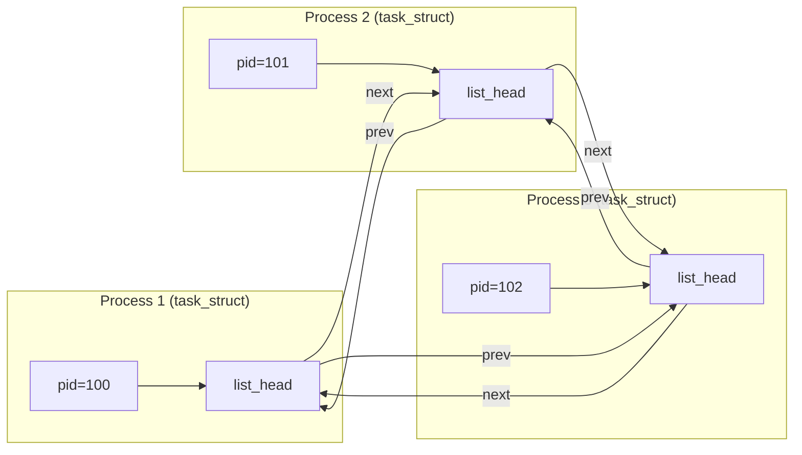
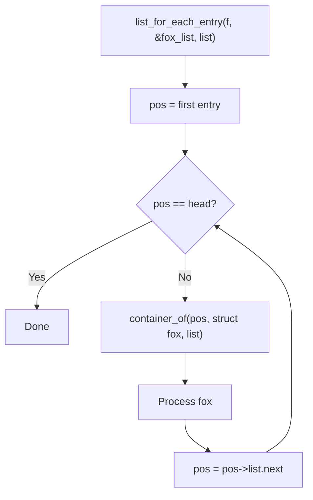

# 01 — Linked Lists (list_head)

## 1. The Problem with Traditional Linked Lists

Traditional C linked lists embed data-type-specific `next`/`prev` pointers:
```c
struct my_node {
    int data;
    struct my_node *next;
    struct my_node *prev;
};
```

This requires reimplementing list logic for every type. The kernel uses an **intrusive** design instead.

---

## 2. Intrusive Linked List Design

The kernel's `list_head` is embedded **inside** the data structure:

```c
/* include/linux/types.h */
struct list_head {
    struct list_head *next;
    struct list_head *prev;
};
```



---

## 3. list_entry() — Get Container from list_head

```c
/* include/linux/list.h */
#define list_entry(ptr, type, member) \
    container_of(ptr, type, member)

/* container_of expands to: */
#define container_of(ptr, type, member) ({          \
    void *__mptr = (void *)(ptr);                    \
    ((type *)(__mptr - offsetof(type, member))); })
```

**Example:**
```c
struct fox {
    unsigned long   tail_length;
    unsigned long   weight;
    bool            is_fantastic;
    struct list_head list;      /* All foxes share this */
};

/* Get fox from a list_head pointer */
struct fox *f = list_entry(ptr, struct fox, list);
```

---

## 4. Defining and Initializing a List

```c
/* Static initialization */
static LIST_HEAD(fox_list);   /* Declares and initializes list head */

/* Dynamic initialization */
struct list_head my_list;
INIT_LIST_HEAD(&my_list);
```

The `LIST_HEAD` macro creates a list node that points to itself (empty list):
```c
#define LIST_HEAD_INIT(name) { &(name), &(name) }
#define LIST_HEAD(name) struct list_head name = LIST_HEAD_INIT(name)
```

---

## 5. Core Operations

### Add / Remove
```c
/* Add entry at HEAD of list (for stack-like, LIFO) */
list_add(struct list_head *new, struct list_head *head);

/* Add entry at TAIL of list (for queue-like, FIFO) */
list_add_tail(struct list_head *new, struct list_head *head);

/* Remove entry from list */
list_del(struct list_head *entry);

/* Remove and re-initialize */
list_del_init(struct list_head *entry);

/* Move entry to another list head */
list_move(struct list_head *list, struct list_head *head);
list_move_tail(struct list_head *list, struct list_head *head);

/* Check if list is empty */
list_empty(const struct list_head *head);
```

### Example: Managing a list of foxes
```c
struct fox *red_fox = kmalloc(sizeof(*red_fox), GFP_KERNEL);
red_fox->tail_length = 40;
INIT_LIST_HEAD(&red_fox->list);

/* Add to global list */
list_add(&red_fox->list, &fox_list);

/* Remove from list */
list_del(&red_fox->list);
```

---

## 6. Iteration Macros

```c
/* Iterate forward through list */
list_for_each(pos, head)   /* pos is struct list_head * */

/* Iterate forward, get the container */
list_for_each_entry(pos, head, member)   /* pos is container type * */

/* Safe iteration (allows deletion during loop) */
list_for_each_entry_safe(pos, n, head, member)
```

**Example:**
```c
struct fox *f;

/* Print all fox tail lengths */
list_for_each_entry(f, &fox_list, list) {
    printk(KERN_INFO "Fox tail length: %lu\n", f->tail_length);
}

/* Delete all foxes */
struct fox *tmp;
list_for_each_entry_safe(f, tmp, &fox_list, list) {
    list_del(&f->list);
    kfree(f);
}
```

---

## 7. Traversal Flow



---

## 8. Variants: hlist (Hash Table Chains)

For hash tables, singly-headed doubly-linked lists save memory:

```c
/* include/linux/list.h */
struct hlist_head { struct hlist_node *first; };
struct hlist_node { struct hlist_node *next, **pprev; };

/* Macros */
hlist_add_head(node, head);
hlist_del(node);
hlist_for_each_entry(pos, head, member);
```

Used in: `task_struct` pid hash table, inode cache, network routing tables.

---

## 9. Real Kernel Usage: Process List

```c
/* include/linux/sched.h */
struct task_struct {
    /* ... */
    struct list_head    tasks;     /* All processes */
    struct list_head    children;  /* Children of this process */
    struct list_head    sibling;   /* Sibling processes */
};

/* kernel/sched/core.c */
/* Iterate all tasks: */
for_each_task(p) {   /* expands to list_for_each_entry */
    /* p is struct task_struct * */
}

/* Or directly: */
struct task_struct *p;
list_for_each_entry(p, &init_task.tasks, tasks) {
    printk(KERN_INFO "PID %d: %s\n", p->pid, p->comm);
}
```

---

## 10. Source Files

| File | Description |
|------|-------------|
| `include/linux/list.h` | All list_head macros and inline functions |
| `include/linux/types.h` | struct list_head definition |
| `lib/list_sort.c` | Merge sort for linked lists |
| `kernel/sched/core.c` | Usage in process management |

---

## 11. Related Concepts
- [02_Queues_kfifo.md](./02_Queues_kfifo.md) — FIFO queues
- [04_Red_Black_Trees.md](./04_Red_Black_Trees.md) — For ordered data
- [../02_Process_Management/02_Process_Descriptor_task_struct.md](../02_Process_Management/02_Process_Descriptor_task_struct.md) — list_head in task_struct
