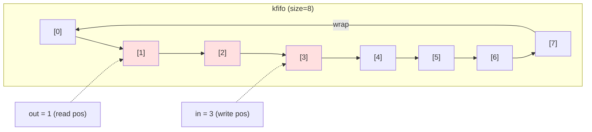
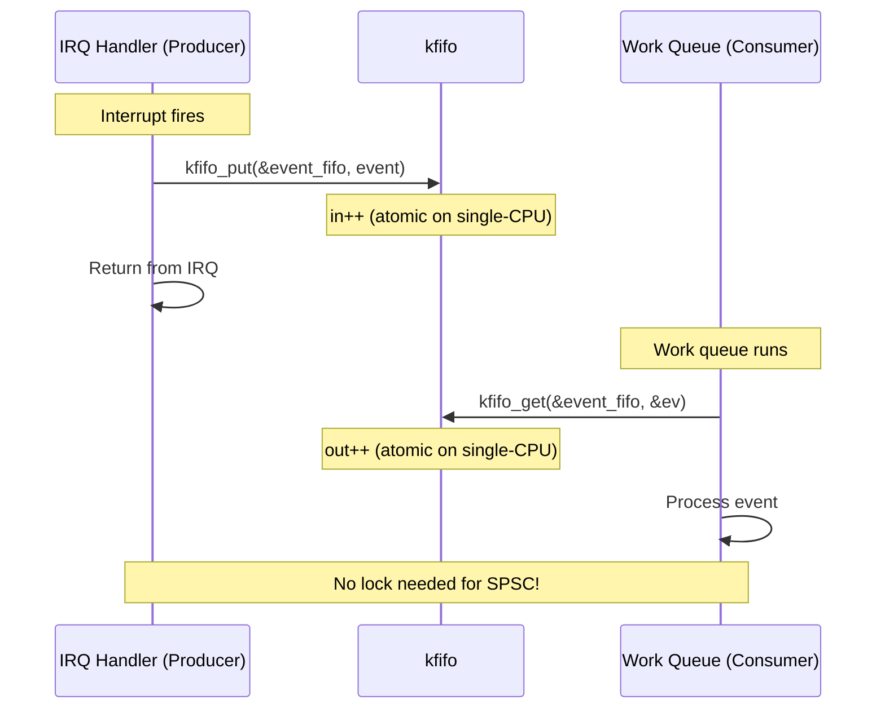

# 02 — Queues: kfifo

## 1. What is kfifo?

`kfifo` is the kernel's **lock-free FIFO (First-In-First-Out) circular buffer**. It provides:
- Single-producer / single-consumer (SPSC) lockless operation
- Fixed-size, power-of-2 buffer (simplifies index math)
- Both byte-stream and record-based modes

**Kernel source:** `include/linux/kfifo.h`, `lib/kfifo.c`

---

## 2. Circular Buffer Mechanics


```

- `in` = write index (producer advances)
- `out` = read index (consumer advances)
- Available data: `in - out` bytes
- Available space: `size - (in - out)` bytes
- Indices never wrap (they overflow naturally), real index = `idx & (size-1)`

---

## 3. Data Structure

```c
/* include/linux/kfifo.h */
struct __kfifo {
    unsigned int    in;     /* Write index */
    unsigned int    out;    /* Read index */
    unsigned int    mask;   /* size - 1 (power of 2) */
    unsigned int    esize;  /* element size */
    void            *data;  /* buffer pointer */
};

/* Typed kfifo (preferred API) */
#define DECLARE_KFIFO(fifo, type, size)    /* static declaration */
#define DEFINE_KFIFO(fifo, type, size)     /* define + init */
```

---

## 4. Creating a kfifo

```c
#include <linux/kfifo.h>

/* Method 1: Static declaration (for global/module level) */
DEFINE_KFIFO(my_fifo, int, 64);   /* 64-element int FIFO */

/* Method 2: Dynamic allocation */
struct kfifo fifo;
int ret = kfifo_alloc(&fifo, PAGE_SIZE, GFP_KERNEL);
if (ret)
    return ret;

/* Method 3: Typed dynamic */
DECLARE_KFIFO_PTR(my_typed_fifo, struct my_event);
ret = kfifo_alloc(&my_typed_fifo, 256, GFP_KERNEL);

/* Cleanup */
kfifo_free(&fifo);
```

---

## 5. Core Operations

```c
/* Enqueue (put) — from producer */
kfifo_put(fifo, val);               /* single element */
kfifo_in(fifo, buf, n);             /* n elements */
kfifo_in_locked(fifo, buf, n, lock); /* with spinlock */

/* Dequeue (get) — from consumer */
kfifo_get(fifo, &val);              /* single element */
kfifo_out(fifo, buf, n);            /* n elements */
kfifo_out_locked(fifo, buf, n, lock);

/* Peek without removing */
kfifo_peek(fifo, &val);

/* Query */
kfifo_len(fifo);        /* number of elements in use */
kfifo_avail(fifo);      /* number of elements available to write */
kfifo_is_empty(fifo);
kfifo_is_full(fifo);
kfifo_size(fifo);       /* total capacity */
kfifo_reset(fifo);      /* discard all data */
```

---

## 6. Producer-Consumer Flow



---

## 7. Complete Example: Event Logging

```c
#include <linux/kfifo.h>
#include <linux/spinlock.h>

struct log_event {
    unsigned long timestamp;
    int           type;
    char          msg[32];
};

/* Static 128-element typed FIFO */
static DEFINE_KFIFO(event_log, struct log_event, 128);
static DEFINE_SPINLOCK(log_lock);   /* Only needed for multi-producer */

/* Producer (e.g., IRQ context) */
static void log_event_irq(int type, const char *msg)
{
    struct log_event ev;

    ev.timestamp = jiffies;
    ev.type = type;
    strncpy(ev.msg, msg, sizeof(ev.msg) - 1);

    /* kfifo_in_spinlocked for multi-producer safety */
    kfifo_in_spinlocked(&event_log, &ev, 1, &log_lock);
}

/* Consumer (process context) */
static void drain_events(void)
{
    struct log_event ev;

    while (kfifo_get(&event_log, &ev)) {
        printk(KERN_INFO "[%lu] type=%d: %s\n",
               ev.timestamp, ev.type, ev.msg);
    }
}
```

---

## 8. kfifo vs Other Queues

| Queue Type | Thread Safety | Size | Use Case |
|-----------|--------------|------|----------|
| `kfifo` SPSC | Lockless | Fixed, power-of-2 | IRQ→tasklet data |
| `kfifo` with spinlock | Multi-producer | Fixed | Multiple IRQ sources |
| `list_head` | Manual lock | Dynamic | General purpose |
| `sk_buff_head` | Built-in spinlock | Dynamic | Network packet queue |
| `workqueue` | Kernel managed | Dynamic | Deferred work |

---

## 9. Source Files

| File | Description |
|------|-------------|
| `include/linux/kfifo.h` | All macros and inline API |
| `lib/kfifo.c` | Implementation |
| `drivers/char/random.c` | Entropy pool uses kfifo-like design |
| `sound/core/rawmidi.c` | Real usage: MIDI event queue |

---

## 10. Related Concepts
- [01_Linked_Lists.md](./01_Linked_Lists.md) — Alternative for dynamic queues
- [../07_Bottom_Halves_And_Deferring_Work/04_Work_Queues.md](../07_Bottom_Halves_And_Deferring_Work/04_Work_Queues.md) — Work queues
- [../06_Interrupts_And_Interrupt_Handlers/02_Interrupt_Handlers.md](../06_Interrupts_And_Interrupt_Handlers/02_Interrupt_Handlers.md) — IRQ context
