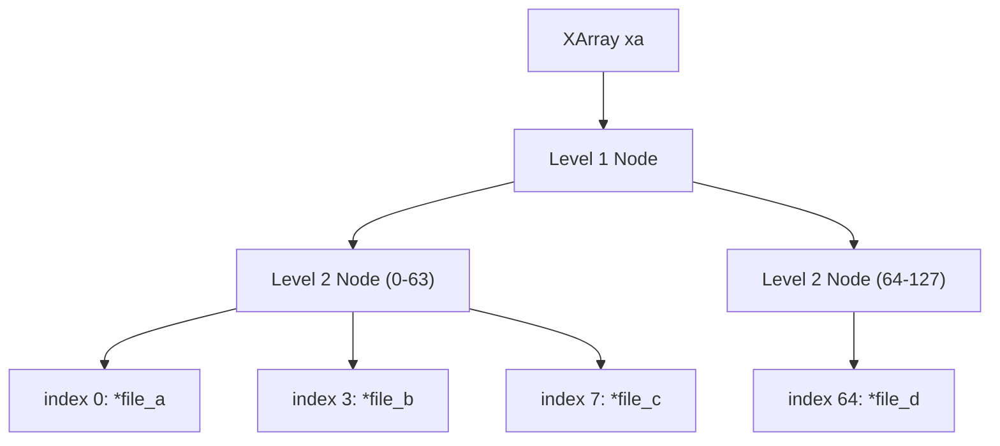
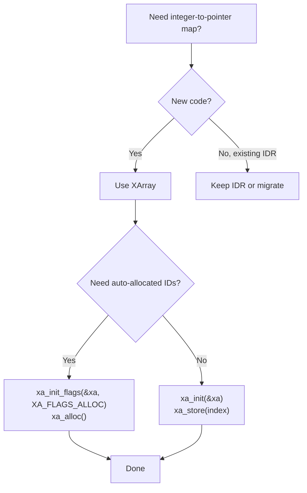
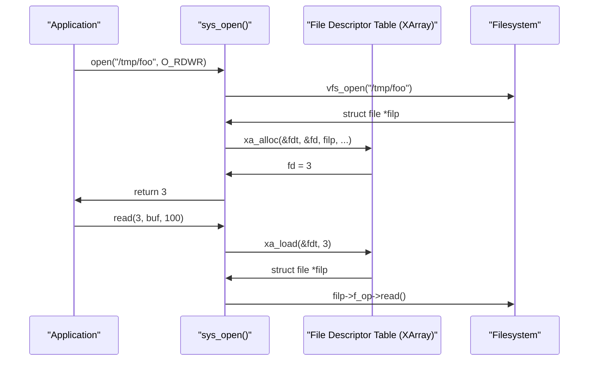

# 03 — Maps: IDR and XArray

## 1. What is a Map in the Kernel?

A **map** is an integer-to-pointer association (ID → object). The kernel needs this for:
- File descriptor tables (fd → struct file *)
- PID → task_struct mappings
- IPC IDs, device minors, etc.

The kernel provides two implementations:
- **IDR** (legacy, `include/linux/idr.h`) — mature, widely used
- **XArray** (modern, `include/linux/xarray.h`) — replaces both IDR and radix trees

---

## 2. XArray (Modern API — Kernel 4.20+)

```c
/* include/linux/xarray.h */
struct xarray {
    spinlock_t  xa_lock;
    gfp_t       xa_flags;   /* GFP_* for internal allocations */
    void __rcu *xa_head;    /* Root of radix-tree-like structure */
};
```



### Initialization
```c
/* Static */
DEFINE_XARRAY(my_xa);
DEFINE_XARRAY_ALLOC(my_xa);   /* For auto-allocation of IDs */

/* Dynamic */
struct xarray xa;
xa_init(&xa);
xa_init_flags(&xa, XA_FLAGS_ALLOC);  /* Enable ID allocation */
```

### Store and Load
```c
/* Store a pointer at index 3 */
void *old = xa_store(&my_xa, 3, ptr, GFP_KERNEL);

/* Load pointer at index 3 */
void *entry = xa_load(&my_xa, 3);

/* Erase (set to NULL) */
xa_erase(&my_xa, 3);

/* Auto-allocate ID, store pointer */
u32 id;
int ret = xa_alloc(&my_xa, &id, ptr, XA_LIMIT(0, INT_MAX), GFP_KERNEL);
/* id now holds the allocated index */
```

### Iteration
```c
unsigned long index;
void *entry;

xa_for_each(&my_xa, index, entry) {
    struct my_obj *obj = entry;
    pr_info("id=%lu, obj=%p\n", index, obj);
}

/* Range iteration */
xa_for_each_range(&my_xa, index, entry, start, end) { ... }
```

---

## 3. IDR (Legacy API)

```c
/* include/linux/idr.h */
struct idr {
    struct radix_tree_root  idr_rt;
    unsigned int            idr_base;
    unsigned int            idr_next;
};
```

### IDR Usage Pattern
```c
DEFINE_IDR(my_idr);

/* Allocate an ID */
int id;
idr_alloc(&my_idr, ptr, min, max, GFP_KERNEL);
/* Returns the allocated ID or negative errno */

/* Lookup by ID */
void *ptr = idr_find(&my_idr, id);

/* Remove */
idr_remove(&my_idr, id);

/* Iterate */
int id;
void *ptr;
idr_for_each_entry(&my_idr, ptr, id) {
    /* process ptr */
}

/* Destroy all */
idr_destroy(&my_idr);
```

---

## 4. XArray vs IDR Decision Flowchart


```

---

## 5. File Descriptor Table Example

The kernel uses XArray to implement the file descriptor table:

```c
/* include/linux/fdtable.h */
struct files_struct {
    atomic_t        count;
    struct fdtable __rcu *fdt;
    struct fdtable  fdtab;
    /* ... */
    struct file __rcu * fd_array[NR_OPEN_DEFAULT];  /* First 64 fds */
};

/* For > 64 fds, uses XArray internally */
```


```

---

## 6. Source Files

| File | Description |
|------|-------------|
| `include/linux/xarray.h` | XArray API |
| `lib/xarray.c` | XArray implementation |
| `include/linux/idr.h` | IDR API |
| `lib/idr.c` | IDR implementation (wrapper over XArray) |
| `fs/file.c` | File descriptor table using XArray |

---

## 7. Related Concepts
- [04_Red_Black_Trees.md](./04_Red_Black_Trees.md) — For ordered key access
- [05_Radix_Trees.md](./05_Radix_Trees.md) — Legacy radix tree
- [../12_Virtual_Filesystem/](../12_Virtual_Filesystem/) — VFS uses XArray for inode caches
