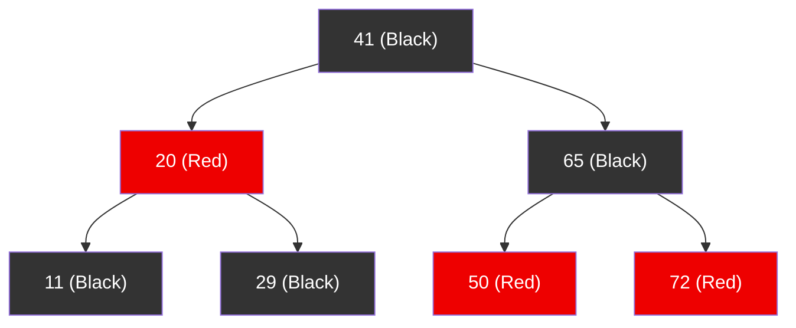
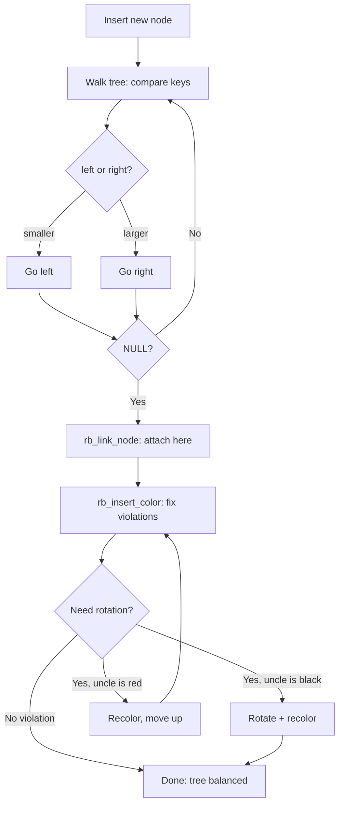

# 04 — Red-Black Trees (rbtree)

## 1. What is a Red-Black Tree?

A **red-black tree** is a self-balancing binary search tree where:
- Every node is colored **Red** or **Black**
- Root is always **Black**
- No two consecutive red nodes (parent + child can't both be red)
- Every path from root to NULL has the **same number of black nodes**

Guarantees **O(log n)** insert, delete, and search.

**Used in Linux for:**
- CFS scheduler run queue (sorted by `vruntime`)
- Virtual memory area (`struct vm_area_struct`) management
- Epoll, ext4 extents, timer management

---

## 2. Tree Structure



---

## 3. Kernel rbtree Data Structures

```c
/* include/linux/rbtree.h */
struct rb_node {
    unsigned long  __rb_parent_color;  /* Parent pointer + color (low bit) */
    struct rb_node *rb_right;
    struct rb_node *rb_left;
} __attribute__((aligned(sizeof(long))));

struct rb_root {
    struct rb_node *rb_node;   /* Root node */
};

/* rb_root_cached — also tracks the leftmost node for O(1) min */
struct rb_root_cached {
    struct rb_root rb_root;
    struct rb_node *rb_leftmost;
};
```

**Note:** Like `list_head`, `rb_node` is embedded in your data structure.

---

## 4. Implementing a Custom rbtree

The kernel **does not provide** a generic compare function — you must write your own search and insert:

```c
/* Example: Interval tree mapping virtual address → vm_area_struct */
struct my_interval {
    struct rb_node node;    /* embedded rb_node */
    unsigned long  start;
    unsigned long  end;
    char           name[32];
};

static struct rb_root my_tree = RB_ROOT;

/* Insert function */
int my_insert(struct rb_root *root, struct my_interval *data)
{
    struct rb_node **new = &(root->rb_node);
    struct rb_node  *parent = NULL;

    /* Walk tree to find insertion point */
    while (*new) {
        struct my_interval *this = rb_entry(*new, struct my_interval, node);
        parent = *new;

        if (data->start < this->start)
            new = &((*new)->rb_left);
        else if (data->start > this->start)
            new = &((*new)->rb_right);
        else
            return -EEXIST;  /* duplicate */
    }

    /* Add new node and rebalance */
    rb_link_node(&data->node, parent, new);
    rb_insert_color(&data->node, root);
    return 0;
}

/* Search function */
struct my_interval *my_search(struct rb_root *root, unsigned long start)
{
    struct rb_node *node = root->rb_node;

    while (node) {
        struct my_interval *data = rb_entry(node, struct my_interval, node);

        if (start < data->start)
            node = node->rb_left;
        else if (start > data->start)
            node = node->rb_right;
        else
            return data;  /* Found */
    }
    return NULL;
}

/* Delete */
void my_delete(struct rb_root *root, struct my_interval *data)
{
    rb_erase(&data->node, root);
    kfree(data);
}
```

---

## 5. Insert Flow



---

## 6. Iteration

```c
/* Forward iteration (in-order = sorted ascending) */
struct rb_node *node;
for (node = rb_first(&my_tree); node; node = rb_next(node)) {
    struct my_interval *data = rb_entry(node, struct my_interval, node);
    pr_info("start=%lu end=%lu\n", data->start, data->end);
}

/* Reverse iteration */
for (node = rb_last(&my_tree); node; node = rb_prev(node)) { ... }

/* Get min/max */
struct rb_node *min = rb_first(&my_tree);
struct rb_node *max = rb_last(&my_tree);
```

---

## 7. CFS Scheduler Usage

```c
/* kernel/sched/fair.c */
struct cfs_rq {
    struct rb_root_cached tasks_timeline;  /* RB tree of runnable tasks */
    /* ... */
};

/* Enqueue a task */
static void __enqueue_entity(struct cfs_rq *cfs_rq, struct sched_entity *se)
{
    struct rb_node **link = &cfs_rq->tasks_timeline.rb_root.rb_node;
    struct rb_node *parent = NULL;
    struct sched_entity *entry;
    bool leftmost = true;

    while (*link) {
        parent = *link;
        entry = rb_entry(parent, struct sched_entity, run_node);
        if (entity_before(se, entry)) {  /* se->vruntime < entry->vruntime */
            link = &parent->rb_left;
        } else {
            link = &parent->rb_right;
            leftmost = false;
        }
    }

    rb_link_node(&se->run_node, parent, link);
    rb_insert_color_cached(&se->run_node, &cfs_rq->tasks_timeline, leftmost);
}
```

---

## 8. API Summary

| Function | Description |
|----------|-------------|
| `RB_ROOT` | Initialize empty tree root |
| `rb_entry(ptr, type, member)` | Get container from rb_node |
| `rb_link_node(node, parent, link)` | Insert node at position |
| `rb_insert_color(node, root)` | Fix tree after insert |
| `rb_erase(node, root)` | Remove node and rebalance |
| `rb_first(root)` | Leftmost (minimum) node |
| `rb_last(root)` | Rightmost (maximum) node |
| `rb_next(node)` | In-order successor |
| `rb_prev(node)` | In-order predecessor |

---

## 9. Source Files

| File | Description |
|------|-------------|
| `include/linux/rbtree.h` | API declarations |
| `lib/rbtree.c` | Core implementation |
| `lib/rbtree_test.c` | Unit tests |
| `kernel/sched/fair.c` | CFS run queue |
| `mm/mmap.c` | VMA management |

---

## 10. Related Concepts
- [../03_Process_Scheduling/03_Run_Queue_And_Red_Black_Tree.md](../03_Process_Scheduling/03_Run_Queue_And_Red_Black_Tree.md) — CFS RB tree in detail
- [05_Radix_Trees.md](./05_Radix_Trees.md) — For sparse integer key access
- [../14_Process_Address_Space/](../14_Process_Address_Space/) — VMAs use rbtree
