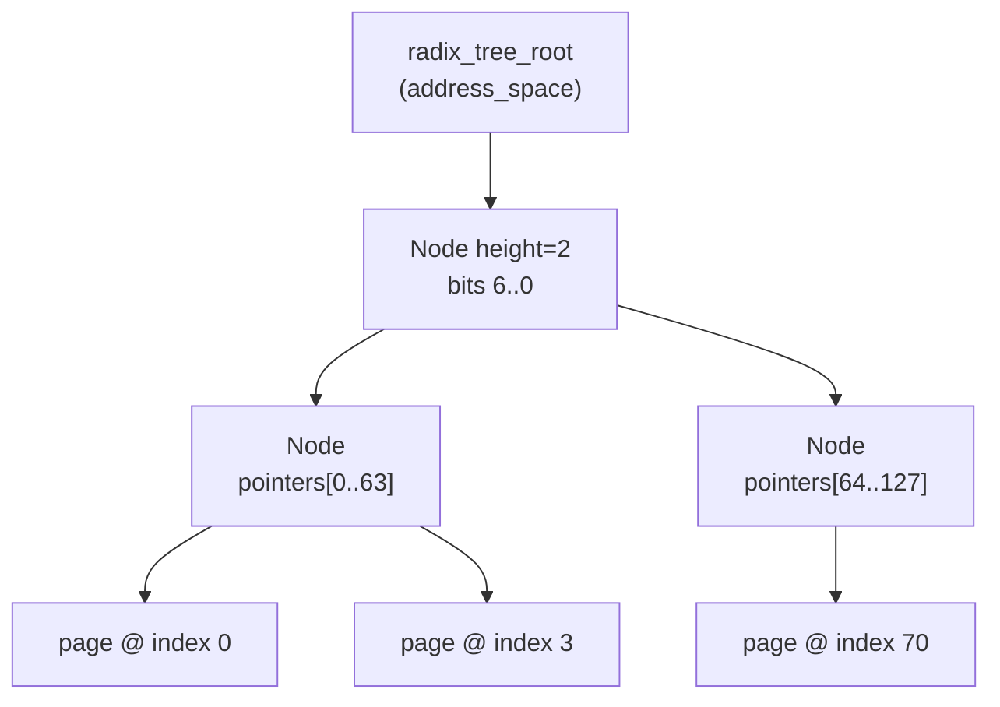
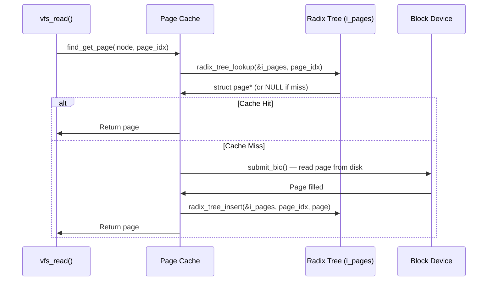

# 05 — Radix Trees

## 1. What is a Radix Tree?

A **radix tree** (Patricia trie) is a **sparse, array-like** data structure that maps integer keys (like page indices) to pointers efficiently. Instead of an array (O(1) but huge), it uses a tree that only allocates nodes where data exists.

**Linux uses it for:**
- Page cache: page index → `struct page *`
- Network firewall routing (IP → action)
- IDR internally builds on it

> **Note:** In modern kernels (5.x+), the classic `radix_tree` is deprecated in favor of **XArray** which is a cleaner API over the same internals.

---

## 2. Structure



- Each internal node has **64 slots** (6-bit fanout)
- Tree height grows as needed for the key range
- Missing pages = `NULL` slot (no node allocated)

---

## 3. Data Structures

```c
/* include/linux/radix-tree.h */
struct radix_tree_root {
    gfp_t               gfp_mask;
    struct radix_tree_node __rcu *rnode;  /* Root node or tagged pointer */
};

struct radix_tree_node {
    unsigned char   shift;      /* Bits remaining in key */
    unsigned char   offset;     /* Slot offset in parent */
    unsigned char   count;      /* Used slots */
    unsigned char   exceptional;/* Special pointer count */
    struct radix_tree_node *parent;
    struct address_space *private_data;
    union {
        struct list_head private_list;
        struct rcu_head  rcu_head;
    };
    void __rcu  *slots[RADIX_TREE_MAP_SIZE];  /* 64 entries */
    unsigned long tags[RADIX_TREE_MAX_TAGS][RADIX_TREE_TAG_LONGS];
};
```

---

## 4. Core API (Legacy)

```c
/* Initialize root (usually embedded in address_space) */
INIT_RADIX_TREE(&root, GFP_ATOMIC);

/* Insert */
int radix_tree_insert(struct radix_tree_root *root,
                      unsigned long index, void *item);

/* Lookup */
void *radix_tree_lookup(const struct radix_tree_root *root,
                        unsigned long index);

/* Delete */
void *radix_tree_delete(struct radix_tree_root *root, unsigned long index);

/* Batch lookup */
unsigned int radix_tree_gang_lookup(const struct radix_tree_root *root,
                                    void **results,
                                    unsigned long first_index,
                                    unsigned int max_items);
```

---

## 5. Page Cache Usage

```c
/* mm/filemap.c — finding a cached page */
struct page *find_get_page(struct address_space *mapping, pgoff_t offset)
{
    return pagecache_get_page(mapping, offset, 0, 0);
}

/* Internally: */
struct page *page = radix_tree_lookup(&mapping->i_pages, offset);
```



---

## 6. Tags

Radix trees support **tags** — bitmask per node slot indicating properties:

```c
/* include/linux/radix-tree.h */
#define PAGECACHE_TAG_DIRTY      XA_MARK_0   /* Page is dirty */
#define PAGECACHE_TAG_WRITEBACK  XA_MARK_1   /* Page being written */
#define PAGECACHE_TAG_TOWRITE    XA_MARK_2   /* Page will be written */

/* Tag a page as dirty: */
radix_tree_tag_set(&mapping->i_pages, page->index, PAGECACHE_TAG_DIRTY);

/* Find all dirty pages in a range: */
radix_tree_gang_lookup_tag(&mapping->i_pages, pages, start, nr, PAGECACHE_TAG_DIRTY);
```

This allows `writeback` to find only dirty pages **without scanning the whole tree**.

---

## 7. XArray Migration

```c
/* Old (radix_tree) → New (XArray) */

/* Old */
radix_tree_insert(&mapping->i_pages, index, page);
struct page *p = radix_tree_lookup(&mapping->i_pages, index);
radix_tree_delete(&mapping->i_pages, index);

/* New */
xa_store(&mapping->i_pages, index, page, GFP_NOFS);
struct page *p = xa_load(&mapping->i_pages, index);
xa_erase(&mapping->i_pages, index);
```

---

## 8. Performance Characteristics

| Operation | Complexity | Notes |
|-----------|-----------|-------|
| Lookup | O(log₆₄ n) ≅ O(1) | Tree height ≤ 10 for 64-bit keys |
| Insert | O(log₆₄ n) | May allocate new nodes |
| Delete | O(log₆₄ n) | May free nodes |
| Range scan | O(k + log n) | k = number of results |

---

## 9. Source Files

| File | Description |
|------|-------------|
| `include/linux/radix-tree.h` | Legacy API |
| `lib/radix-tree.c` | Implementation |
| `include/linux/xarray.h` | Modern replacement |
| `lib/xarray.c` | XArray implementation |
| `mm/filemap.c` | Page cache usage |

---

## 10. Related Concepts
- [03_Maps_idr.md](./03_Maps_idr.md) — XArray as IDR replacement
- [../15_Page_Cache_And_Page_Writeback/](../15_Page_Cache_And_Page_Writeback/) — Page cache in depth
- [04_Red_Black_Trees.md](./04_Red_Black_Trees.md) — For sorted key access
