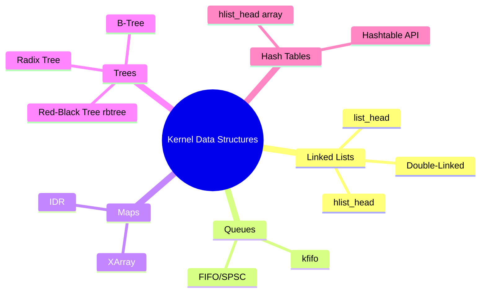

# Chapter 05 — Kernel Data Structures

## Overview

The Linux kernel provides efficient, generic, reusable data structures used throughout the codebase. Rather than each subsystem reinventing the wheel, all kernel code uses these shared primitives from `include/linux/`.




## Chapter Topics

| File | Topic |
|------|-------|
| [01_Linked_Lists.md](./01_Linked_Lists.md) | Intrusive linked lists with list_head |
| [02_Queues_kfifo.md](./02_Queues_kfifo.md) | Lock-free FIFOs with kfifo |
| [03_Maps_idr.md](./03_Maps_idr.md) | ID → pointer maps with IDR/XArray |
| [04_Red_Black_Trees.md](./04_Red_Black_Trees.md) | Self-balancing BSTs with rbtree |
| [05_Radix_Trees.md](./05_Radix_Trees.md) | Efficient sparse integer-keyed lookups |

## Key Kernel Headers

```
include/linux/list.h        — list_head, hlist_head, all list macros
include/linux/kfifo.h       — kfifo circular buffer
include/linux/idr.h         — IDR integer → pointer map
include/linux/xarray.h      — XArray (modern IDR/radix tree replacement)
include/linux/rbtree.h      — rb_node, rb_root
include/linux/radix-tree.h  — radix_tree_root (legacy)
include/linux/hashtable.h   — DECLARE_HASHTABLE macro
```
