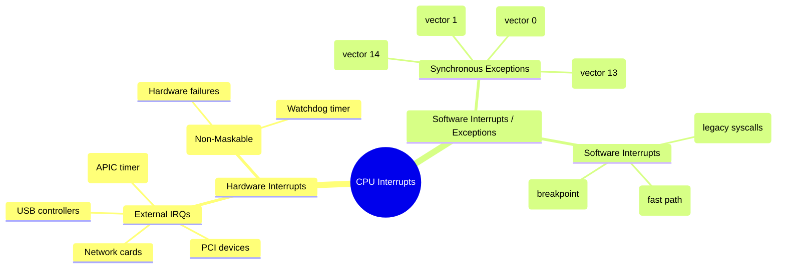
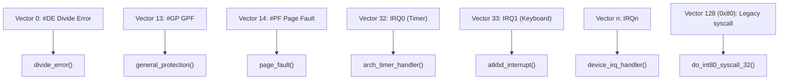
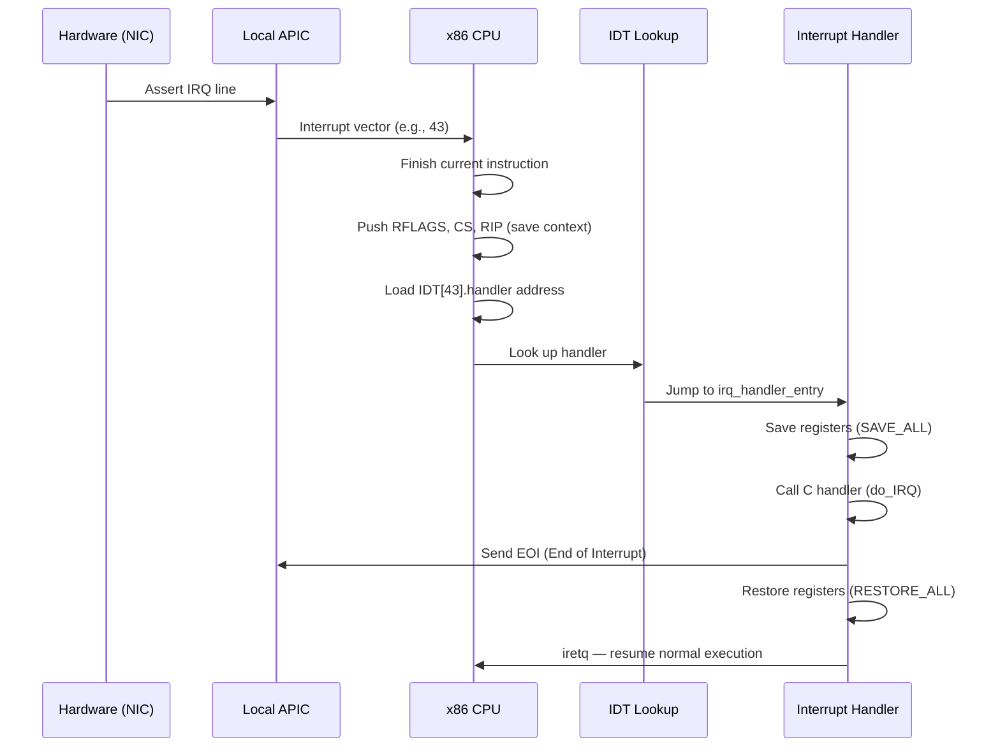

# 01 — Interrupt Basics

## 1. What is an Interrupt?

An **interrupt** is an asynchronous signal from hardware (or a synchronous exception from software) that causes the CPU to stop its current execution and transfer control to a kernel handler called an **Interrupt Service Routine (ISR)**.

---

## 2. Types of Interrupts



---

## 3. Interrupt vs Exception

| Property | Interrupt | Exception |
|----------|-----------|-----------|
| Source | External hardware | CPU internal (fault, trap) |
| Timing | Asynchronous | Synchronous with instruction |
| Examples | Timer, NIC, disk | Page fault, divide by zero |
| Maskable? | IRQs can be masked | Most cannot |

---

## 4. x86 Interrupt Descriptor Table (IDT)

The **IDT** maps vector numbers (0–255) to handler addresses:

```c
/* arch/x86/include/asm/desc_defs.h */
struct gate_struct {
    u16 offset_low;
    u16 segment;
    struct idt_bits bits;
    u16 offset_middle;
    u32 offset_high;
    u32 reserved;
} __attribute__((packed));

/* 256 entries: 0-31 = CPU exceptions, 32-255 = IRQs/syscalls */
```



---

## 5. Interrupt Flow: Hardware to Handler



---

## 6. Interrupt Priority and Masking

```c
/* Disable all maskable interrupts (IF flag = 0) */
local_irq_disable();    /* cli instruction */

/* Re-enable interrupts */
local_irq_enable();     /* sti instruction */

/* NMI cannot be masked */
/* LAPIC timer IRQ can be masked per-CPU */
```

**APIC Priority (IRQL):**
- Higher vector = higher priority
- CPU ignores interrupts at lower priority than current
- x86 uses **TPR** (Task Priority Register) in LAPIC

---

## 7. Interrupt Context

When an interrupt fires, the kernel enters **interrupt context** — this is NOT a process context:

| Property | Process Context | Interrupt Context |
|----------|----------------|-------------------|
| `current` valid? | Yes | Yes (but may be meaningless) |
| Can sleep? | Yes | NO — may not sleep or block |
| Stack | Process kernel stack | Per-CPU IRQ stack |
| Can call schedule()? | Yes | NO |
| Duration expectation | Variable | Very short (microseconds) |

---

## 8. /proc/interrupts

```bash
# Show current interrupt counts per CPU:
cat /proc/interrupts

#            CPU0   CPU1   CPU2   CPU3
#   1:       456      0      0      0   IO-APIC   1-edge      i8042 (keyboard)
#   8:         1      0      0      0   IO-APIC   8-edge      rtc0
#  16:         0      0      0      0   IO-APIC  16-fasteoi   ehci_hcd
# NMI:         0      0      0      0   Non-maskable interrupts
# LOC:    123456 123456 123456 123456   Local timer interrupts
```

---

## 9. Source Files

| File | Description |
|------|-------------|
| `arch/x86/kernel/idt.c` | IDT setup |
| `arch/x86/kernel/traps.c` | Exception handlers |
| `arch/x86/kernel/irq.c` | x86 IRQ dispatch |
| `arch/x86/entry/entry_64.S` | Low-level ASM entry points |
| `kernel/irq/manage.c` | IRQ management |
| `include/linux/interrupt.h` | API headers |

---

## 10. Related Concepts
- [02_Interrupt_Handlers.md](./02_Interrupt_Handlers.md) — Writing and registering ISRs
- [../07_Bottom_Halves_And_Deferring_Work/](../07_Bottom_Halves_And_Deferring_Work/) — Deferred work from ISRs
- [05_Interrupt_Control.md](./05_Interrupt_Control.md) — Disabling/enabling interrupts
