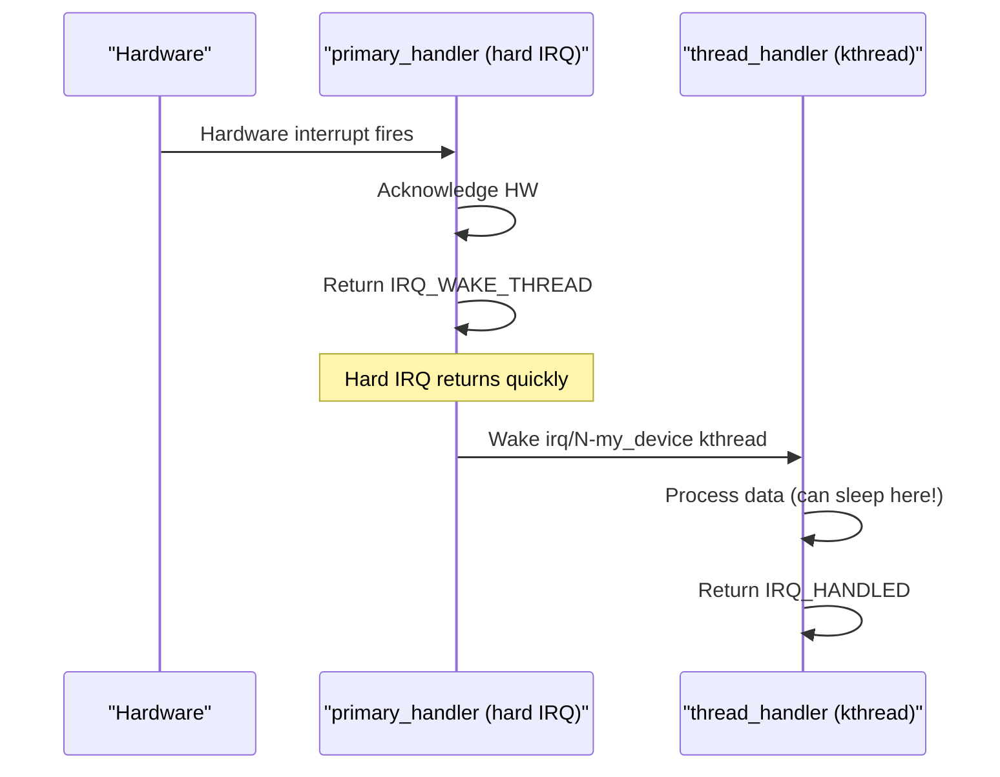
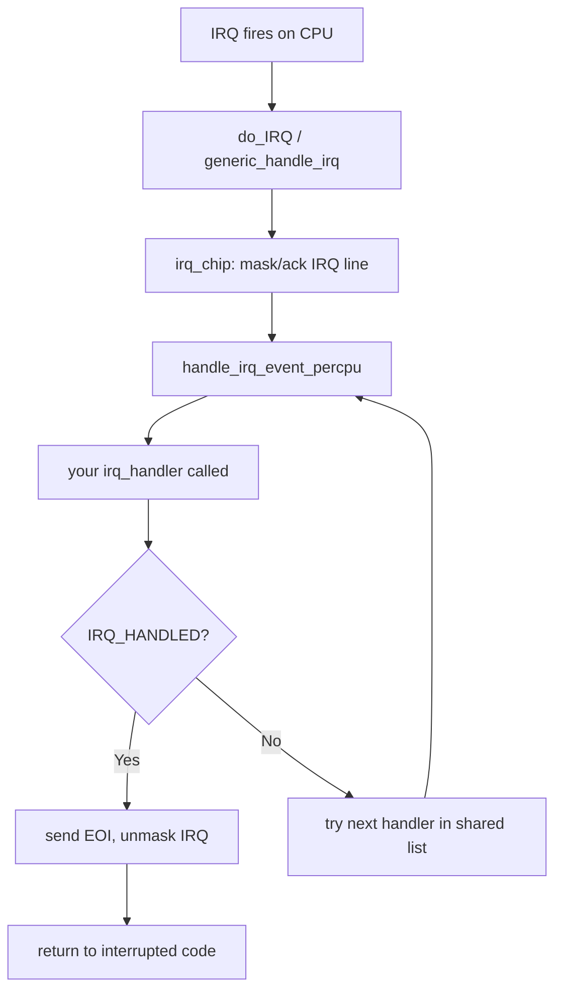

# 02 — Interrupt Handlers

## 1. What is an Interrupt Handler?

An **interrupt handler** (also called **Interrupt Service Routine — ISR**, or **top half**) is a C function invoked by the kernel when a hardware interrupt fires.

### Key Constraints
- Must run **fast** — interrupts are disabled on this CPU while handler runs (or at same/higher priority)
- Must **not sleep** or call any function that can block
- Must **acknowledge** the interrupt to prevent re-firing (e.g., clear status register or send EOI)
- Slow work should be deferred to **bottom halves** (softirq/tasklet/workqueue)

---

## 2. Writing an Interrupt Handler

```c
/* Function signature */
static irqreturn_t my_irq_handler(int irq, void *dev_id)
{
    struct my_device *dev = dev_id;  /* Cast back to your device struct */

    /* 1. Check if our device actually raised this IRQ */
    if (!my_device_irq_pending(dev))
        return IRQ_NONE;  /* Not ours — shared IRQ */

    /* 2. Acknowledge the interrupt (CRITICAL — prevents re-firing) */
    my_device_clear_irq(dev);

    /* 3. Do fast work: read status registers, update counters */
    dev->status = my_device_read_status(dev);
    dev->irq_count++;

    /* 4. Defer slow work */
    tasklet_schedule(&dev->tasklet);  /* OR queue_work(&dev->work); */

    return IRQ_HANDLED;  /* We handled this interrupt */
}
```

---

## 3. irqreturn_t Return Values

```c
/* include/linux/irqreturn.h */
typedef enum irqreturn {
    IRQ_NONE        = (0 << 0),  /* Not our interrupt */
    IRQ_HANDLED     = (1 << 0),  /* We handled it */
    IRQ_WAKE_THREAD = (1 << 1),  /* Wake the threaded handler */
} irqreturn_t;
```

| Return Value | Meaning |
|-------------|---------|
| `IRQ_NONE` | Interrupt not from this device (shared IRQ) |
| `IRQ_HANDLED` | Interrupt handled successfully |
| `IRQ_WAKE_THREAD` | Wake the threaded IRQ handler (slow work in process context) |

---

## 4. IRQF_* Flags

```c
/* include/linux/interrupt.h */
#define IRQF_SHARED         0x00000080  /* Allow multiple handlers on same IRQ */
#define IRQF_TRIGGER_RISING 0x00000001  /* Edge-triggered, rising edge */
#define IRQF_TRIGGER_FALLING 0x00000002
#define IRQF_TRIGGER_HIGH   0x00000004  /* Level-triggered, high */
#define IRQF_TRIGGER_LOW    0x00000008  /* Level-triggered, low */
#define IRQF_ONESHOT        0x00002000  /* Don't re-enable until thread handler done */
#define IRQF_NO_AUTOEN      0x00020000  /* Don't enable IRQ automatically */
```

---

## 5. Threaded IRQ Handlers

For drivers that need to do slow work in interrupt context, use **threaded IRQs**:

```c
/* request_threaded_irq — splits handler into fast + slow */
ret = request_threaded_irq(
    irq,
    my_primary_handler,    /* Fast: runs in hard IRQ context */
    my_thread_handler,     /* Slow: runs in kernel thread (can sleep!) */
    IRQF_SHARED | IRQF_ONESHOT,
    "my_device",
    dev
);
```


```

---

## 6. Handler Flow


```

---

## 7. What You Can and Cannot Do in a Handler

```c
static irqreturn_t my_handler(int irq, void *dev)
{
    /* ALLOWED: */
    atomic_inc(&counter);              /* Atomic ops */
    spin_lock(&my_lock);               /* Spinlocks (no sleep) */
    tasklet_schedule(&my_tasklet);     /* Defer work */
    wake_up(&my_waitqueue);            /* Wake sleeping process */
    printk(KERN_DEBUG "...");          /* Printk (non-sleeping) */
    readl(dev_base + STATUS_REG);      /* MMIO access */

    /* NOT ALLOWED: */
    // msleep(1);                      /* Any sleep function */
    // kmalloc(size, GFP_KERNEL);      /* May sleep (use GFP_ATOMIC) */
    // mutex_lock(&mx);                /* May sleep */
    // copy_to_user(ptr, data, len);   /* May fault/sleep */
    // schedule();                     /* NEVER */

    return IRQ_HANDLED;
}
```

---

## 8. Source Files

| File | Description |
|------|-------------|
| `include/linux/interrupt.h` | Handler API, IRQF_* flags |
| `kernel/irq/manage.c` | request_irq, threaded IRQs |
| `kernel/irq/handle.c` | handle_irq_event* |
| `drivers/net/ethernet/intel/e1000/e1000_main.c` | Real NIC handler example |

---

## 9. Related Concepts
- [03_Registering_An_Interrupt_Handler.md](./03_Registering_An_Interrupt_Handler.md) — request_irq() details
- [../07_Bottom_Halves_And_Deferring_Work/](../07_Bottom_Halves_And_Deferring_Work/) — Slow work after ISR
- [05_Interrupt_Control.md](./05_Interrupt_Control.md) — Disabling interrupts
