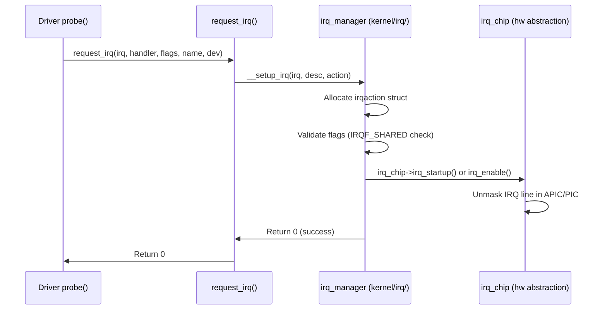

# 03 — Registering an Interrupt Handler

## 1. request_irq()

```c
/* include/linux/interrupt.h */
int request_irq(unsigned int irq,
                irq_handler_t handler,
                unsigned long flags,
                const char *name,
                void *dev);
```

| Parameter | Description |
|-----------|-------------|
| `irq` | IRQ line number (from device/DT/PCI) |
| `handler` | Function pointer: `irqreturn_t (*)(int, void *)` |
| `flags` | IRQF_* flags (IRQF_SHARED, triggers, etc.) |
| `name` | Shown in `/proc/interrupts` |
| `dev` | Opaque cookie passed back to handler (needed for IRQF_SHARED) |

**Returns:** 0 on success, negative errno on failure (-EINVAL, -EBUSY, -ENOMEM)

---

## 2. Complete Driver Example

```c
#include <linux/module.h>
#include <linux/interrupt.h>
#include <linux/pci.h>

#define MY_DEVICE_IRQ_STATUS    0x10
#define MY_DEVICE_IRQ_CLEAR     0x14

struct my_dev {
    void __iomem    *base;
    unsigned int     irq;
    atomic_t         irq_count;
    struct tasklet_struct tasklet;
    struct work_struct    work;
};

/* Tasklet for deferred work */
static void my_tasklet_fn(unsigned long data)
{
    struct my_dev *dev = (struct my_dev *)data;
    /* Process data — still cannot sleep here */
    pr_info("Tasklet processing, count=%d\n", atomic_read(&dev->irq_count));
}

/* ISR — Top Half */
static irqreturn_t my_irq_handler(int irq, void *dev_id)
{
    struct my_dev *dev = dev_id;
    u32 status;

    /* Read status register */
    status = readl(dev->base + MY_DEVICE_IRQ_STATUS);
    if (!status)
        return IRQ_NONE;    /* Not our interrupt */

    /* Clear interrupt in hardware */
    writel(status, dev->base + MY_DEVICE_IRQ_CLEAR);

    /* Increment count */
    atomic_inc(&dev->irq_count);

    /* Defer slow processing */
    tasklet_schedule(&dev->tasklet);

    return IRQ_HANDLED;
}

/* Probe function — called when device found */
static int my_pci_probe(struct pci_dev *pdev, const struct pci_device_id *id)
{
    struct my_dev *dev;
    int ret;

    dev = devm_kzalloc(&pdev->dev, sizeof(*dev), GFP_KERNEL);
    if (!dev)
        return -ENOMEM;

    /* Map device registers */
    dev->base = devm_ioremap_resource(&pdev->dev, &pdev->resource[0]);
    if (IS_ERR(dev->base))
        return PTR_ERR(dev->base);

    /* Get IRQ number from PCI */
    dev->irq = pdev->irq;

    /* Initialize tasklet */
    tasklet_init(&dev->tasklet, my_tasklet_fn, (unsigned long)dev);

    /* Register interrupt handler */
    ret = request_irq(dev->irq,
                      my_irq_handler,
                      IRQF_SHARED,          /* Share with other PCI devices */
                      "my_device",
                      dev);
    if (ret) {
        dev_err(&pdev->dev, "Failed to request IRQ %d: %d\n", dev->irq, ret);
        return ret;
    }

    pci_set_drvdata(pdev, dev);
    dev_info(&pdev->dev, "Registered for IRQ %d\n", dev->irq);
    return 0;
}

/* Remove function */
static void my_pci_remove(struct pci_dev *pdev)
{
    struct my_dev *dev = pci_get_drvdata(pdev);

    /* IMPORTANT: free before cleanup */
    free_irq(dev->irq, dev);
    tasklet_kill(&dev->tasklet);
}
```

---

## 3. REQUEST_IRQ Internals



---

## 4. free_irq()

**Always call `free_irq()` before module unload!** Failure to do so results in a handler firing after the module code is unmapped → kernel oops.

```c
/* Free the IRQ */
free_irq(unsigned int irq, void *dev_id);

/* dev_id must match what was passed to request_irq() */
/* For IRQF_SHARED: dev_id distinguishes which handler to remove */
```

---

## 5. /proc/interrupts Output

```bash
cat /proc/interrupts

#            CPU0     CPU1     CPU2     CPU3
#   0:         46        0        0        0  IO-APIC   2-edge      timer
#   1:          2        0        0        1  IO-APIC   1-edge      i8042
#  24:      15374     3821     4102     2901  PCI-MSI  524288-edge  nvme0q0
# NMI:          0        0        0        0  Non-maskable interrupts
# LOC:    1234567  1234567  1234567  1234567  Local timer interrupts
# ERR:          0
# MIS:          0

# Column meanings:
# IRQ number | per-CPU counts | chip type | trigger | device name
```

---

## 6. Devm Managed IRQ

With `devm_*` functions, IRQ is freed automatically on device removal:

```c
ret = devm_request_irq(&pdev->dev, irq, my_handler,
                       IRQF_SHARED, "my_device", dev);
/* No need to call free_irq() — devm handles it */
```

---

## 7. Getting IRQ Numbers

```c
/* From PCI device */
irq = pdev->irq;          /* Legacy INTx */
irq = pci_irq_vector(pdev, 0);  /* MSI/MSI-X */

/* From Device Tree (platform driver) */
irq = platform_get_irq(pdev, 0);

/* From GPIO */
irq = gpiod_to_irq(gpio_desc);

/* From IRQ domain */
irq = irq_find_mapping(domain, hwirq);
```

---

## 8. Source Files

| File | Description |
|------|-------------|
| `kernel/irq/manage.c` | request_irq, free_irq |
| `kernel/irq/internals.h` | Internal structures |
| `include/linux/interrupt.h` | Public API |
| `drivers/pci/msi.c` | MSI interrupt setup |

---

## 9. Related Concepts
- [02_Interrupt_Handlers.md](./02_Interrupt_Handlers.md) — Writing the handler function
- [05_Interrupt_Control.md](./05_Interrupt_Control.md) — Disabling interrupts
- [../07_Bottom_Halves_And_Deferring_Work/](../07_Bottom_Halves_And_Deferring_Work/) — Deferred work
