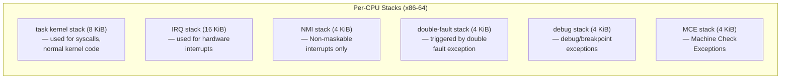
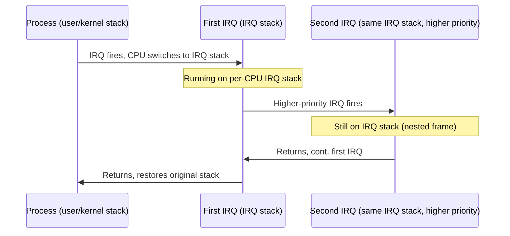

# 04 — IRQ Stacks

## 1. Why Separate IRQ Stacks?

When an interrupt fires on x86-64, the kernel needs a stack to execute the ISR. Without a dedicated IRQ stack, the ISR would use the **current process's kernel stack**, risking:
- Stack overflow (process stack might be nearly full)
- Nested interrupts exhausting the 8KiB kernel stack
- Corruption of the interrupted process's frame

**Solution:** Each CPU has several dedicated stacks for interrupt/exception handling.

---

## 2. x86-64 Stack Layout



---

## 3. Kernel Stack Sizes

```c
/* include/linux/sched.h */
#ifdef CONFIG_KASAN
#define THREAD_SIZE_ORDER    (3 + KASAN_STACK_ORDER)
#else
#define THREAD_SIZE_ORDER    (2)     /* x86-64 default: 4 pages = 16 KiB... */
#endif
#define THREAD_SIZE  (PAGE_SIZE << THREAD_SIZE_ORDER)

/* arch/x86/include/asm/page_64_types.h */
#define EXCEPTION_STKSZ  (PAGE_SIZE << 0)   /* 4 KiB per exception stack */
#define IRQ_STACK_SIZE   (4 * PAGE_SIZE)    /* 16 KiB per-CPU IRQ stack */
```

---

## 4. Stack Switch on Interrupt

```c
/* arch/x86/entry/entry_64.S (simplified) */
SYM_CODE_START(interrupt_entry)
    /* CPU already pushed SS, RSP, RFLAGS, CS, RIP on original stack */
    
    /* Switch to per-CPU IRQ stack if not already there */
    movq    PER_CPU_VAR(irq_stack_ptr), %rsp
    
    /* Save all registers */
    SAVE_ALL
    
    /* Call C handler */
    call    do_IRQ
    
    /* Restore registers */
    RESTORE_ALL
    
    /* Return: switches back to original stack */
    iretq
SYM_CODE_END(interrupt_entry)
```

---

## 5. Interrupt Nesting on x86-64



> On modern Linux x86-64, the CPU switches to the **IRQ stack** automatically via the **IST (Interrupt Stack Table)** in the TSS (Task State Segment).

---

## 6. TSS and IST (x86-64)

```c
/* arch/x86/include/asm/processor.h */
struct tss_struct {
    /* ... */
    u64 ist[7];     /* IST0..IST6: Interrupt Stack Table entries */
                    /* Each points to a dedicated stack for specific vectors */
};

/* arch/x86/kernel/cpu/common.c */
static void set_intr_gate(int n, void *addr)
{
    /* Gate descriptor points to IST stack entry */
}
```

**IST assignments (x86-64):**
| IST# | Used For |
|------|----------|
| IST1 | Double Fault (#DF) |
| IST2 | NMI |
| IST3 | Debug (#DB) |
| IST4 | MCE |
| IST5–7 | Reserved/unused |

---

## 7. Stack Overflow Detection

```c
/* CONFIG_VMAP_STACK — virtual-mapped stacks with guard pages */
/* Since Linux 4.9, the kernel stack is vmalloc'd with guard pages */

/* If stack overflows, the guard page causes a #PF → handled by
   double fault handler on its own IST stack */
```

---

## 8. Viewing Stack Usage

```bash
# See how much IRQ stack is used (rough):
grep -i "irq" /proc/buddyinfo

# See task stack info:
cat /proc/$(pgrep ksoftirqd)/status | grep VmStk

# Kernel config:
grep THREAD_INFO_IN_TASK .config
grep VMAP_STACK .config
```

---

## 9. Source Files

| File | Description |
|------|-------------|
| `arch/x86/include/asm/page_64_types.h` | Stack size constants |
| `arch/x86/kernel/irq_64.c` | IRQ stack allocation |
| `arch/x86/entry/entry_64.S` | Stack switch assembly |
| `arch/x86/include/asm/processor.h` | TSS/IST structures |
| `arch/x86/kernel/cpu/common.c` | TSS/IDT initialization |

---

## 10. Related Concepts
- [01_Interrupt_Basics.md](./01_Interrupt_Basics.md) — IDT and vector numbers
- [05_Interrupt_Control.md](./05_Interrupt_Control.md) — Disabling interrupts
- [../11_Memory_Management/](../11_Memory_Management/) — Virtual memory for stack allocation
