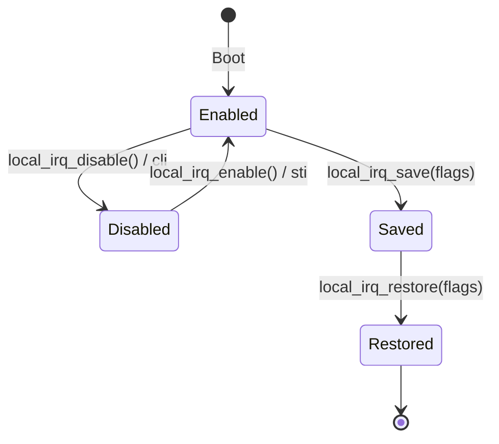
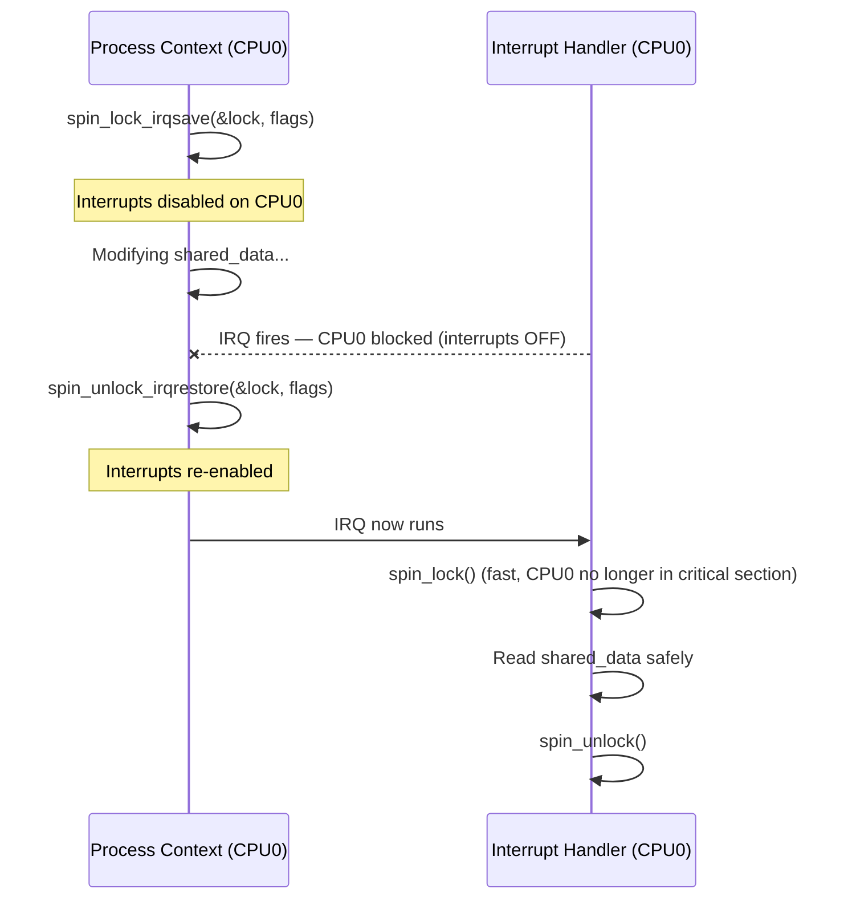

# 05 — Interrupt Control

## 1. Why Control Interrupts?

Sometimes the kernel must **atomically** read/modify shared data structures that could be corrupted if an interrupt fires midway. The solution is to **disable interrupts** (local or global) while in the critical section.

---

## 2. Local Interrupt Control (per-CPU)

```c
/* Disable local (current CPU) interrupts */
local_irq_disable();    /* Clears IF flag: cli */

/* Re-enable local interrupts */
local_irq_enable();     /* Sets IF flag: sti */

/* Save state then disable — for nested use */
unsigned long flags;
local_irq_save(flags);      /* saves RFLAGS, then cli */
/* ... critical section ... */
local_irq_restore(flags);   /* restores RFLAGS */
```

> **Warning:** `local_irq_disable()` only disables interrupts on **this CPU**. Other CPUs still process interrupts!

---

## 3. Interrupt State Flow



---

## 4. Checking Interrupt State

```c
/* Check if interrupts are currently enabled */
if (irqs_disabled())
    pr_warn("Interrupts are OFF!\n");

/* Check if we're in interrupt context */
if (in_interrupt())
    /* Could be hard IRQ or softirq */

if (in_irq())
    /* Hard IRQ context */

if (in_softirq())
    /* Softirq or tasklet context */

if (in_atomic())
    /* Spinlock held, or softirq, or hard IRQ */
```

---

## 5. Spinlocks + IRQ Control

For data shared between **process context and interrupt handlers**, you need **both** a spinlock AND disabling local interrupts:

```c
/* Process context accessing shared data */
spin_lock_irqsave(&my_lock, flags);
/* --- critical section --- */
spin_unlock_irqrestore(&my_lock, flags);

/* Interrupt handler accessing same data */
spin_lock(&my_lock);   /* IRQ already disabled (we're in interrupt) */
/* --- critical section --- */
spin_unlock(&my_lock);
```



---

## 6. When to Use What

| Scenario | Use |
|----------|-----|
| Protect data accessed only from process context | `spin_lock` / `mutex_lock` |
| Protect data accessed from process + softirq | `spin_lock_bh()` / `spin_unlock_bh()` |
| Protect data accessed from process + hard IRQ | `spin_lock_irqsave()` / `spin_unlock_irqrestore()` |
| Protect data accessed only from hard IRQ | `spin_lock()` (IRQs already off) |
| Long critical sections (can sleep) | `mutex_lock()` (process context only) |

---

## 7. spin_lock_irqsave vs spin_lock_irq

```c
/* spin_lock_irq — simpler, but DANGEROUS if you don't know previous IRQ state */
spin_lock_irq(&lock);   /* Assumes interrupts were ON before */
/* ... */
spin_unlock_irq(&lock); /* Re-enables unconditionally — may be wrong! */

/* spin_lock_irqsave — ALWAYS USE THIS in drivers */
unsigned long flags;
spin_lock_irqsave(&lock, flags);   /* Saves RFLAGS, disables IRQs */
/* ... */
spin_unlock_irqrestore(&lock, flags);  /* Restores previous state */
```

---

## 8. Bottom Half Control

```c
/* Disable bottom halves (softirqs/tasklets) only */
local_bh_disable();     /* Increment softirq count */
local_bh_enable();      /* Decrement, run pending softirqs if any */

/* spin_lock_bh — combines spinlock + bh disable */
spin_lock_bh(&lock);
/* ... critical section ... */
spin_unlock_bh(&lock);
```

---

## 9. Common Pitfall: Forgetting to Restore

```c
/* BAD: early return without restoring IRQ state */
int bad_function(void)
{
    unsigned long flags;
    spin_lock_irqsave(&lock, flags);
    
    if (error_condition)
        return -EINVAL;  /* BUG: lock not released, IRQs stay disabled! */
    
    /* ... */
    spin_unlock_irqrestore(&lock, flags);
    return 0;
}

/* GOOD: always use goto for early exit */
int good_function(void)
{
    unsigned long flags;
    int ret = 0;
    
    spin_lock_irqsave(&lock, flags);
    
    if (error_condition) {
        ret = -EINVAL;
        goto out;
    }
    /* ... */
out:
    spin_unlock_irqrestore(&lock, flags);
    return ret;
}
```

---

## 10. Source Files

| File | Description |
|------|-------------|
| `include/linux/irqflags.h` | local_irq_* and in_irq()/ in_atomic() |
| `include/linux/spinlock.h` | spin_lock_irqsave and friends |
| `arch/x86/include/asm/irqflags.h` | x86 cli/sti implementations |
| `kernel/softirq.c` | local_bh_disable/enable |

---

## 11. Related Concepts
- [02_Interrupt_Handlers.md](./02_Interrupt_Handlers.md) — Handler constraints
- [../08_Intro_To_Kernel_Synchronization/](../08_Intro_To_Kernel_Synchronization/) — Locking overview
- [../09_Kernel_Synchronization_Methods/02_Spin_Locks.md](../09_Kernel_Synchronization_Methods/02_Spin_Locks.md) — Spinlock details
