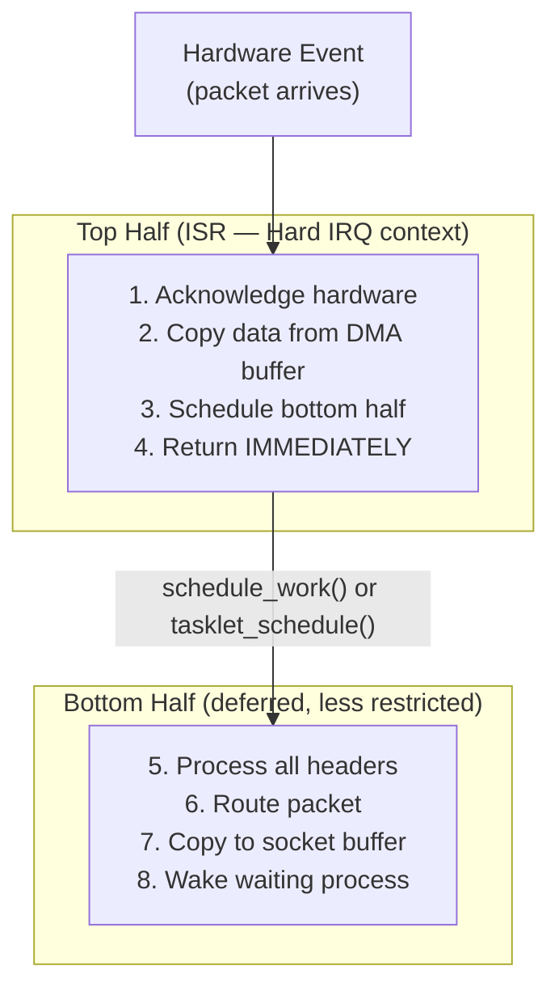
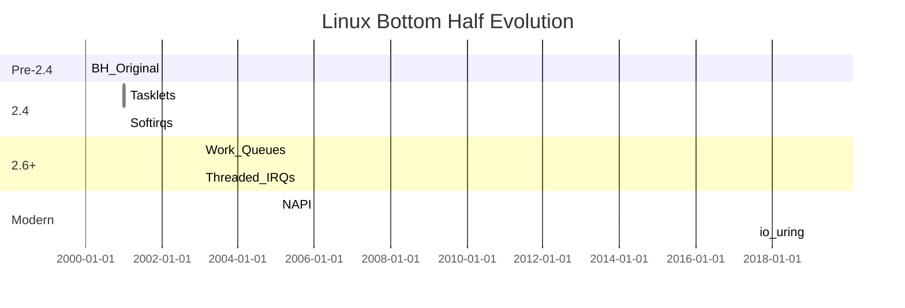

# 01 — Why Bottom Halves?

## 1. The Fundamental Problem

Interrupt handlers have strict constraints:
- Must return **very quickly** (milliseconds block all IRQs at same/lower priority)
- Must **not sleep**
- Must **not block**
- Interrupts may be **disabled** while running

But many tasks triggered by hardware events take time:
- Network packet processing (TCP/IP stack processing)
- Disk I/O completion (notify waiting processes)
- USB data transfer
- Timer callbacks

**Solution: Split interrupt handling into two halves.**

---

## 2. Top Half vs Bottom Half


```

---

## 3. Real-World Split: Network Driver

```c
/* Top Half — runs in hard IRQ: e1000_intr() */
static irqreturn_t e1000_intr(int irq, void *data)
{
    struct e1000_adapter *adapter = data;

    /* Disable IRQ to prevent re-entry */
    e1000_irq_disable(adapter);

    /* Schedule NAPI poll — bottom half */
    napi_schedule(&adapter->napi);

    return IRQ_HANDLED;  /* Return immediately */
}

/* Bottom Half — NAPI poll function (called from softirq) */
static int e1000_clean(struct napi_struct *napi, int budget)
{
    struct e1000_adapter *adapter =
        container_of(napi, struct e1000_adapter, napi);
    int work_done = 0;

    /* Now do the real work: */
    e1000_clean_rx_irq(adapter, &work_done, budget);  /* Process packets */
    e1000_clean_tx_irq(adapter);                       /* Clean TX ring */

    if (work_done < budget) {
        napi_complete_done(napi, work_done);
        e1000_irq_enable(adapter);  /* Re-enable interrupts */
    }

    return work_done;
}
```

---

## 4. Historical Context


```

---

## 5. Context Comparison

| Context | sleep? | Preemptible? | Concurrent? | Use Case |
|---------|--------|-------------|-------------|---------|
| Hard IRQ (top half) | No | No | Yes (other CPUs) | Acknowledge, schedule BH |
| Softirq | No | No | Yes (same softirq on diff CPUs) | Networking, block I/O |
| Tasklet | No | No | No (same tasklet) | Simple deferred work |
| Work Queue | **Yes** | Yes | Yes | Anything needing sleep |
| Process context | Yes | Yes | Yes | Normal driver/syscall code |

---

## 6. Related Concepts
- [02_Softirqs.md](./02_Softirqs.md) — Softirq system
- [03_Tasklets.md](./03_Tasklets.md) — Tasklet API
- [04_Work_Queues.md](./04_Work_Queues.md) — Work queues
- [../06_Interrupts_And_Interrupt_Handlers/02_Interrupt_Handlers.md](../06_Interrupts_And_Interrupt_Handlers/02_Interrupt_Handlers.md) — Top half handlers
