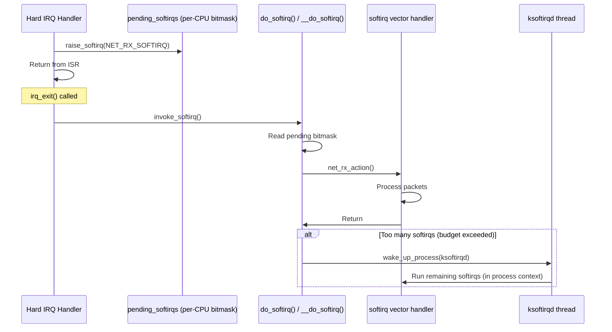

# 02 — Softirqs

## 1. What is a Softirq?

A **softirq** (software interrupt) is the kernel's lowest-latency, highest-performance deferred work mechanism. It runs after a hard IRQ returns, is statically allocated at compile time, and can run **simultaneously on multiple CPUs** (unlike tasklets).

**Key properties:**
- Run immediately after hard IRQ returns (or via `ksoftirqd` thread)
- **Cannot sleep** (still in soft IRQ context)
- Same softirq **can run concurrently** on different CPUs — handlers must be reentrant!
- Strictly limited — only a small number of built-in softirqs exist

---

## 2. Softirq Types (Linux Kernel)

```c
/* include/linux/interrupt.h */
enum {
    HI_SOFTIRQ       = 0,  /* Tasklets (high priority) */
    TIMER_SOFTIRQ    = 1,  /* Timer callbacks */
    NET_TX_SOFTIRQ   = 2,  /* Network transmit */
    NET_RX_SOFTIRQ   = 3,  /* Network receive */
    BLOCK_SOFTIRQ    = 4,  /* Block I/O completion */
    IRQ_POLL_SOFTIRQ = 5,  /* IRQ polling (NAPI) */
    TASKLET_SOFTIRQ  = 6,  /* Tasklets (normal priority) */
    SCHED_SOFTIRQ    = 7,  /* Scheduler rebalancing */
    HRTIMER_SOFTIRQ  = 8,  /* High-resolution timers */
    RCU_SOFTIRQ      = 9,  /* RCU callbacks */
    NR_SOFTIRQS      = 10
};
```

---

## 3. Softirq Execution Flow



---

## 4. Data Structures

```c
/* kernel/softirq.c */
struct softirq_action {
    void (*action)(struct softirq_action *);
};

/* Per-softirq vector table */
static struct softirq_action softirq_vec[NR_SOFTIRQS] __cacheline_aligned_in_smp;

/* Per-CPU pending bitmask */
typedef struct {
    unsigned int __softirq_pending;
} irq_cpustat_t;
DECLARE_PER_CPU_ALIGNED(irq_cpustat_t, irq_stat);
```

---

## 5. Registering a Softirq

Softirqs are **statically allocated** — you CANNOT create new ones from drivers.

```c
/* Registration (done once, at boot time) */
open_softirq(NET_TX_SOFTIRQ, net_tx_action);
open_softirq(NET_RX_SOFTIRQ, net_rx_action);

/* Raise (schedule) a softirq */
raise_softirq(NET_RX_SOFTIRQ);           /* From any context; disables IRQs */
raise_softirq_irqoff(NET_RX_SOFTIRQ);    /* From IRQ context; IRQs already off */
```

---

## 6. Writing a Softirq Handler

```c
/* Rules: No locking needed for per-CPU data, but global data needs locks */
static void net_rx_action(struct softirq_action *h)
{
    struct list_head *list = &__get_cpu_var(softnet_data).poll_list;
    unsigned long time_limit = jiffies + 2;  /* 2 jiffies budget */
    int budget = netdev_budget;              /* Default: 300 packets */
    
    while (!list_empty(list)) {
        struct napi_struct *n;
        
        if (budget <= 0 || time_after_eq(jiffies, time_limit))
            goto softnet_break;  /* Exceeded budget — wake ksoftirqd */
        
        n = list_first_entry(list, struct napi_struct, poll_list);
        budget -= napi_poll(n, budget);
    }
    return;

softnet_break:
    raise_softirq_irqoff(NET_RX_SOFTIRQ);  /* Re-raise for ksoftirqd */
}
```

---

## 7. ksoftirqd Threads

When too many softirqs are pending (to prevent starving user processes), the kernel hands off to **ksoftirqd**:

```bash
# ksoftirqd threads — one per CPU
ps aux | grep ksoftirqd
# root         9  0.0  0.0      0     0 ?  S  10:00   0:00 [ksoftirqd/0]
# root        17  0.0  0.0      0     0 ?  S  10:00   0:00 [ksoftirqd/1]
```

```c
/* kernel/softirq.c */
static int ksoftirqd_should_run(unsigned int cpu)
{
    return local_softirq_pending();
}

static void run_ksoftirqd(unsigned int cpu)
{
    local_irq_disable();
    if (local_softirq_pending()) {
        __do_softirq();
        local_irq_enable();
        cond_resched();
        return;
    }
    local_irq_enable();
}
```

---

## 8. Monitoring Softirqs

```bash
# Per-CPU softirq counts/sec:
watch -n 1 'cat /proc/softirqs'

#                    CPU0       CPU1       CPU2       CPU3
#           HI:          1          0          0          0
#        TIMER:    1234567    1234567    1234567    1234567
#       NET_TX:       1234       5678       9012       3456
#       NET_RX:    9876543    1234567     876543     234567
#        BLOCK:      23456      34567      45678      56789
#    IRQ_POLL:          0          0          0          0
#     TASKLET:       1234       2345       3456       4567
#       SCHED:    9876543    8765432    7654321    6543210
#     HRTIMER:    1234567    2345678    3456789    4567890
#         RCU:    9876543    8765432    7654321    6543210
```

---

## 9. Source Files

| File | Description |
|------|-------------|
| `kernel/softirq.c` | Core softirq, ksoftirqd |
| `include/linux/interrupt.h` | raise_softirq, open_softirq |
| `net/core/dev.c` | NET_RX_SOFTIRQ handler |

---

## 10. Related Concepts
- [03_Tasklets.md](./03_Tasklets.md) — Tasklets built on HI/TASKLET_SOFTIRQ
- [04_Work_Queues.md](./04_Work_Queues.md) — For work that can sleep
- [../06_Interrupts_And_Interrupt_Handlers/01_Interrupt_Basics.md](../06_Interrupts_And_Interrupt_Handlers/01_Interrupt_Basics.md)
