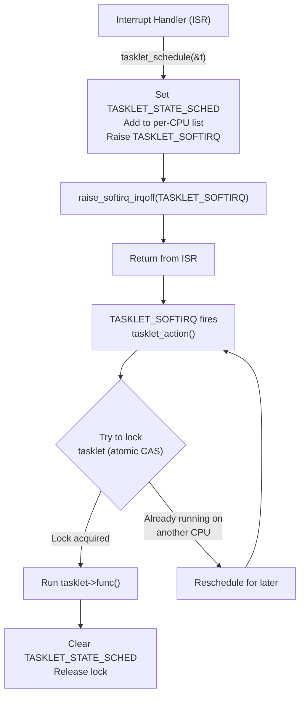

# 03 — Tasklets

## 1. What is a Tasklet?

A **tasklet** is a simple deferred function built on top of softirqs (using `HI_SOFTIRQ` or `TASKLET_SOFTIRQ`). Unlike raw softirqs:
- **Dynamically allocated** — drivers can create tasklets
- **Serialized** — the same tasklet never runs on two CPUs simultaneously
- **Simpler** — no need to write reentrant code

**Caveats:**
- Cannot sleep (still runs in softirq context)
- Deprecated in kernel 6.x (use `threaded IRQs` or `work queues` instead)

---

## 2. Data Structure

```c
/* include/linux/interrupt.h */
struct tasklet_struct {
    struct tasklet_struct *next;     /* Next in tasklet list */
    unsigned long state;             /* TASKLET_STATE_SCHED or LOCKED */
    atomic_t      count;             /* Reference count (0 = enabled) */
    bool          use_callback;      /* Use new callback style? */
    union {
        void (*func)(unsigned long); /* Old-style callback */
        void (*callback)(struct tasklet_struct *); /* New-style */
    };
    unsigned long data;              /* Argument passed to func */
};
```

---

## 3. Creating and Using a Tasklet

```c
#include <linux/interrupt.h>

/* Old style (func + data) */
static void my_tasklet_fn(unsigned long data)
{
    struct my_device *dev = (struct my_device *)data;
    /* Process data — CANNOT sleep */
    pr_info("Tasklet running, irq_count=%d\n", dev->irq_count);
}

static DECLARE_TASKLET(my_tasklet, my_tasklet_fn, 0UL);  /* Static + init */

/* Dynamic allocation */
struct tasklet_struct my_tasklet;
tasklet_init(&my_tasklet, my_tasklet_fn, (unsigned long)dev);

/* Schedule (from ISR) */
tasklet_schedule(&my_tasklet);       /* Normal priority (TASKLET_SOFTIRQ) */
tasklet_hi_schedule(&my_tasklet);    /* High priority (HI_SOFTIRQ) */

/* Disable/enable */
tasklet_disable(&my_tasklet);        /* Stops tasklet from running (waits) */
tasklet_enable(&my_tasklet);         /* Re-enables */

/* Kill (wait for completion, then disable permanently) */
tasklet_kill(&my_tasklet);           /* MUST call before freeing device */
```

---

## 4. New-Style Tasklet (Kernel 5.9+)

```c
/* New callback style — recommended for new code */
static void my_tasklet_callback(struct tasklet_struct *t)
{
    struct my_device *dev = from_tasklet(dev, t, tasklet);
    /* from_tasklet() = container_of(t, type, member) */
    pr_info("New-style tasklet: irq_count=%d\n", dev->irq_count);
}

struct my_device {
    struct tasklet_struct tasklet;
    int irq_count;
    /* ... */
};

/* Initialize */
tasklet_setup(&dev->tasklet, my_tasklet_callback);

/* Schedule */
tasklet_schedule(&dev->tasklet);
```

---

## 5. Tasklet Execution Flow



---

## 6. Complete Driver Example

```c
#include <linux/module.h>
#include <linux/interrupt.h>

struct my_drv {
    void __iomem         *base;
    unsigned int          irq;
    struct tasklet_struct tasklet;
    u32                   status;
};

/* Tasklet handler — deferred work */
static void my_drv_tasklet(struct tasklet_struct *t)
{
    struct my_drv *drv = from_tasklet(drv, t, tasklet);
    u32 status = drv->status;
    
    if (status & RX_READY) {
        /* Process received data */
        my_process_rx(drv);
    }
    if (status & TX_DONE) {
        /* Free sent buffers */
        my_cleanup_tx(drv);
    }
}

/* Top-half ISR */
static irqreturn_t my_drv_isr(int irq, void *dev_id)
{
    struct my_drv *drv = dev_id;
    
    drv->status = readl(drv->base + STATUS_REG);
    writel(drv->status, drv->base + STATUS_REG);  /* ACK */
    
    tasklet_schedule(&drv->tasklet);
    return IRQ_HANDLED;
}

static int my_drv_probe(struct platform_device *pdev)
{
    struct my_drv *drv;
    int ret;
    
    drv = devm_kzalloc(&pdev->dev, sizeof(*drv), GFP_KERNEL);
    tasklet_setup(&drv->tasklet, my_drv_tasklet);
    
    ret = devm_request_irq(&pdev->dev, drv->irq, my_drv_isr, 0, "my_drv", drv);
    return ret;
}

static int my_drv_remove(struct platform_device *pdev)
{
    struct my_drv *drv = platform_get_drvdata(pdev);
    tasklet_kill(&drv->tasklet);  /* Wait for completion */
    return 0;
}
```

---

## 7. Tasklet vs Softirq vs Work Queue

| | Tasklet | Softirq | Work Queue |
|-|---------|---------|-----------|
| Can sleep? | No | No | **Yes** |
| Concurrent same tasklet? | No | Yes | Yes |
| Dynamic creation? | Yes | No | Yes |
| Overhead | Low | Lowest | Higher |
| Ease of use | Easy | Hard | Easy |
| Status in 6.x | Deprecated | Kept | Preferred |

---

## 8. Source Files

| File | Description |
|------|-------------|
| `include/linux/interrupt.h` | tasklet_struct, API |
| `kernel/softirq.c` | tasklet_action(), tasklet internals |

---

## 9. Related Concepts
- [02_Softirqs.md](./02_Softirqs.md) — Tasklets are built on softirqs
- [04_Work_Queues.md](./04_Work_Queues.md) — Replacement for tasklets (can sleep)
- [05_Choosing_A_Bottom_Half_Mechanism.md](./05_Choosing_A_Bottom_Half_Mechanism.md)
